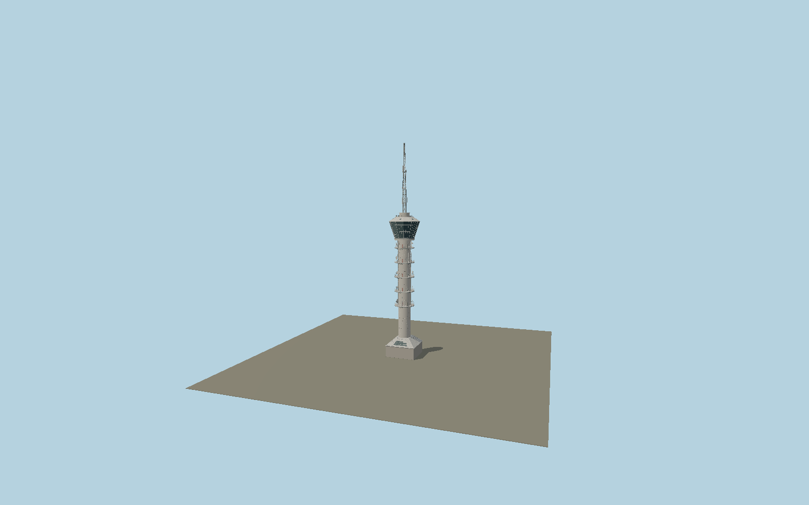

# Tyholttårnet

Trondheim’s 124 m communications tower: narrow cast-concrete shaft, five circular service platforms with rails, dish antennas and cable ladders, twelve-faceted flared restaurant glass, white stepped roof and a tapering steel lattice mast above a square hipped base.

## Identity and geometry

Catalog N0606, [Q1935277](https://www.wikidata.org/wiki/Q1935277). The owner establishes 124 m height and 1985 construction, and supplies current full-tower, close-pod and aerial photographs. Strinda historical society gives 7.2 m concrete shaft diameter. The larger co-centered map ring establishes the 17.4 m projected pod diameter and the square base establishes orientation. The mapped restaurant/shaft classifications are reversed relative to the photographs; raw tags are preserved in map-frame.json and not used literally. Platform ordinates, mast truss members, intermediate pod heights and minor fittings are proportionally reconstructed from the owner’s photographs, not surveyed dimensions.

Center of the co-centered mapped tower parts, Y=0 at exterior ground. Native +X follows the northeast edge of the mapped square base; +Z is southeast. The circular shaft and pod have no unique front; +Y is up. The geographic proposal identifies its anchor and orientation evidence separately from remaining terrain and azimuth uncertainty.

Source facts and measured references are recorded in spec.json. References: [1](https://trym.no/prosjekt/tyholttarnet/), [2](https://trym.no/wp-content/uploads/2019/12/tarnet.jpg), [3](https://trym.no/wp-content/uploads/2019/12/tyholt-768x701.jpg), [4](https://www.strindahistorielag.no/wiki/index.php/Tyholtt%C3%A5rnet), [5](https://egon.no/historiskebygg), [6](https://www.openstreetmap.org/way/42645747), [7](https://www.openstreetmap.org/way/474904230), [8](https://www.openstreetmap.org/way/474904229). Reference pages and images are not redistributed.

## Original source and shared materials

Geometry is authored in `packages/worldgen/scripts/tyholt-tower-model.mjs`. Shared material graphs with metric repeat UV0 and original vertex tints; GLB PBR fallback remains self-contained. No per-model texture duplication. No third-party mesh or photograph is embedded.

133,426 triangles; 266,556 vertices; 3 material groups; 10,932,904 source bytes. Source hash: `sha256:fd01f803c21cad5f12284a5f071d7d9cdd456d5c8f14166ffce903579484a0b4`. Geometry validation checks finite Float32 coordinates, indices, triangle area and winding before export.

Regenerate with `node packages/worldgen/scripts/generate-heritage-towers.mjs N0606`; add `--check` for reproducibility. The generator refuses to overwrite a master whose hash differs from source.json. Import uses `--no-optimize` to preserve facade recesses.

## Remaining detail and review

- Current owner photographs determine permanent form. Intermediate platforms, roof and base heights are proportional reconstructions; the 74/75 m restaurant-floor descriptions are compatible approximate public values rather than exact floor survey datums.
- Antennas, cable ladders and service fittings form a representative arrangement; telecommunications equipment changes over time. Nighttime projection lighting and restaurant interiors are outside this exterior asset scope.
- The low attached H-shaped office building remains a separate mapped building and is not duplicated. Raw map part material/class labels conflict and are explicitly overridden using the photographed narrow shaft and broad flared pod.
- Near/far visual QA, shared-material inspection and maximum-fidelity approval remain pending.

Named near/far cameras are included for lit visual review. A valid export is not maximum-fidelity certification.
