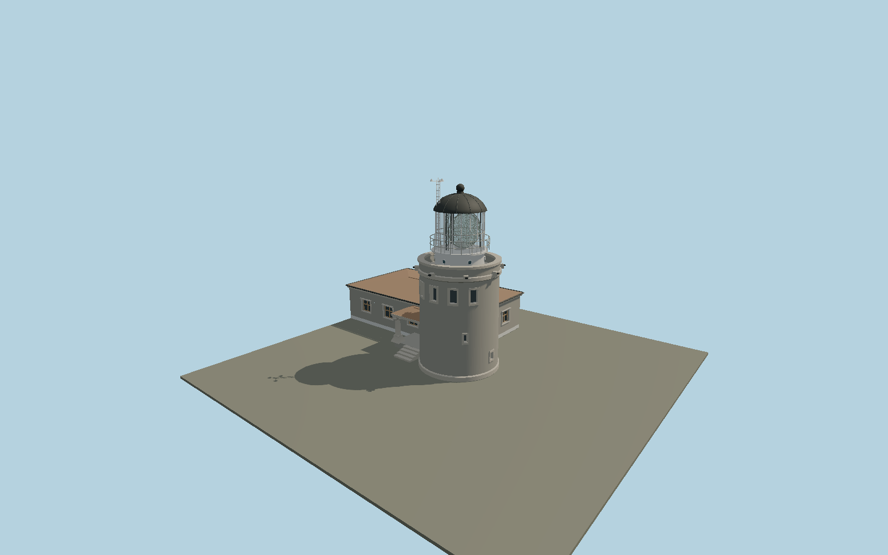

# Kullen Lighthouse — N0679

Short rough-granite cylindrical tower with five broad seaward watchroom windows, masonry parapet/scuppers, white ventilated drum, tall clear lantern and visible three-panel first-order optic, black domed roof and weather mast; attached low stone service house and carved granite-column entrance porch.

## Identity and evidence

Exact catalog identity **Q1518751**. Source facts: `{"heightMeters":15,"focalElevationMeters":78.5,"mappedTowerDiameterMeters":6.5,"attachedHousePlanMeters":[15,8.66],"basis":"Sjöfartsverket identifies the1900 granite/gneiss tower and its78.5m focal elevation. The authority-linked Swedish Lighthouse Society gives15m structural height and credited close photographs of the watchroom, first-order lens and carved entrance. The exact-QID tower and current mapped building parts fix the attached house footprint; component heights and small relief are photo-proportioned."}`. The source specification keeps published dimensions separate from reconstructed details.

- https://www.sjofartsverket.se/sv/om-oss/fyrar-och-kulturfastigheter/visningsfyrar/kullen--sveriges-kap-horn/
- https://wiki.fyr.org/index.php/Kullen
- https://wiki.fyr.org/images/9/9a/KullenFyr143EsbjHillberg.jpg
- https://wiki.fyr.org/images/5/55/KullenLins142EsbjHillberg.jpg
- https://wiki.fyr.org/images/f/f0/714600DT01.jpg
- https://wiki.fyr.org/images/1/15/714600DT02.jpg
- https://www.openstreetmap.org/way/1197717521
- https://www.openstreetmap.org/way/1483946313
- https://www.openstreetmap.org/way/1483946315

Original geometry and shared procedural materials. Official photographs are research references only; no reference imagery or third-party mesh is embedded or redistributed.

## Authored geometry and materials

149,988 triangles, 266,208 vertices, 9 surface groups; 11,388,360 source bytes. SHA-256: `sha256:53b96477b363c70bfc1028ee9c63e33b800972f85a447da6fbdbe5f4c4603a9a`. Actual bounds: -3.630, 0.000, -3.630 to 15.680, 15.000, 10.560 m.

Shared canonical material graphs with metric UV repeats in extras.molenSurface; portable glTF PBR factors and vertex colors remain. Dark recesses/lantern panels retain local fallback materials. Shared references: `matgraph:molen.worldgen.material.plaster_lime` (2 × 2 m), `matgraph:molen.worldgen.material.stone_ashlar` (2.4 × 1.5 m), `matgraph:molen.worldgen.material.tile_ceramic` (2.4 × 2.4 m), `matgraph:molen.worldgen.material.metal_painted` (2 × 2 m), `matgraph:molen.worldgen.material.stone_granite` (2 × 2 m), `matgraph:molen.worldgen.material.wood_plain` (2 × 0.25 m), `matgraph:molen.worldgen.material.concrete_plain` (2 × 2 m). Model-native axes: {"up":"+Y","front":"+Z","origin":"Authored main tower center at local base level; attached ensembles are offset from this origin."}.

## Placement proposal

Mapped house long axis resolves native+X east/slightly south; native+Z runs into the attached house south of the tower. The seaward watchroom faces native-Z, and mapped small roof identifies the northeast columned porch. Origin is the tower center at local site grade, not focal elevation. Proposed anchor 12.451522111, 56.301025985 (longitude, latitude), heading -0.123 radians. Elevation policy: **terrain-contact**. This is a reviewable proposal, not a completed site-fit certification. Ground models require terrain contact; offshore models also require water-datum and base-height checks.

## Limitations and review

- The modeled exterior follows the cited published facts and inspected photographs. Unpublished dimensions and local fittings are explicitly photo-proportioned; no claim of engineering survey accuracy is made.
- Portable PBR and shared metric surfaces are provided. Surface weathering, material color under local lighting and fine facade relief require close render review before maximum-detail acceptance.
- The granite and gneiss use shared metric mineral surfaces; individual historic stones are not surveyed. The broad watchroom, porch carving and lens silhouette follow credited photographs; fine casting and optical prisms are original geometric reconstructions. The detached downhill fog-signal building, keeper homes and hill terrain remain map context. The15m extent includes weather instrumentation.

Near/far fixtures are in `spec.qaCameras`. Float32 finite geometry, triangle degeneracy and winding are checked by the generator. Current rendering, shared-material, maximum-fidelity and geographic review results are recorded in `qa.json` and the readiness ledger; source generation alone does not approve a model.

Regenerate with `node packages/worldgen/scripts/generate-lighthouse-models.mjs --ids=N0679`; add `--check` for reproducibility. Editable component recipes are in `packages/worldgen/scripts/lighthouse-kullen-lizard-models.mjs`. The generator protects artist-edited master hashes and preserves import/capture/shared-capture/QA documents.
