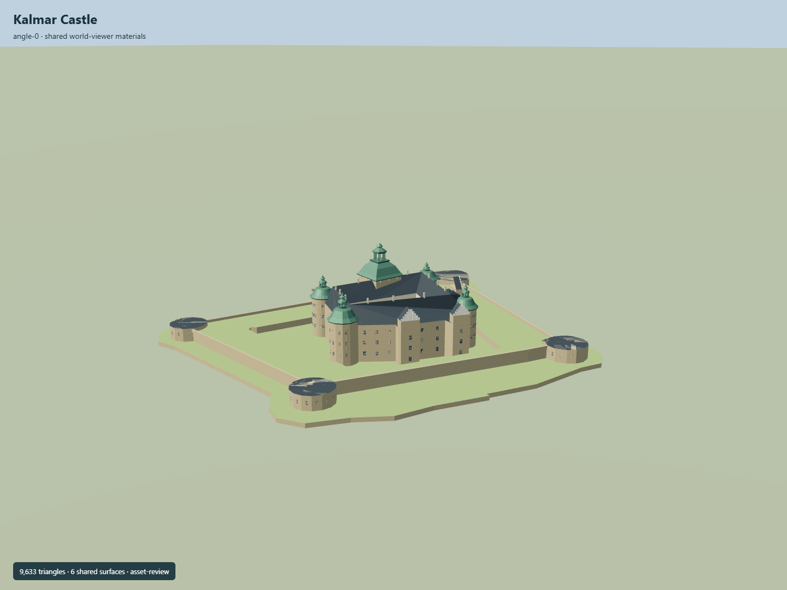

# Kalmar Castle

Open irregular Renaissance courtyard and four gabled wings,three round and one dodecagonal tower with distinct copper helmets,square Kuretornet with open lantern/old entrance,white Renaissance gables,original well canopy,mapped outer defenses and four cannon towers with western timber bridge.

## Evidence and reconstruction

Published dimensions and reconstructed details are separated in spec.json. Primary references:

- [Reference](https://api.openstreetmap.org/api/0.6/map?bbox=16.352,56.6564,16.3583,56.6596)
- [Reference](https://kalmarslott.se/)
- [Reference](https://www.sfv.se/vara-fastigheter/sverige/kalmar-lan/kalmar-slott)
- [Reference](https://kalmarslott.se/historia/historien-om-kalmar-slott/)
- [Reference](https://kalmarslott.se/historia/utveckling/)
- [Reference](https://cms.sfv.se/media/cjbpyeoq/kalmarslott_flygfoto1-komprimerad.jpg)
- [Reference](https://cms.sfv.se/media/mq2ddbi1/20170827_152248.jpg?width=800&height=1200&mode=crop&format=webp&autoorient=true&rxy=0.5213032581453634)

Six existing256-square shared graphs with linear tints and central metric UV repeats; plain glass/grass. No new/embedded image,photo texture or downloaded mesh. Courtyard is a physical hole at every level.

## Model and axes

9,633 triangles; 28,899 vertices; 8 material groups; 1,160,536 bytes. Native bounds: -111.141, 0.300, -120.786 to 103.816, 49.500, 107.463. Source hash: `sha256:7dfdbda6cafeaf7acec7895e75f2127a7d788021ac04c63214532cc1284f6d8c`.

{"up":"+Y","front":"Mapped western bridge and old Kuretornet entrance, baked into East/South coordinates","longitudinal":"+Z south","origin":"Exact-QID footprint map anchor; model ground attachment Y4.2 is an original provisional castle-platform estimate. Outer defenses descend toY0.3."}

Geometry is baked in native East/South coordinates with heading0. Internal plan angle is an authoring convenience and never placement orientation. Original platformY4.2 is a provisional attachment plane; outer coast/defenses extend below it. Physical vertical/site fit remains unverified.

## Reproduce

Run `node packages/worldgen/scripts/generate-signature-towers.mjs --ids=N0296` (or add `--check`). The generator preserves manually edited masters by checking their baseline hashes. Import through the standard authored-model workflow with optimization disabled; then capture all QA cameras, including shared-surface views.

## Pending work

- Exact-QID relation preserves castle footprint/courtyard. Nearby defense traces,coast,towers and bridge remain separately associated; the current map is not a survey.
- No published numeric height verified. All vertical values,helmets/lanterns,roof partitioning,apertures,white gables,well and bank section are original photographic estimates.
- No complete interiors,painted royal rooms,sculpture/inscriptions,church interior,exhibits or walkable circulation/collision are authored. Detached offsite cottage and temporary outdoor objects are omitted.
- The SFV2013–14 kitchen extension is acknowledged but its complete surveyed current footprint/roof is unresolved; no invented specific kitchen volume is counted as verified.
- No copied reference photo/drawing,downloaded model or unique texture. Six existing256-square shared graphs; flat glass/grass.
- Original platformY4.2 is a provisional attachment plane. Coast/defenses extend below it; exact vertical registration,host terrain cutout,moat/water and real access fit need geographic review before activation.
- Synthetic Earth context and fixed LOD captures do not approve physical-device timings or continuous streaming/upgrades.

This bundle follows the medium-fi standard. Medium-fi appearance and geographic fit are reviewed separately. Hash-bound visual acceptance is recorded separately after capture inspection.

## Additional geographic data

© OpenStreetMap contributors; Statens fastighetsverk; Kalmar Slott.
