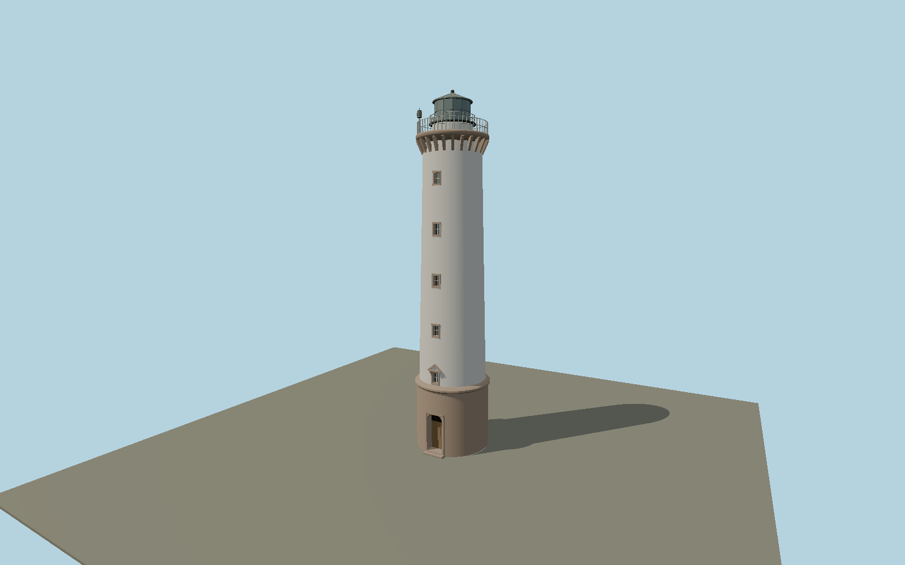

# Långe Erik — N0665

Slender white limestone shaft on six-meter exposed brown stone drum, arched entrance, heavy belt molding, pedimented first window, inset rectangular windows, 24 gallery corbels, two levels of iron railing, dark shallow cap and small ribbed modern beacon on the gallery.

## Identity and evidence

Exact catalog identity **Q1024406**. Source facts: `{"heightMeters":32.1,"unplasteredBaseHeightMeters":6,"galleryHeightApproxMeters":28,"baseDiameterMappedMeters":6.664,"basis":"Sjöfartsverket specifies 32.1 m total height, exposed lower six meters and gallery near 28 m. Exact-QID OSM circle gives about 6.66 m diameter. Original Carin Bäckström 2019 photograph provides arched entry, brown belt and pedimented first opening; the lighthouse-society brochure photographs the gallery-mounted Sabik LED 350."}`. The source specification keeps published dimensions separate from reconstructed details.

- https://www.sjofartsverket.se/sv/om-oss/fyrar-och-kulturfastigheter/visningsfyrar/olands-norra-udde--lange-erik/
- https://fyr.org/assets/pdf/broschyr/olands_norra_udde.pdf
- https://commons.wikimedia.org/wiki/File:L%C3%A5nge_Erik_20190718_01.jpg
- https://commons.wikimedia.org/wiki/File:L%C3%A5nge_Erik_fr%C3%A5n_luften.jpg
- https://www.openstreetmap.org/way/128130333

Original geometry and shared procedural materials. Official photographs are research references only; no reference imagery or third-party mesh is embedded or redistributed.

## Authored geometry and materials

26,710 triangles, 49,260 vertices, 6 surface groups; 2,048,328 source bytes. SHA-256: `sha256:79e878e7801d438885efd7ff015d22af42d1f3aab140389b4ca51e6b9710a67d`. Actual bounds: -3.490, 0.000, -3.490 to 3.490, 32.100, 3.650 m.

Shared canonical material graphs with metric UV repeats in extras.molenSurface; portable glTF PBR factors and vertex colors remain. Dark recesses/lantern panels retain local fallback materials. Shared references: `matgraph:molen.worldgen.material.plaster_lime` (2 × 2 m), `matgraph:molen.worldgen.material.stone_ashlar` (2.4 × 1.5 m), `matgraph:molen.worldgen.material.stone_limestone` (2.4 × 1.6 m), `matgraph:molen.worldgen.material.metal_painted` (2 × 2 m), `matgraph:molen.worldgen.material.wood_plain` (2 × 0.25 m). Model-native axes: {"up":"+Y","front":"+Z","origin":"Authored main tower center at local base level; attached ensembles are offset from this origin."}.

## Placement proposal

Exact-QID circle fixes origin and base width. Authored entrance faces south toward the island approach, reconstructed from the original entrance and aerial photographs; the circular footprint supplies no unique long axis. Natural shore and detached station buildings remain host features. Proposed anchor 17.09692995, 57.36703945 (longitude, latitude), heading 0 radians. Elevation policy: **terrain-contact**. This is a reviewable proposal, not a completed site-fit certification. Ordinary ground models use terrain contact; Kiipsaare requires an offshore water/base-height check.

## Limitations and review

- The modeled exterior follows the cited published facts and inspected photographs. Unpublished dimensions and local fittings are explicitly photo-proportioned; no claim of engineering survey accuracy is made.
- Portable PBR and shared metric surfaces are provided. Surface weathering, material color under local lighting and fine facade relief require close render review before maximum-detail acceptance.
- Gallery components, window spacing and dark cap use photograph proportions between the operator’s dimensional controls. The modern external light is modeled as static visible equipment, not a certified navigation signal. Detached machine house north of the tower is outside this individual tower asset.

Near/far fixtures are in `spec.qaCameras`. Float32 finite geometry, triangle degeneracy and winding are checked by the generator. Rendering, shared-material alignment, maximum-fidelity and geographic reviews remain pending until their hash-bound reports exist.

Regenerate with `node packages/worldgen/scripts/generate-lighthouse-models.mjs --ids=N0665`; add `--check` for reproducibility. Editable component recipes are in `packages/worldgen/scripts/lighthouse-models.mjs`. The generator protects artist-edited master hashes and preserves import/capture/shared-capture/QA documents.
