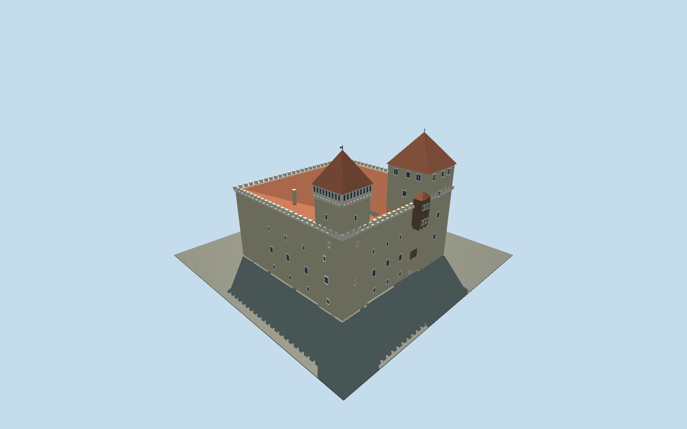

# Kuressaare Castle

Square dolomite convent building with a small open courtyard, broad red roof fields sloping inward, massive northern Sturvolt, slender eastern Tall Hermann, crenellated gallery and timber gate oriel.

## Evidence and reconstruction

Published dimensions and reconstructed details are separated in spec.json. Primary references:

- [Reference](https://linnus.samu.ee/en/about-the-castle/)
- [Reference](https://www.lumia.ee/en/projects/kuressaare-episcopal-castle)
- [Reference](https://www.kuressaarecastle.ee/)
- [Reference](https://whc.unesco.org/en/tentativelists/1716/)
- [Reference](https://www.openstreetmap.org/relation/414356)

No third-party geometry, photograph or bitmap texture is embedded. Shared surface graphs come from the central library; vertex tints carry model colors. Glazing uses PBR materials; transparent surfaces are declared per model.

## Model and axes

8,215 triangles; 17,013 vertices; 5 material groups; 714,300 bytes. Native bounds: -21.625, 0.000, -23.050 to 21.620, 38.200, 21.285. Source hash: `sha256:e49a8a86aa042811f1a397a8726f38e3903eaea7d3827e0c051e188bd0ea59c2`.

{"up":"+Y","longitudinal":"+X east-southeast, 32.26 degrees south of east","front":"-Z northeast gate; Sturvolt at -X/-Z and Tall Hermann at +X/-Z","origin":"Mapped building center; architectural base Y=0"}

Exact mapped outline and courtyard retain their anchor and signed axis; tower identities resolve direction. Geographic activation awaits terrain and gate-approach review.

## Reproduce

Run `node packages/worldgen/scripts/generate-signature-towers.mjs --ids=N0272` (or add `--check`). The generator preserves manually edited masters by checking their baseline hashes. Import through the standard authored-model workflow with optimization disabled; then capture all QA cameras, including shared-surface views.

## Pending work

- Original medium-fi reconstruction, not a conservation survey.
- Intermediate elevations and watchtower38.2m height inferred; the published37m defence-tower datum is unspecified.
- Fine tracery, diamond glazing lattice, complete interiors and fixtures omitted.
- Tour predates some2024 interior changes; exterior masses cross-checked against contemporary architect photographs.
- Wider fortress, bastions, moat, Cannon Tower and neighboring buildings omitted.
- Actual terrain seating, continuous-motion shimmer and physical-device performance pending.

This bundle follows the medium-fi standard. Medium-fi appearance and geographic fit are reviewed separately. Hash-bound visual acceptance is recorded separately after capture inspection.

## Additional geographic data

© OpenStreetMap contributors, ODbL-1.0. Saaremaa Museum tour and LUMIA drawings/photos used as visual references only.
