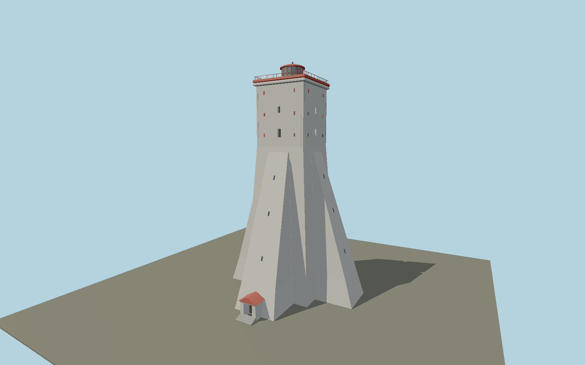

# Kõpu Lighthouse — N0641

Massive white square stone lighthouse with four broad sloping buttresses, tall square upper block, red anchor plates, roof balcony, red lantern cupola and south entrance porch.

## Identity and evidence

Exact catalog identity **Q1795607**. Source facts: `{"heightMeters":37.7,"operatorCoordinate":[22.1996445,58.9159645],"form":"White four-sided buttressed stone tower, balcony and red lantern room.","basis":"Estonian Transport Administration current navigation-aid668 record. Operator-submitted IALA2020 photographs and current record photograph inspected."}`. The source specification keeps published dimensions separate from reconstructed details.

- https://nma.transpordiamet.ee/aton/2684/
- https://heritage.iala.int/lighthouses/kopu-lighthouse/
- https://www.openstreetmap.org/way/249448393

Operator and IALA-submitted photographs are visual research only, not redistributed. OSM footprint dimensions/axes ©OpenStreetMap contributors, ODbL1.0.

## Authored geometry and materials

9,798 triangles, 19,508 vertices, 5 surface groups; 803,592 source bytes. SHA-256: `sha256:5abcda320f09ac1c0dd28f71580a57a9de3a597da4db93b8c8c28cb3eafad21b`. Actual bounds: -10.600, 0.000, -11.500 to 11.600, 37.700, 13.550 m.

Shared canonical material graphs with metric UV repeats in extras.molenSurface; portable glTF PBR factors and vertex colors remain. Dark recesses/lantern panels retain local fallback materials. Shared references: `matgraph:molen.worldgen.material.plaster_lime` (2 × 2 m), `matgraph:molen.worldgen.material.metal_painted` (2 × 2 m), `matgraph:molen.worldgen.material.wood_plain` (2 × 0.25 m), `matgraph:molen.worldgen.material.concrete_plain` (2 × 2 m). Model-native axes: {"up":"+Y","front":"+Z (south entrance)","origin":"Central shaft at local terrain contact. Buttress arms follow +X/-X and +Z/-Z."}.

## Placement proposal

Official coordinate preferred to OSM envelope center. Cached footprint rectangle heading0.69837257rad is diagonal to buttress edges; subtractπ/4 to align authored arms with those edges. Operator identifies southern entrance; residual asymmetry and exact porch fit need review. Proposed anchor 22.1996445, 58.9159645 (longitude, latitude), heading -0.087025590763 radians. Elevation policy: **terrain-contact**. This is a reviewable proposal, not a completed site-fit certification. Ordinary ground models use terrain contact; Kiipsaare requires an offshore water/base-height check.

## Limitations and review

- Original exterior reconstruction from documented main dimensions and inspected references. Individual moldings, sections, weathering, openings and fittings are photo-proportioned estimates.
- No interior visitor route, surveyed collision model, operating navigation-light simulation or exact optical assembly is included. Lantern glazing is a restrained opaque PBR approximation.
- Shared material references use metric UVs with portable vertex-color PBR fallback. Maximum-fidelity, lit shared-surface and geographic fit reviews remain separate pending gates.
- Height37.7m is authoritative; core width, buttress profile stations, terrace details and porch sizes are photo/map reconstructions. The restored irregular shell and exposed boulders are simplified; annex buildings are omitted.

Near/far fixtures are in `spec.qaCameras`. Float32 finite geometry, triangle degeneracy and winding are checked by the generator. Rendering, shared-material alignment, maximum-fidelity and geographic reviews remain pending until their hash-bound reports exist.

Regenerate with `node packages/worldgen/scripts/generate-lighthouse-models.mjs --ids=N0641`; add `--check` for reproducibility. Editable component recipes are in `packages/worldgen/scripts/lighthouse-models.mjs`. The generator protects artist-edited master hashes and preserves import/capture/shared-capture/QA documents.
