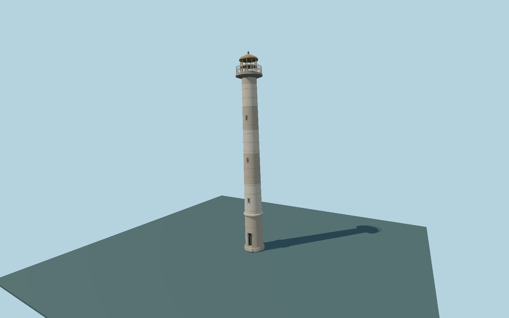

# Kiipsaare Lighthouse — N0643

Slender slightly leaning weathered concrete lighthouse with narrow recessed openings, worn paint courses, exposed threshold, circular gallery, empty lantern frame and rust-colored shallow cupola.

## Identity and evidence

Exact catalog identity **Q498583**. Source facts: `{"heightMeters":26,"currentSetting":"In the sea on unstable ground; angle of inclination changes.","basis":"Estonian national tourism agency description and official project photographs. Cached Wikidata25m differs from the primary tourism26m; primary26m used."}`. The source specification keeps published dimensions separate from reconstructed details.

- https://visitestonia.com/en/kiipsaare-lighthouse
- https://transpordiamet.ee/tuletornid
- https://visitestonia.com/images/665550/kiipsaare-tuletorn-011-visit-estonia.jpg
- https://visitestonia.com/images/665551/kiipsaare-tuletorn-008-visit-estonia.jpg

VisitEstonia photographs consulted as primary location references; images are not embedded, copied as textures or redistributed.

## Authored geometry and materials

13,632 triangles, 23,576 vertices, 3 surface groups; 991,108 source bytes. SHA-256: `sha256:53230b0862cc43a241503f8fbd5d27f0a038df369809df987a118d6eeef59f3a`. Actual bounds: -2.523, -0.048, -1.720 to 1.379, 25.985, 1.720 m.

Shared canonical material graphs with metric UV repeats in extras.molenSurface; portable glTF PBR factors and vertex colors remain. Dark recesses/lantern panels retain local fallback materials. Shared references: `matgraph:molen.worldgen.material.metal_painted` (2 × 2 m), `matgraph:molen.worldgen.material.concrete_plain` (2 × 2 m). Model-native axes: {"up":"+Y","front":"+Z doorway","origin":"Approximate visible base/waterline reference; photographic2-degree lean toward-X is baked into this static source."}.

## Placement proposal

Reference coordinate only: no exact mapped footprint is cached. Cylindrical main silhouette is nearly rotationally symmetric; doorway azimuth and lean direction are unresolved. Do not ground this offshore structure to a land DEM or claim current tilt. Proposed anchor 21.84111111, 58.49583333 (longitude, latitude), heading 0 radians. Elevation policy: **water-contact-review**. This is a reviewable proposal, not a completed site-fit certification. Ordinary ground models use terrain contact; Kiipsaare requires an offshore water/base-height check.

## Limitations and review

- Original exterior reconstruction from documented main dimensions and inspected references. Individual moldings, sections, weathering, openings and fittings are photo-proportioned estimates.
- No interior visitor route, surveyed collision model, operating navigation-light simulation or exact optical assembly is included. Lantern glazing is a restrained opaque PBR approximation.
- Shared material references use metric UVs with portable vertex-color PBR fallback. Maximum-fidelity, lit shared-surface and geographic fit reviews remain separate pending gates.
- The2-degree lean is a representative photo-proportioned pose, not a current survey; the authority says it varies. Diameter, gallery, lantern framing and irregular paint bands are photo estimates. Water level, seabed/submerged footing and door azimuth remain unresolved. No intact lens or active beacon is invented.

Near/far fixtures are in `spec.qaCameras`. Float32 finite geometry, triangle degeneracy and winding are checked by the generator. Rendering, shared-material alignment, maximum-fidelity and geographic reviews remain pending until their hash-bound reports exist.

Regenerate with `node packages/worldgen/scripts/generate-lighthouse-models.mjs --ids=N0643`; add `--check` for reproducibility. Editable component recipes are in `packages/worldgen/scripts/lighthouse-models.mjs`. The generator protects artist-edited master hashes and preserves import/capture/shared-capture/QA documents.
