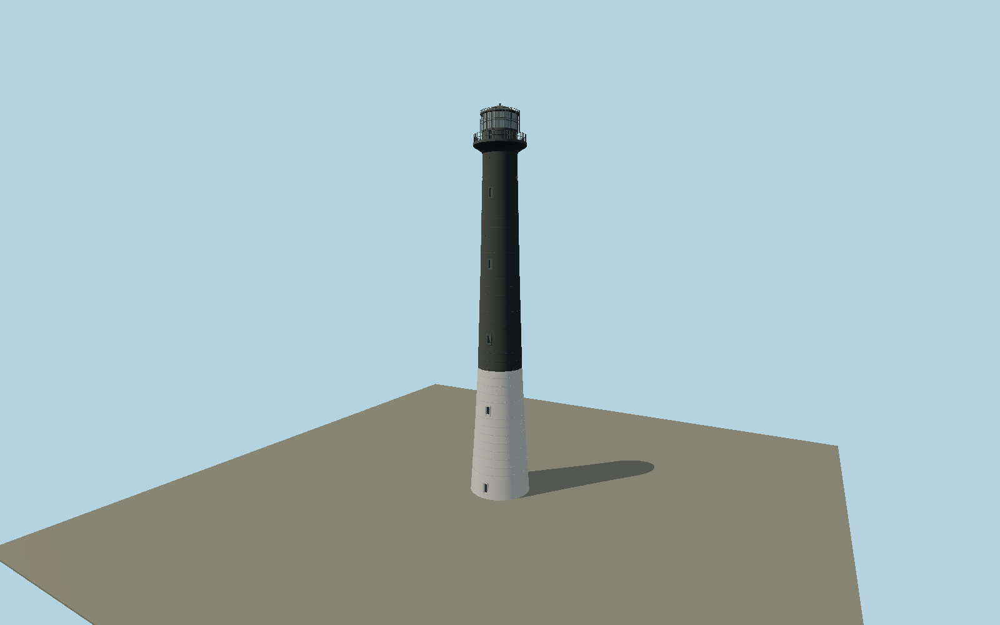

# Sõrve Lighthouse — N0648

Tall black-over-white tapered concrete shaft with subtle casting rings, sparse narrow windows, flared gallery and black double-caged lantern.

## Identity and evidence

Exact catalog identity **Q3376479**. Source facts: `{"heightMeters":53,"operatorCoordinate":[22.05536033,57.909826],"year":1960,"basis":"Estonian navigation-aid935 record publishes53.0m abovebase, superseding cached52m;52.5m focalheight is a different datum."}`. The source specification keeps published dimensions separate from reconstructed details.

- https://nma.transpordiamet.ee/aton/2632/
- https://nma.transpordiamet.ee/view_file/2400
- https://www.openstreetmap.org/way/1199536561

Original geometry and shared procedural materials. Official photographs are research references only; no reference imagery or third-party mesh is embedded or redistributed.

## Authored geometry and materials

51,662 triangles, 100,012 vertices, 3 surface groups; 4,222,728 source bytes. SHA-256: `sha256:39b43354e60b3b8915cf8aa2bc99355b57d1b74bc6f6831d41aa426f2d905b5c`. Actual bounds: -4.120, 0.000, -4.120 to 4.120, 53.000, 4.120 m.

Shared canonical material graphs with metric UV repeats in extras.molenSurface; portable glTF PBR factors and vertex colors remain. Dark recesses/lantern panels retain local fallback materials. Shared references: `matgraph:molen.worldgen.material.metal_painted` (2 × 2 m), `matgraph:molen.worldgen.material.concrete_plain` (2 × 2 m). Model-native axes: {"up":"+Y","front":"+Z","origin":"Authored main tower center at local base level; attached ensembles are offset from this origin."}.

## Placement proposal

Authority coordinate identifies tower center. Authored entrance faces -Z; mapped access path1199536561 ends at[22.0553305,57.9098546], 3.64m northwest of the center, resolving entrance heading0.505986351887rad. Circular lantern remains rotationally symmetric. Proposed anchor 22.05536033, 57.909826 (longitude, latitude), heading 0.505986351887 radians. Elevation policy: **terrain-contact**. This is a reviewable proposal, not a completed site-fit certification. Ground models require terrain contact; offshore models also require water-datum and base-height checks.

## Limitations and review

- The modeled exterior follows the cited published facts and inspected photographs. Unpublished dimensions and local fittings are explicitly photo-proportioned; no claim of engineering survey accuracy is made.
- Portable PBR and shared metric surfaces are provided. Surface weathering, material color under local lighting and fine facade relief require close render review before maximum-detail acceptance.
- Shaft radii, paint boundary height, opening elevations and casting seams are photo-proportioned. Navigation optics are static exterior glazing rather than an operational light simulation.

Near/far fixtures are in `spec.qaCameras`. Float32 finite geometry, triangle degeneracy and winding are checked by the generator. Current rendering, shared-material, maximum-fidelity and geographic review results are recorded in `qa.json` and the readiness ledger; source generation alone does not approve a model.

Regenerate with `node packages/worldgen/scripts/generate-lighthouse-models.mjs --ids=N0648`; add `--check` for reproducibility. Editable component recipes are in `packages/worldgen/scripts/lighthouse-offshore-models.mjs`. The generator protects artist-edited master hashes and preserves import/capture/shared-capture/QA documents.
