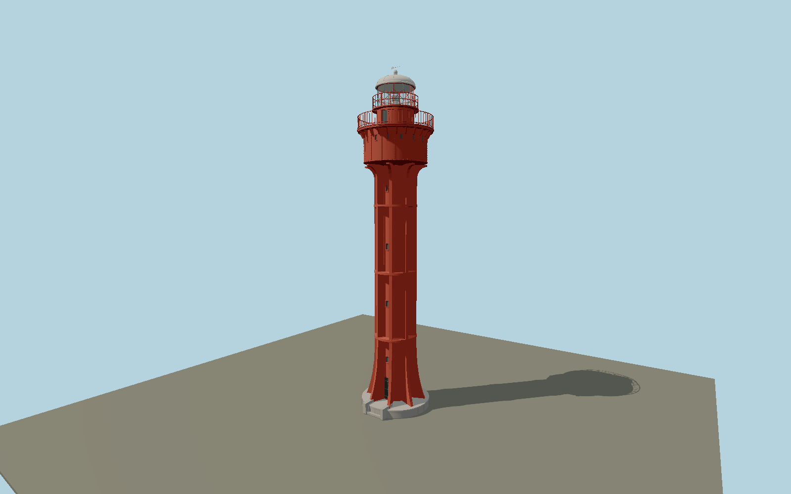

# Ristna Lighthouse — N0674

Bright red concrete-jacketed stair tube with eight full-height ribs, flared foot and upper supports, three horizontal braces, expanded riveted service room with sixteen small ports, scalloped gallery brackets, close picket rail, diamond-glazed lantern and white dome/vane.

## Identity and evidence

Exact catalog identity **Q3376573**. Source facts: `{"heightMeters":27.2,"focalHeightMeters":35.9,"serviceRoomDiameterMeters":5,"structuralRibs":8,"appearance":"Maintained red/white configuration following2026 completion of exterior restoration; no temporary scaffold.","basis":"Current ATON2844 gives27.2m height and coordinate. Lighthouse Society reproduces the National Archives1925 restoration elevation/sections, confirming eight ribs, three brace levels and service/lantern proportions. West Estonia industrial-heritage project gives5m service-room diameter. Authority2026 close photograph controls surviving details; photo-derived minor moldings remain explicit."}`. The source specification keeps published dimensions separate from reconstructed details.

- https://nma.transpordiamet.ee/aton/2844/
- https://www.etts.ee/tuletornide-nimekiri/ristna-tuletorn/
- https://www.etts.ee/wp-content/uploads/2023/09/ristna-4.jpg
- https://www.etts.ee/wp-content/uploads/2023/10/Ristna_tuletorn_2014.jpg
- https://westestonia.com/de/industrieerbe-tourismus/
- https://www.transpordiamet.ee/uudised/ehitustood-jatavad-ristna-tuletorni-kesksuveni-suletuks
- https://www.transpordiamet.ee/sites/default/files/2026-04/_MG_8067-15.jpg
- https://www.transpordiamet.ee/uudised/augustis-avavad-kulastajatele-uksed-kaks-uue-kuue-saanud-tuletorni

Original geometry and shared procedural materials. Official photographs are research references only; no reference imagery or third-party mesh is embedded or redistributed.

## Authored geometry and materials

68,696 triangles, 143,024 vertices, 5 surface groups; 5,833,356 source bytes. SHA-256: `sha256:d2bc7d7d4956ad0bd664630349566b77ced0583778b6522d8ebca7a0b634ad7c`. Actual bounds: -3.010, 0.000, -3.010 to 3.010, 27.200, 3.040 m.

Shared canonical material graphs with metric UV repeats in extras.molenSurface; portable glTF PBR factors and vertex colors remain. Dark recesses/lantern panels retain local fallback materials. Shared references: `matgraph:molen.worldgen.material.plaster_lime` (2 × 2 m), `matgraph:molen.worldgen.material.metal_painted` (2 × 2 m), `matgraph:molen.worldgen.material.stone_granite` (2 × 2 m). Model-native axes: {"up":"+Y","front":"+Z","origin":"Authored main tower center at local base level; attached ensembles are offset from this origin."}.

## Placement proposal

Authority coordinate fixes the tower within meters of exact-QIDnode3369819188. Native+Z doorway faces southeast, reconstructed from the2014 society aerial with western coast behind, the northern/eastern station buildings and the approach from Ristna majaka tee. This is a photographed quadrant reconstruction, not a surveyed doorway bearing; the eight-rib mass has45degree symmetry. Proposed anchor 22.05526516, 58.9400605 (longitude, latitude), heading 0.7853981634 radians. Elevation policy: **terrain-contact**. This is a reviewable proposal, not a completed site-fit certification. Ordinary ground models use terrain contact; Kiipsaare requires an offshore water/base-height check.

## Limitations and review

- The modeled exterior follows the cited published facts and inspected photographs. Unpublished dimensions and local fittings are explicitly photo-proportioned; no claim of engineering survey accuracy is made.
- Portable PBR and shared metric surfaces are provided. Surface weathering, material color under local lighting and fine facade relief require close render review before maximum-detail acceptance.
- Detailed exterior follows the documented post1920 concrete jacket, not the original1874 open iron frame. Published total height and5m service drum constrain a photographed/archival component reconstruction. Exact entrance azimuth and minor restored2026 vent fittings are not surveyed. Detached station buildings remain map structures.

Near/far fixtures are in `spec.qaCameras`. Float32 finite geometry, triangle degeneracy and winding are checked by the generator. Rendering, shared-material alignment, maximum-fidelity and geographic reviews remain pending until their hash-bound reports exist.

Regenerate with `node packages/worldgen/scripts/generate-lighthouse-models.mjs --ids=N0674`; add `--check` for reproducibility. Editable component recipes are in `packages/worldgen/scripts/lighthouse-models.mjs`. The generator protects artist-edited master hashes and preserves import/capture/shared-capture/QA documents.
