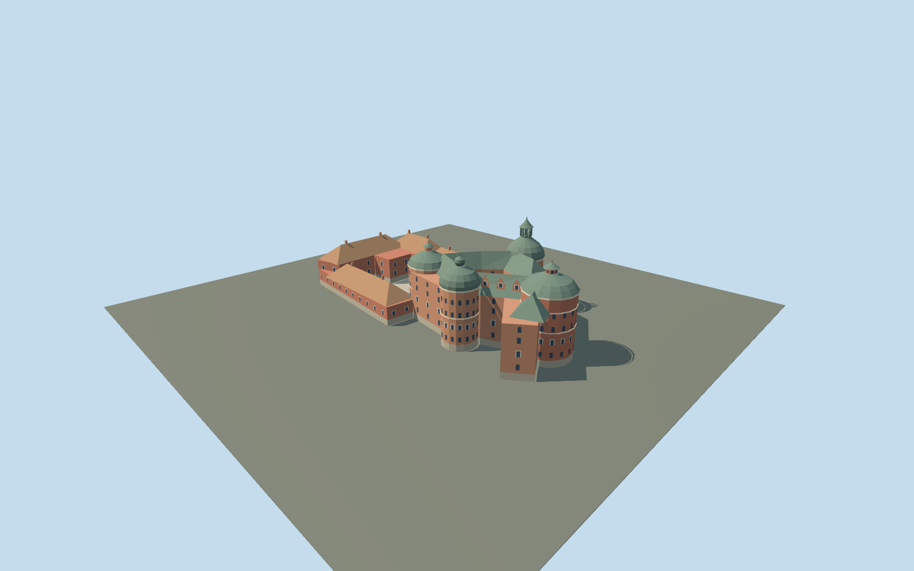

# Gripsholm Castle

Mapped Gripsholm brick castle with open inner and outer courts, four differentiated oxidized-copper tower caps, a tall open lantern, broad red helmet tower, onion cap, stepped brick dormers, low tiled wings and a real northwest entrance passage.

## Evidence and reconstruction

Published dimensions and reconstructed details are separated in spec.json. Primary references:

- [Reference](https://www.kungligaslotten.se/english/royal-palaces-and-sites/gripsholm-castle.html)
- [Reference](https://www.sfv.se/vara-fastigheter/sverige/sodermanlands-lan/gripsholms-slott)
- [Reference](https://www.kungligaslotten.se/download/18.7ce04b63167c576df6c18f72/1549446726603/Karta%20%C3%B6ver%20Gripsholms%20slott%20eng.pdf)
- [Reference](https://www.kungligaslotten.se/english/royal-palaces-and-sites/gripsholm-castle/visit-us/practical-information-access.html)
- [Reference](https://www.openstreetmap.org/relation/2848711)

No third-party geometry, photograph or bitmap texture is embedded. Shared surface graphs come from the central library; vertex tints carry model colors. Glazing uses PBR materials; transparent surfaces are declared per model.

## Model and axes

5,247 triangles; 15,549 vertices; 6 material groups; 626,436 bytes. Native bounds: -69.005, 0.000, -32.086 to 69.098, 42.000, 31.965. Source hash: `sha256:e483025ba991dcefc9228e9dd2340f4c4413f1e4ab8842877dca873f63e83717`.

{"up":"+Y","longitudinal":"+X southeast from outer forecourt toward the four-tower core","front":"Outer entrance at-X northwest;lake-facing facades around the core;two courts remain open","origin":"Mapped building rectangle center;provisional flat ground attachmentY=0"}

Exact mapped building ring and two courtyard holes retained. Official visitor map supplies entrance/core sign,not completed geographic review. Actual ground differences,shore approach,height datum and footprint replacement pending.

## Reproduce

Run `node packages/worldgen/scripts/generate-signature-towers.mjs --ids=N0279` (or add `--check`). The generator preserves manually edited masters by checking their baseline hashes. Import through the standard authored-model workflow with optimization disabled; then capture all QA cameras, including shared-surface views.

## Pending work

- Mapped parent outline and courtyard holes establish body plan. Tower centers/radii approximate arc fits;individual roof profiles,elevations,window positions,dormers and ornament are visual interpretations.
- No surveyed/published heights in the selected primary references. Tallest roof42m and body elevations are inferred proportions. Roof overhangs and lower-LOD facet approximations broaden the mapped envelope.
- Tower names have not been independently matched to each source-local arc;position/roof labels avoid claiming that identification. Photo-based cap assignments and northwest entrance sign remain subject to real-site review.
- FlatY0 does not represent actual ground differences,lake shore or island. Drawbridge,remote estate buildings,boats,trees and interiors excluded;model scope is the castle building compound.
- Geographic activation,terrain seating and footprint replacement pending;inactive research draft,replaceFootprint=false. Review context neighbors/flat ground are synthetic,not actual Mariefred terrain.
- Five shared256² graphs supply brick,granite,limestone,oxidized copper and roof tile;glass is untextured. Research photos/maps linked only. No fine mortar,thin glazing bars,carved ornament,wires or railings.
- Physical laptop/phone performance and continuous-motion LOD shimmer remain unmeasured.

This bundle follows the medium-fi standard. Medium-fi appearance and geographic fit are reviewed separately. Hash-bound visual acceptance is recorded separately after capture inspection.

## Additional geographic data

© OpenStreetMap contributors. The Royal Palaces/Swedish Royal Court and Statens Fastighetsverk primary references.
