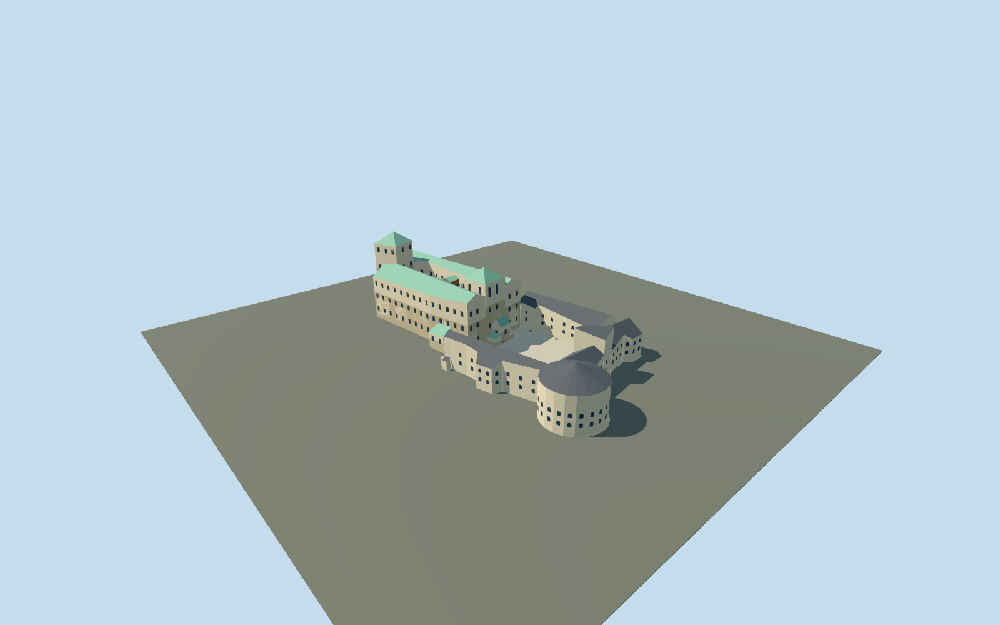

# Turku Castle

Current Turku Castle: west38m/east32m rectangular towers, pitched green copper main wings around two open courts and an elevated timber/glass gallery; white bailey/grey metal roofs, southeast round tower, lower annexes and three actual arched entrance passages.

## Evidence and reconstruction

Published dimensions and reconstructed details are separated in spec.json. Primary references:

- [Reference](https://api.openstreetmap.org/api/0.6/map?bbox=22.2253,60.4338,22.2315,60.4370)
- [Reference](https://turunlinna.fi/en/home-page/)
- [Reference](https://turunlinna.fi/sv/abo-slotts-historia/)
- [Reference](https://turunlinna.fi/en/getting-here/)
- [Reference](https://turunlinna.fi/wp-content/uploads/2025/02/Turun-linna009-Ania-Padzik.jpg)
- [Reference](https://turunlinna.fi/wp-content/uploads/2024/10/Turun-linnan-paalinnan-sisapiha-Henri-Taponen-Turun-kaupunki-WP.jpg)
- [Reference](https://www.vikingline.de/globalassets/images/destinations/finland/activities/turku-castle/aerial-view-turku-castle-visitturku-812x501.jpg)
- [Reference](https://kaupunkisuunnittelu.turku.fi/kaavoitus/5661-2019Yleisotilaisuusesitys2023ID11290-Valmisteluehdotus.pdf)

Seven existing shared256-square stone/lime plaster/copper/painted metal/timber/brick/gravel graphs with metric repeats and linear tints; flat glass. No embedded/new image, copied mesh or photo texture.

## Model and axes

6,844 triangles; 20,532 vertices; 8 material groups; 825,888 bytes. Native bounds: -70.559, 0.000, -33.523 to 70.894, 38.000, 32.784. Source hash: `sha256:48c1c41f347c996f1384fb2dca43b3ac5575b9791f2ea3763e9dbb6f27131cdd`.

{"up":"+Y","longitudinal":"Native+X east,+Z south, current WGS84 component traces; runtime heading0.","origin":"Exact castle horizontal map anchor. Provisional common ground/courtyard Y0; actual rocky rise and grades belong to host terrain."}

Exact-QID current castle outline and separate components retain native East/South heading0. Common courtyard Y0 is provisional; rocky west approach/grade attachment and exterior fidelity need site review.

## Reproduce

Run `node packages/worldgen/scripts/generate-signature-towers.mjs --ids=N0305` (or add `--check`). The generator preserves manually edited masters by checking their baseline hashes. Import through the standard authored-model workflow with optimization disabled; then capture all QA cameras, including shared-surface views.

## Pending work

- Native East/South mapped traces retain heading0. Coordinate arithmetic is not a visual site-fit approval.
- Official west/east tower totals38/32m and maximum3m wall thickness are preserved. Other OSM heights include mapper photo estimates; no common surveyed datum or facade measurement verified.
- Three mapped courtyards are open; timber/gallery bridge starts at mapped Y15. Original arch profiles, roof axes/pitches, facade bay spacing, patchy lime plaster and ground attachment remain estimated.
- Nearby merchants warehouses, wooden cottages, park, natural rocky rise, vegetation, port development and historic1827reconstruction are separate or excluded.
- Seven existing shared256-square stone, lime plaster, patinated copper, painted metal, timber, brick and gravel graphs. Linear palette tints and metric repeats; flat glass. No unique embedded/new texture or downloaded mesh.
- Research photos/PDF remain private references; only attribution and original numeric controls ship. City planning aerial is2023, not a2026survey.
- Interiors, heraldry, fine window grids, museum exhibits, accessibility ramps and walkable collision certification excluded or pending.
- Actual rock/grade attachment, exterior/geographic/medium-fi review and physical ordinary-laptop/phone performance remain pending.

This bundle follows the medium-fi standard. Medium-fi appearance and geographic fit are reviewed separately. Hash-bound visual acceptance is recorded separately after capture inspection.

## Additional geographic data

© OpenStreetMap contributors; City of Turku/Turku Castle Museum/Ania Padzik/Henri Taponen; VisitTurku; City of Turku/Terratec Oy.
