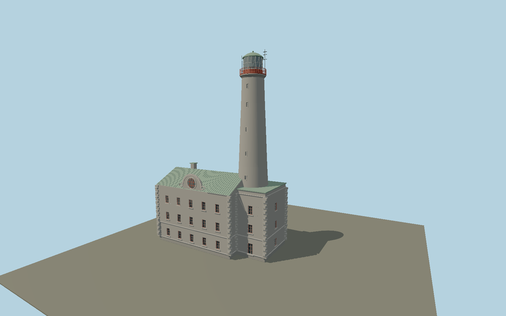

# Bengtskär Lighthouse — N0653

Granholm’s gray granite National Romantic keeper block with three storeys, divided red-brown windows, projecting quoins, copper gable roof and round-window curving pediment; long stone taper rises from its east end to a red gallery, white astragals and green copper lantern dome.

## Identity and evidence

Exact catalog identity **Q3737012**. Source facts: `{"heightMeters":46,"focalOrSeaElevationMeters":52,"year":1906,"architect":"Florentin Granholm","mainPlanMeters":[29.124,13.564],"basis":"NGA Pub195 identifies46m structure; operator52m is sea-relative elevation, not tower height. Main stepped plan from OSM1119816491 and tower center from1119816492. Storeys, detailed proportions and fittings reconstructed from current operator exterior photographs."}`. The source specification keeps published dimensions separate from reconstructed details.

- https://www.bengtskar.fi/en/home/
- https://www.bengtskar.fi/en/see-and-experience/worth-seeing-and-experiencing/
- https://www.bengtskar.fi/en/see-and-experience/the-dramatic-history-of-the-lighthouse/
- https://www.bengtskar.fi/wp-content/uploads/2024/11/taustakuva-vaalea-1-utvidgad.jpg
- https://msi.nga.mil/api/publications/download?key=16694491%2FSFH00000%2FPub195bk.pdf
- https://www.openstreetmap.org/way/1119816491
- https://www.openstreetmap.org/way/1119816492

Original geometry and shared procedural materials. Official photographs are research references only; no reference imagery or third-party mesh is embedded or redistributed.

## Authored geometry and materials

31,258 triangles, 60,026 vertices, 5 surface groups; 2,479,252 source bytes. SHA-256: `sha256:dd8a5e629af9cf155fd35939fcf451c2ceba0bfc7d7d470ba2ac8fe7506bd0a3`. Actual bounds: -23.532, 0.000, -5.821 to 6.568, 46.000, 8.723 m.

Shared canonical material graphs with metric UV repeats in extras.molenSurface; portable glTF PBR factors and vertex colors remain. Dark recesses/lantern panels retain local fallback materials. Shared references: `matgraph:molen.worldgen.material.stone_ashlar` (2.4 × 1.5 m), `matgraph:molen.worldgen.material.metal_painted` (2 × 2 m), `matgraph:molen.worldgen.material.stone_granite` (2 × 2 m), `matgraph:molen.worldgen.material.wood_plain` (2 × 0.25 m). Model-native axes: {"up":"+Y","front":"+Z","origin":"Authored main tower center at local base level; attached ensembles are offset from this origin."}.

## Placement proposal

Mapped circular tower-part centroid is the model origin. Main building long axis fixes heading0.068090906725rad; residential block extends west and round-window pediment faces south. Host terrain supplies the rock-island contact;52m sea elevation is not applied as building height. Proposed anchor 22.499259431579, 59.723439410526 (longitude, latitude), heading 0.068090906725 radians. Elevation policy: **terrain-contact**. This is a reviewable proposal, not a completed site-fit certification. Ordinary ground models use terrain contact; Kiipsaare requires an offshore water/base-height check.

## Limitations and review

- The modeled exterior follows the cited published facts and inspected photographs. Unpublished dimensions and local fittings are explicitly photo-proportioned; no claim of engineering survey accuracy is made.
- Portable PBR and shared metric surfaces are provided. Surface weathering, material color under local lighting and fine facade relief require close render review before maximum-detail acceptance.
- Asset is the main connected lighthouse/keeper building. Detached island outbuildings, trenches and natural rock are separate map features. Individual battle marks and stone blocks are represented by shared granite surface rather than invented documentary damage.

Near/far fixtures are in `spec.qaCameras`. Float32 finite geometry, triangle degeneracy and winding are checked by the generator. Rendering, shared-material alignment, maximum-fidelity and geographic reviews remain pending until their hash-bound reports exist.

Regenerate with `node packages/worldgen/scripts/generate-lighthouse-models.mjs --ids=N0653`; add `--check` for reproducibility. Editable component recipes are in `packages/worldgen/scripts/lighthouse-models.mjs`. The generator protects artist-edited master hashes and preserves import/capture/shared-capture/QA documents.
