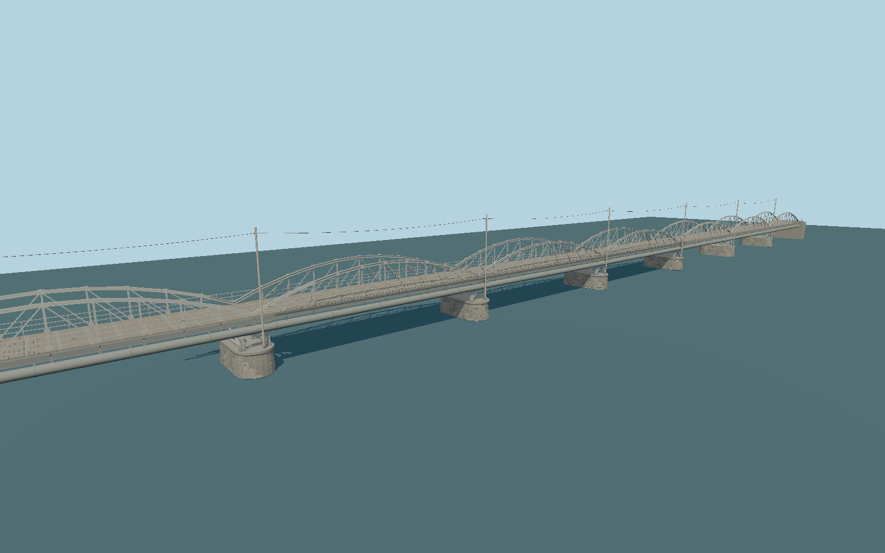

# Gamla bron, Umeå — N0003

Ten shallow polygonal bowstring steel-truss spans above a narrow pedestrian deck, carried on open X-braced steel trestles and coursed masonry piers; riveted structural flanges, deck joists, three-bar parapets, the visible utility main, pole line and low lighting fittings.

## Identity and evidence

This is **Wikidata Q3603782**, the old bridge in Umeå, Sweden. The municipality dates its opening to 1863. The heritage inventory records **301 m and ten spans**; the current steel structure dates to 1894–1895. Original 2023 and municipal 2022 photographs establish the shallow polygonal bowstring trusses **above** the deck, open steel trestles, rounded masonry piers, utility pipe and pole line.

The exact-identity OSM outline has a **309.007 × 6.695 m envelope**. That envelope is retained separately from the nominal 301 m structural length. This model divides the published structure into ten equal 30.1 m spans and adds compact abutments to a 309 m full extent; the published structural length and mapped envelope remain distinct; the short abutment extensions are a photographic reconstruction.

## Original geometry

Authored in `packages/worldgen/scripts/gamla-bron-model.mjs`: paired bowstrings and lattice webs, built-up I-section chords and trestles, gussets and bolt heads, deck boards and joists, three-bar railings, masonry course seams, pipe collars and brackets, utility poles and wire, and low lighting fittings.

156,768 source triangles; 292,148 vertices; 6 material groups; 12,402,144 bytes. SHA-256: `sha256:5eed00e4226f063f6e80b67517271c8874a8ddd3be04c9c87fc366b80742dd55`. Actual bounds: -154.500, -0.012, -4.225 to 154.500, 14.200, 4.225 m.

Up +Y, bridge length +X, transverse +Z. Origin is the horizontal midpoint of the nominal span system. **Y=0 is the reconstructed exposed-pier/river surface**, provisionally sea-level zero in the viewer. Native +X faces NNE toward the city bank, and +Z carries the downstream ESE pipe and pole line. Seasonal river level and exact bank grading depend on host data.

## Sources and rights

- https://lm.umea.se/namnkarta/poi/169FBA25/GamlaBron
- https://cust.kulturhotell.se/c57/files/original/d159921d56a1108490233d10d341a16a.pdf
- https://www.designatljus.eu/projekt/gamla-bron-umea
- https://via.tt.se/pressmeddelande/3317479/gamla-bron-i-umea-tands-upp-i-ukrainas-farger?publisherId=1422393
- https://commons.wikimedia.org/wiki/File:Gamla_bron,_Ume%C3%A5,_2023-10-16,_fr%C3%A5n_sidan.jpg
- https://commons.wikimedia.org/wiki/File:Gamla_bron_Ume%C3%A5_2007-06-24.jpg
- https://www.openstreetmap.org/way/454463632

The 2023 original photograph is by Axel Pettersson (CC BY 4.0); the 2007 photograph is by Mikael Lindmark (CC BY-SA 2.5). Both are visual research references, with no photographic content embedded or redistributed. Municipal and contractor references retain their own rights. OSM dimensional evidence © OpenStreetMap contributors, ODbL. Geometry is original and follows the repository license.

## Verification and limitations

- The 301 m nominal structural length and 309.007 m mapped envelope are retained separately. Four-meter approach/abutment extensions at each end are a visual reconstruction, not proof of the exact endpoint relationship.
- Width, height, individual span/pier stationing, stone courses, steel member sections, rivet pattern, pipe fittings and pole spacing are proportioned from photographs and remain unverified.
- No historic timber reconstruction, proposed 2026 architectural intervention, colored temporary festival lighting, embedded reference photos, submerged foundations or engineering collision model is included.
- The current model is a photographic exterior reconstruction using shared materials. River-surface elevation0m is provisional, and exact bank grading and changing water level remain host-dependent; hash-bound visual and geographic reviews are recorded separately in qa.json.

The deck height, truss rise, widths, steel sections, individual stone/fastener patterns, utility fittings and equal span stationing are photo-proportioned estimates. No engineering drawing or vertical survey has validated these details. Surfaces use canonical shared granite, painted metal and plain timber with metric UVs and original component tints. Timber grain runs across the deck along each plank and vertically on the utility poles. This is a detailed exterior reconstruction; current rendered, placement and fidelity approvals are recorded in qa.json.

Regenerate with `node packages/worldgen/scripts/generate-gamla-bron.mjs`; verify reproducibility with `--check`. The generator protects artist-edited masters against the source-manifest hash, and preserves existing QA/import/capture documents. Import through the normal Molen workflow with optimization disabled. The source scene and named near/far QA cameras are ready for rendered review; see the capture/QA documents when present.
