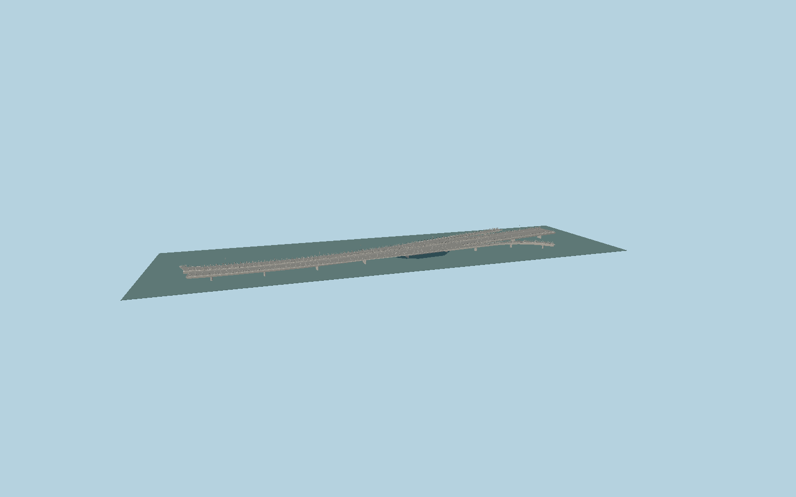

# Kyrkbron

Two separately curved low concrete box-girder decks with open central gap, independently branching northern ramps, capsule piers, steel bearings, shared cycleway, metal parapets, road markings, drain pipes and low-arm street lighting.

## Evidence

- [Primary reference](https://lm.umea.se/namnkarta/poi/14076CF0/Kyrkbron)
- [Primary reference](https://www.umu.se/sidan-68/tema-2-uppror/kyrkbron/)
- [Primary reference](https://www.umea.se/upplevaochgora/idrottmotionochfriluftsliv/friluftslivochmotion/batarochhamnar.4.7d7d901172bb372c5d3c03.html)
- [Primary reference](https://commons.wikimedia.org/wiki/File:Kyrkbron_pelare_2011-08-31.jpg)
- [Primary reference](https://commons.wikimedia.org/wiki/File:Kyrkbron.jpg)
- [Primary reference](https://www.openstreetmap.org/way/454759226)

Published dimensions and reconstruction assumptions are separated in spec.json. Source photos were consulted; no photos or third-party geometry are embedded. Map plan attribution: © OpenStreetMap contributors, ODbL-1.0.

## Source

389022 triangles; 30596064 bytes; 4 material groups. SHA256: sha256:9fad1650dc3af20f32c8f256dffe18021f358b8cb74aba89b10cf2292d3f2cde.

Shared surfaces (concrete_plain, metal_painted) are loaded through the central library; any transparent materials use local PBR parameters. Axis and provisional vertical datum are in spec.json.

Regenerate with node packages/worldgen/scripts/generate-researched-bridges.mjs --ids=N0010; append --check to verify. Import and capture through the standard next-1000 scripts. Geometry validation does not substitute for current-frame visual review.

## Reconstruction limits

- Original exterior reconstruction; the published municipal navigation clearance is distinguished from photographic deck depth and pier stationing.
- Map envelope includes branch ramps. It is not a91m-wide single deck; unrelated wooden bank footbridges and the separate upstream Tegsvägen crossings are omitted.
- Original field photographs by MikaelLindmark(2011,CCBYSA3.0) and DagLindgren(2010) were consulted for structure. No photographs or third-party mesh are embedded.
- Normal water level is represented at provisional sea level0; exact stage and bank integration require host terrain/water agreement.
