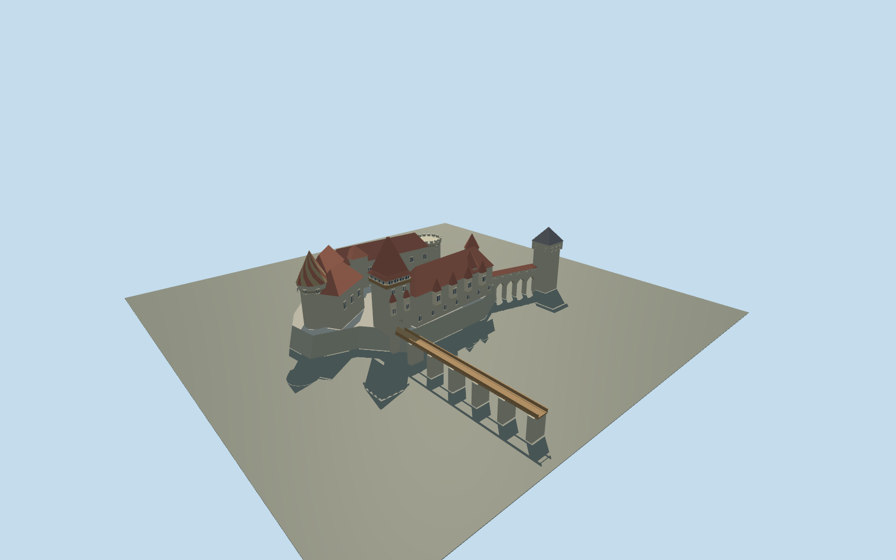

# Corvin Castle

Current Gothic-Renaissance exterior with steep flared gate roof,painted conical tower,four projecting palace oriels,open court loggia,long timber entrance bridge and detached Neboisa tower on a narrow arched gallery.

## Evidence and reconstruction

Published dimensions and reconstructed details are separated in spec.json. Primary references:

- [Reference](https://www.castelulcorvinilor.ro/turul-castelului/)
- [Reference](https://www.castelulcorvinilor.ro/wp-content/uploads/2016/05/home-wine-slide-1.jpg)
- [Reference](https://www.castelulcorvinilor.ro/wp-content/uploads/2016/05/home-wine-slide-2.jpg)
- [Reference](https://www.castelulcorvinilor.ro/wp-content/uploads/2016/05/turnul-de-poarta.jpg)
- [Reference](https://www.castelulcorvinilor.ro/wp-content/uploads/2016/05/curtea-interioara.jpg)
- [Reference](https://www.castelulcorvinilor.ro/wp-content/uploads/2016/05/detalii-de-arhitectura.jpg)
- [Reference](https://www.openstreetmap.org/way/1327914056)

No third-party geometry, photograph or bitmap texture is embedded. Shared surface graphs come from the central library; vertex tints carry model colors. Glazing uses PBR materials; transparent surfaces are declared per model.

## Model and axes

5,936 triangles; 17,808 vertices; 6 material groups; 715,876 bytes. Native bounds: -62.600, 0.000, -94.000 to 65.205, 45.000, 35.190. Source hash: `sha256:4a40af1bb4f94a1349e8c0ccb4c02633956382953d69733285d014fb60b676d3`.

{"up":"+Y","lateral":"+X along cached long axis, toward main northern end","longitudinal":"+Z across courtyard; bridge projects toward -Z","origin":"Cached mapped envelope center; Y0 at estimated valley attachment plane, castle court Y9."}

Original approximate exterior study with cached mapped boundary;inactive pending real-site/terrain review.

## Reproduce

Run `node packages/worldgen/scripts/generate-signature-towers.mjs --ids=N0285` (or add `--check`). The generator preserves manually edited masters by checking their baseline hashes. Import through the standard authored-model workflow with optimization disabled; then capture all QA cameras, including shared-surface views.

## Pending work

- Current exterior study; roof arrangement and broad Gothic gallery/oriel identity are original approximate interpretations of operator photographs. Exact internal footprints and four named small tower positions need review.
- Cached exterior outline retained as evidence,not filled as a solid castle. Separate main rock plinth and detached Neboisa footing are estimated; low gallery arches remain open. Main entrance bridge71m estimated,not mapped or surveyed.
- Reported gate22m height definition uncertain:study uses22m body plus14m estimated roof aboveY9 courtyard. Painted tower30m interpreted as body plus roof;all remaining heights estimates.
- Four oriels and selected broad Gothic openings/court loggia modeled,not complete tracery,individual joints,thin rails,finials,flags,statues,interiors or modern fixtures.
- Shared256²limestone,terracotta tile,slate and wood graphs;vertex palettes,metricUVs,no research imagery,unique textures or baked shading.
- Synthetic Balkan-konak context supplies style comparison only. Inactive geographic draft,replaceFootprint=false. Exact signed direction,bridge gradient,terrain and base datum require in-world review. Physical devices and actual adaptive-streaming path unmeasured.

This bundle follows the medium-fi standard. Medium-fi appearance and geographic fit are reviewed separately. Hash-bound visual acceptance is recorded separately after capture inspection.

## Additional geographic data

© OpenStreetMap contributors;Corvin Castle operator primary factual/photo references.
