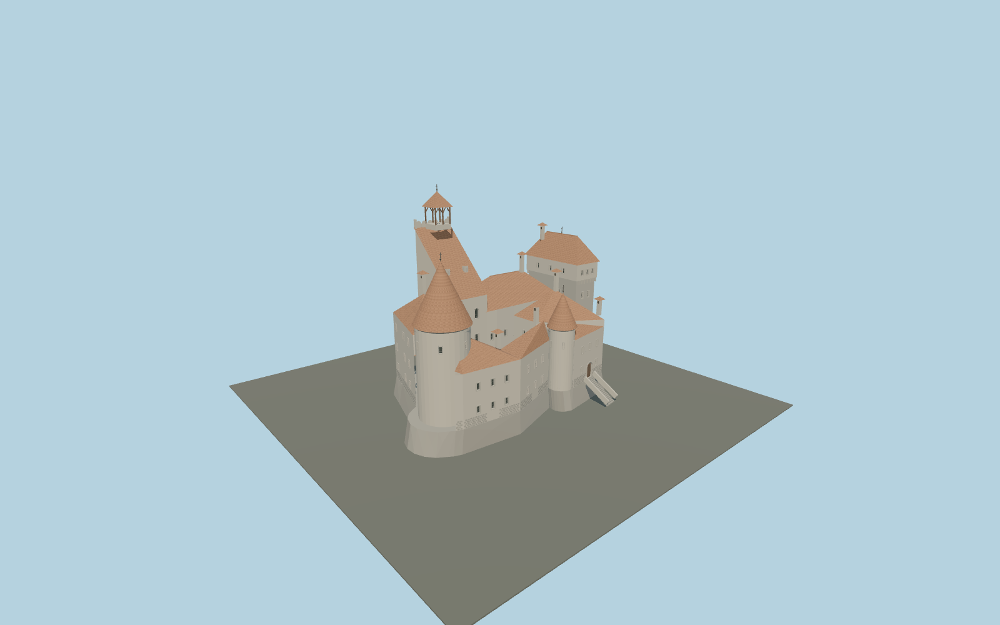

# Bran Castle

Asymmetric Transylvanian castle with mapped open courtyard, round western tower, steep single-slope keep roof, scalloped rear parapet and timber belfry, projecting eastern tower chamber, south stair turret, arched galleries, well and entrance stairs.

## Evidence and reconstruction

Published dimensions and reconstructed details are separated in spec.json. Primary references:

- [Reference](https://bran-castle.com/pages/historical-chronology)
- [Reference](https://bran-castle.com/pages/bran-fortress)
- [Reference](https://bran-castle.com/pages/visitor-map)
- [Reference](https://www.openstreetmap.org/relation/3300200)
- [Reference](https://commons.wikimedia.org/wiki/File:Bran_Castle,_Transylvania_(2023).jpg)
- [Reference](https://commons.wikimedia.org/wiki/File:Bran_castle_courtyard.jpg)
- [Reference](https://commons.wikimedia.org/wiki/File:Bran_castle_courtyard_round_tower.jpg)

No third-party geometry, photograph or bitmap texture is embedded. Shared surface graphs come from the central library; vertex tints carry model colors. Glazing uses PBR materials; transparent surfaces are declared per model.

## Model and axes

145,600 triangles; 333,850 vertices; 8 material groups; 13,770,396 bytes. Native bounds: -24.800, 0.000, -14.267 to 24.800, 40.400, 18.009. Source hash: `sha256:1d40b097ab6f1765fa729f7b06db09811704bac68fee1c3ed384422ff4987bff`.

{"up":"+Y","longitudinal":"+X 39.51 degrees south of east","front":"+Z southwest","origin":"OSM castle anchor, provisional local rock contact"}

Draft until hill contact, vertical datum and fitted individual tower footprints are checked in the world viewer.

## Reproduce

Run `node packages/worldgen/scripts/generate-signature-towers.mjs --ids=N0248` (or add `--check`). The generator preserves manually edited masters by checking their baseline hashes. Import through the standard authored-model workflow with optimization disabled; then capture all QA cameras, including shared-surface views.

## Pending work

- Maximum fidelity remains pending: mapped horizontal layout is retained but measured elevations, roof valleys and obscured window positions require refinement.
- OSM height tags from 50 to 73 m have an unresolved common datum. The authored local heights are photographic estimates, not a survey.
- The courtyard gallery, well ironwork, scalloped keep parapet, entrance portal, chimneys and window rhythms use photographic proportions. Interior rooms, artworks and furniture are outside this exterior asset.
- The four-meter rock contact is not the full hill. Park, forest, approach paths and terrain fitting remain separate.
- Shared procedural plaster, stone, timber, ceramic tile and metal avoid embedded images. Plaster weathering and the distinctive rounded tile pattern need further material-specific refinement.

This bundle contains source geometry, not a claim of maximum-fidelity completion. Hash-bound visual acceptance is recorded separately after capture inspection.

## Additional geographic data

Map geometry © OpenStreetMap contributors, ODbL-1.0. Photographs and official visitor map are references only; no pixels or third-party mesh copied.
