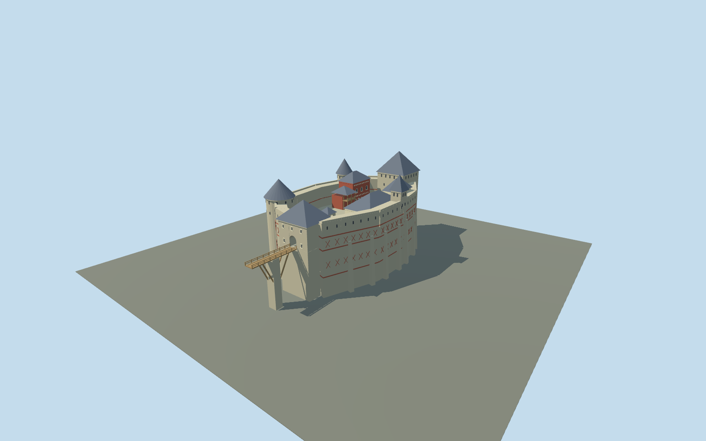

# Khotyn Fortress

Five-tower inner citadel with tall curved stone walls, red-brick geometric bands, shingled roofs, open courtyard, palace, chapel, well and wooden entrance bridge. The surrounding Ottoman earthworks are outside this model.

## Evidence and reconstruction

Published dimensions and reconstructed details are separated in spec.json. Primary references:

- [Reference](https://khotynska-fortecya.cv.ua/mapa_forteci)
- [Reference](https://khotynska-fortecya.cv.ua/istoriya-khotynskoyi-fortetsi-en)
- [Reference](https://www.openstreetmap.org/relation/8520372)

No third-party geometry, photograph or bitmap texture is embedded. Shared surface graphs come from the central library; vertex tints carry model colors. Glazing uses PBR materials; transparent surfaces are declared per model.

## Model and axes

8,615 triangles; 17,621 vertices; 5 material groups; 740,964 bytes. Native bounds: -32.137, 0.000, -54.300 to 29.400, 54.000, 75.640. Source hash: `sha256:1ee9d2ca9c81ab2bdf617202b1e5458b64c6332a189e1478f4a27ad656e55e69`.

{"up":"+Y","longitudinal":"+Z approximately SSE toward entrance","front":"+Z entrance bridge","origin":"Reconstructed citadel center; lowest foundation Y=0, courtyard Y=24"}

Exact-QID relation covers outer earthworks, not this inner citadel. Candidate coordinate and approximate signed orientation are draft only. Synthetic foundation datum is not a sampled terrain elevation; do not replace the entire relation.

## Reproduce

Run `node packages/worldgen/scripts/generate-signature-towers.mjs --ids=N0260` (or add `--check`). The generator preserves manually edited masters by checking their baseline hashes. Import through the standard authored-model workflow with optimization disabled; then capture all QA cameras, including shared-surface views.

## Pending work

- The native plan is an original reconstruction from the reserve diagram, not a surveyed footprint. West-tower 5m published diameter has an ambiguous internal/external datum; 9m exterior is a photographic estimate.
- Foundation depth, courtyard level, bridge piers and adjoining ground are schematic. The wider outer fortress, moat terrain and church beyond the citadel are excluded.
- Brick crosses, window rhythm, stairs and wooden fittings are selectively abstracted under medium-fi. Closed interiors and the 50m well shaft are omitted.
- Procedural-neighbor context is a style and LOD review, not evidence of geographic fit.

This bundle follows the medium-fi standard. Medium-fi appearance and geographic fit are reviewed separately. Hash-bound visual acceptance is recorded separately after capture inspection.

## Additional geographic data

Map identity © OpenStreetMap contributors, ODbL-1.0. Reserve images are linked references, not redistributed textures or geometry.
