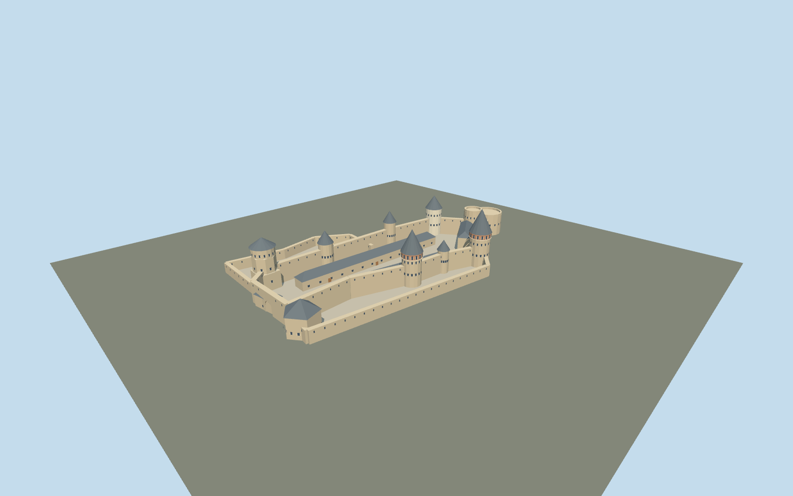

# Kamianets-Podilskyi Castle

Kamianets Old Castle:irregular open court,faceted Papal southeast tower with broad cap,two tall conical northern towers with warm arched crowns,pentagonal New East gate corner,open paired western bastion and lower outer courts with low casemate roofs.

## Evidence and reconstruction

Published dimensions and reconstructed details are separated in spec.json. Primary references:

- [Reference](https://tovtry.com/ua/history/secinski/zamki/text_full.html)
- [Reference](https://kam-pod.gov.ua/turistu/item/159-turystychni-marshruty)
- [Reference](https://kamianets.travel/en/location/starii-zamok-kamianec-podilskii)
- [Reference](https://niazkamenec.org.ua/bezbaryernyst-pamyatok/355-meta-bezbaryernyst-pamyatok.html)
- [Reference](https://www.openstreetmap.org/way/274749273)

No third-party geometry, photograph or bitmap texture is embedded. Shared surface graphs come from the central library; vertex tints carry model colors. Glazing uses PBR materials; transparent surfaces are declared per model.

## Model and axes

4,182 triangles; 12,234 vertices; 6 material groups; 494,304 bytes. Native bounds: -91.900, 0.000, -62.491 to 96.732, 35.000, 50.586. Source hash: `sha256:564cf387f7ff1641251bf7eda0f9c84e70b04246ab66d7392c3caee6173c9eae`.

{"up":"+Y","longitudinal":"+X toward northwest end / New West tower; -X toward southeast entry and Papal tower","front":"Northern cone towers and lower gate court at+Z;Papal/southern chain at-Z","origin":"Reference identity coordinate,not surveyed courtyard center; provisional flat courtyard attachmentY=0"}

Whole mapped boundary includes defenses/approach and is not extruded as a building. Exact old-castle orientation,position,terrain and footprint replacement need in-world review.

## Reproduce

Run `node packages/worldgen/scripts/generate-signature-towers.mjs --ids=N0278` (or add `--check`). The generator preserves manually edited masters by checking their baseline hashes. Import through the standard authored-model workflow with optimization disabled; then capture all QA cameras, including shared-surface views.

## Pending work

- Published historic approximate180m long/50m wide descriptions and traced plan establish hierarchy,not a current metric tower survey. Diagram is scaled anisotropically;individual tower centers,dimensions,heights,roof pitches and facades remain interpretations.
- All tower heights are inferred;maximum35m is a visual proportion target,not verified measurement. Native reference anchor is not surveyed courtyard center;NW/SE sign is interpreted and exact angle/position remain pending.
- Historical1928 plan and roof descriptions differ from current restoration. Current municipal photo guides tall conical north roofs,broad Papal cap and open western bastion;fine crown/window details are approximate. No removed1876 Stanislaw gate or destroyed Black tower is recreated.
- Separate New Castle hornwork,river-level Water tower,canyon terrain,city bridge and adjoining city fortifications excluded. FlatY0 does not represent real levels;outer courts have simplified attachment elevations.
- Geographic placement,terrain seating and footprint replacement pending;inactive draft,replaceFootprint=false. Synthetic context views are not actual Kamianets map data.
- No research photo ships as texture. Shared256² graphs supply limestone,brick,lime plaster,shingle and plain wood. Fine stone joints,carved coats of arms,thin rails,wires and interiors omitted under medium-fi.
- Physical laptop/phone performance and continuous-motion LOD shimmer remain unmeasured.

This bundle follows the medium-fi standard. Medium-fi appearance and geographic fit are reviewed separately. Hash-bound visual acceptance is recorded separately after capture inspection.

## Additional geographic data

© OpenStreetMap contributors. Original Sitsinsky survey hosted by Podilski Tovtry National Nature Park;Kamianets City Council,municipal tourism and National Architectural Reserve primary references.
