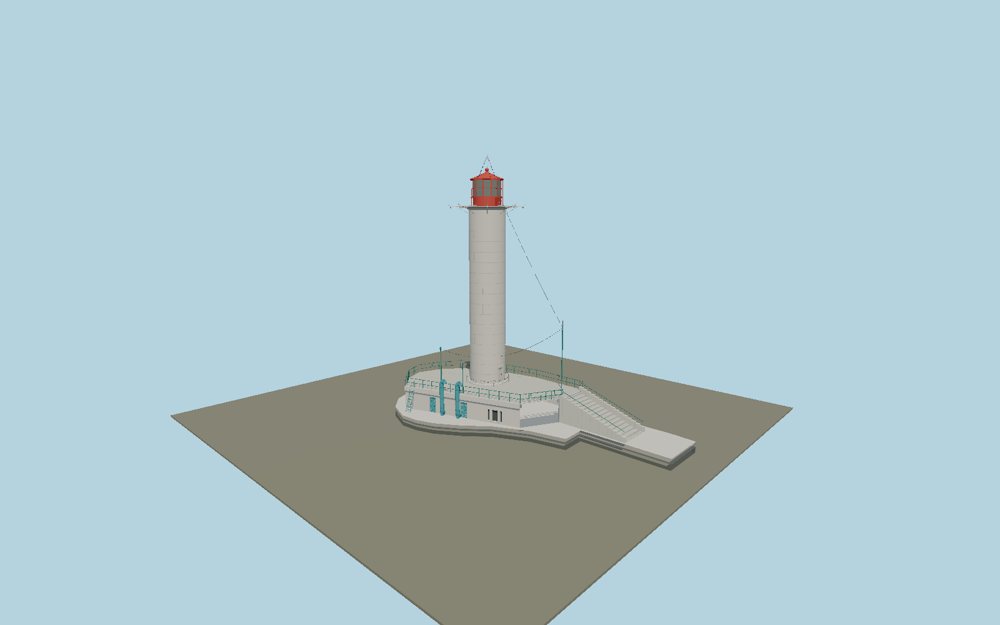

# Vorontsov Lighthouse — N0667

White jointed cylindrical cast-iron tower with sparse portholes, projecting circular gallery and eight light arms, red caged lantern and shallow roof, paired blue cowled pipes, harbor-side service doors, tiered white platform, deck railings, chain barrier and breakwater access stair.

## Identity and evidence

Exact catalog identity **Q1976702**. Source facts: `{"towerHeightMeters":26,"focalHeightMeters":27,"appearanceEra":"Operator photographs published2018–2019","towerBaseAboveModelDatumPhotoApproxMeters":4,"bodyDiameterPhotoApproxMeters":4.32,"basis":"Ukraine State Hydrography publishes26m tower height from base and27m focal elevation. Its two station photographs control the cylindrical section joints, red lantern, radial brackets, blue service fittings and asymmetric white compound. Tower cap is at30m over model sea datum and main tower base at4m, with lantern focal center27m. Thin aerial tip extends above the documented tower envelope. Compound plan is derived from exact tower-QID node and adjoining coastline ways; small exterior dimensions remain photo-proportioned."}`. The source specification keeps published dimensions separate from reconstructed details.

- https://hydro.gov.ua/?page_id=381
- https://hydro.gov.ua/?p=1262
- https://hydro.gov.ua/wp-content/uploads/2018/09/1-19.png
- https://hydro.gov.ua/wp-content/uploads/2019/06/64799486_646013762541915_8439423072338968576_n.jpg
- https://www.openstreetmap.org/node/703128124
- https://www.openstreetmap.org/way/555774482
- https://www.openstreetmap.org/way/1035205249

Original geometry and shared procedural materials. Official photographs are research references only; no reference imagery or third-party mesh is embedded or redistributed.

## Authored geometry and materials

54,128 triangles, 102,790 vertices, 5 surface groups; 4,353,236 source bytes. SHA-256: `sha256:4b5dbd6cb1816d93d83a361ddce9882f62bd996c120c31a0694a5f30eb518c2c`. Actual bounds: -10.041, 0.000, -10.292 to 6.156, 31.181, 24.000 m.

Shared canonical material graphs with metric UV repeats in extras.molenSurface; portable glTF PBR factors and vertex colors remain. Dark recesses/lantern panels retain local fallback materials. Shared references: `matgraph:molen.worldgen.material.plaster_lime` (2 × 2 m), `matgraph:molen.worldgen.material.stone` (2 × 2 m), `matgraph:molen.worldgen.material.metal_painted` (2 × 2 m), `matgraph:molen.worldgen.material.concrete_plain` (2 × 2 m). Model-native axes: {"up":"+Y","front":"+Z","origin":"Authored main tower center at local base level; attached ensembles are offset from this origin."}.

## Placement proposal

Exact-QID tower node anchors the cylinder. +Z follows the south-southeast pier axis (0.5rad from south toward east); compound shoreline points are inverse-rotated from world coordinates. The model waterline isY0, quay body rises above it and lighthouse service deck isY4. Absolute sea-level placement retains the operator’s27m light elevation; local tides/waves are host water effects. Published compound photographs resolve harbor-facing service facade on the southwest side. Proposed anchor 30.7600343, 46.4965348 (longitude, latitude), heading 0.5 radians. Elevation policy: **sea-level**. This is a reviewable proposal, not a completed site-fit certification. Ground models require terrain contact; offshore models also require water-datum and base-height checks.

## Limitations and review

- The modeled exterior follows the cited published facts and inspected photographs. Unpublished dimensions and local fittings are explicitly photo-proportioned; no claim of engineering survey accuracy is made.
- Portable PBR and shared metric surfaces are provided. Surface weathering, material color under local lighting and fine facade relief require close render review before maximum-detail acceptance.
- Exterior represents the operator-published2018–2019 configuration. Hidden power-room equipment and unlocated later solar equipment are not invented; external service fittings visible in those references are represented. Published26m structural and27m light heights govern the silhouette; service-deck height, pipe details and cast-iron seam pitch are reconstructed from photographs. The remaining long breakwater is a separate map structure.

Near/far fixtures are in `spec.qaCameras`. Float32 finite geometry, triangle degeneracy and winding are checked by the generator. Current rendering, shared-material, maximum-fidelity and geographic review results are recorded in `qa.json` and the readiness ledger; source generation alone does not approve a model.

Regenerate with `node packages/worldgen/scripts/generate-lighthouse-models.mjs --ids=N0667`; add `--check` for reproducibility. Editable component recipes are in `packages/worldgen/scripts/lighthouse-blacksea-models.mjs`. The generator protects artist-edited master hashes and preserves import/capture/shared-capture/QA documents.
