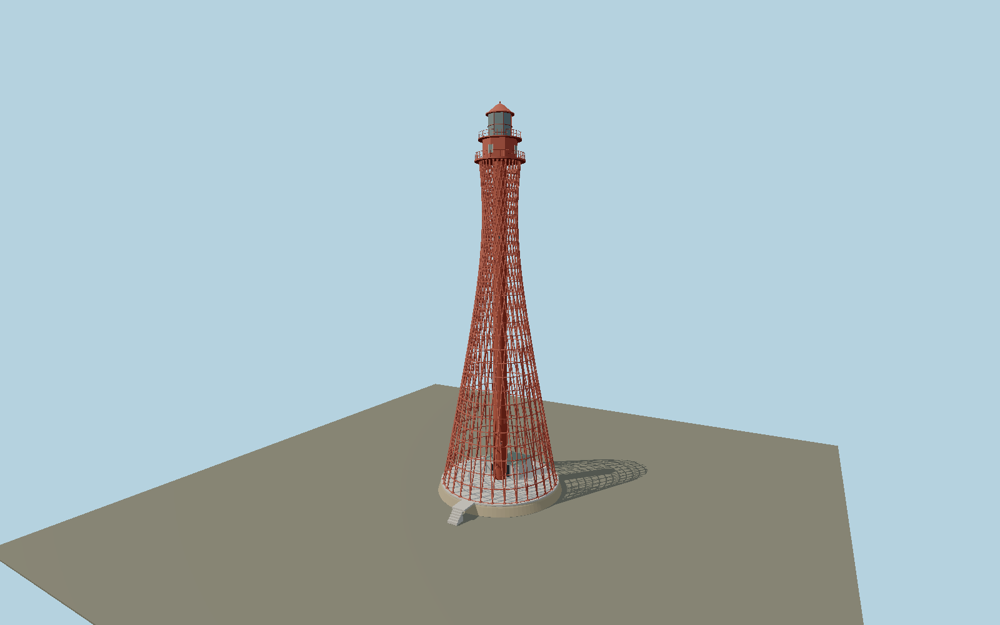

# Stanislav-Adziogol Lighthouse — N0649

Red open hyperboloid lattice with two families of straight inclined steel members, circular horizontal ties, central stair tube, lower service room and tiered red lantern cabin.

## Identity and evidence

Exact catalog identity **Q380270**. Source facts: `{"heightMeters":64,"basis":"Ukrainian hydrographic operator states64m abovebase and67m focalheight; this supersedes the conflicting76m OSM value.","referenceAppearance":"Operator archive photograph, original intact exterior; current condition is not established by this archive."}`. The source specification keeps published dimensions separate from reconstructed details.

- https://hydro.gov.ua/?page_id=335
- https://hydro.gov.ua/wp-content/uploads/2018/09/6-2.png
- https://hydro.gov.ua/?p=1574
- https://www.openstreetmap.org/way/702157400
- https://www.openstreetmap.org/way/444105312

Original geometry and shared procedural materials. Official photographs are research references only; no reference imagery or third-party mesh is embedded or redistributed.

## Authored geometry and materials

44,792 triangles, 86,864 vertices, 5 surface groups; 3,580,952 source bytes. SHA-256: `sha256:b35c8ad91d9a0cd6d2471bbce5cb82b170831fd36fe32e385961af81b98f1110`. Actual bounds: -10.500, 0.000, -10.500 to 10.500, 64.000, 14.400 m.

Shared canonical material graphs with metric UV repeats in extras.molenSurface; portable glTF PBR factors and vertex colors remain. Dark recesses/lantern panels retain local fallback materials. Shared references: `matgraph:molen.worldgen.material.plaster_lime` (2 × 2 m), `matgraph:molen.worldgen.material.stone` (2 × 2 m), `matgraph:molen.worldgen.material.metal_painted` (2 × 2 m), `matgraph:molen.worldgen.material.concrete_plain` (2 × 2 m). Model-native axes: {"up":"+Y","front":"+Z","origin":"Authored main tower center at local base level; attached ensembles are offset from this origin."}.

## Placement proposal

Mapped near-circular19.6m latticefoot identifies center. Pier444105312 extends northeast from the island; its axis through approximately[7.2,-20.5]m east/south fixes the authored+Z landing toward north-northeast at heading2.804572585rad. Ground contact is the artificial island. This is the intact operator-archive appearance, with post2022 condition explicitly unverified. Proposed anchor 32.232577164, 46.492261894 (longitude, latitude), heading 2.804572585 radians. Elevation policy: **terrain-contact**. This is a reviewable proposal, not a completed site-fit certification. Ordinary ground models use terrain contact; Kiipsaare requires an offshore water/base-height check.

## Limitations and review

- The modeled exterior follows the cited published facts and inspected photographs. Unpublished dimensions and local fittings are explicitly photo-proportioned; no claim of engineering survey accuracy is made.
- Portable PBR and shared metric surfaces are provided. Surface weathering, material color under local lighting and fine facade relief require close render review before maximum-detail acceptance.
- The intact exterior is reconstructed from the operator archive; post2022 exterior condition is not verified. Generator/member counts and section sizes, lantern details and service room are photo-proportioned. This asset does not pretend the conflicting76m map height is correct.

Near/far fixtures are in `spec.qaCameras`. Float32 finite geometry, triangle degeneracy and winding are checked by the generator. Rendering, shared-material alignment, maximum-fidelity and geographic reviews remain pending until their hash-bound reports exist.

Regenerate with `node packages/worldgen/scripts/generate-lighthouse-models.mjs --ids=N0649`; add `--check` for reproducibility. Editable component recipes are in `packages/worldgen/scripts/lighthouse-models.mjs`. The generator protects artist-edited master hashes and preserves import/capture/shared-capture/QA documents.
