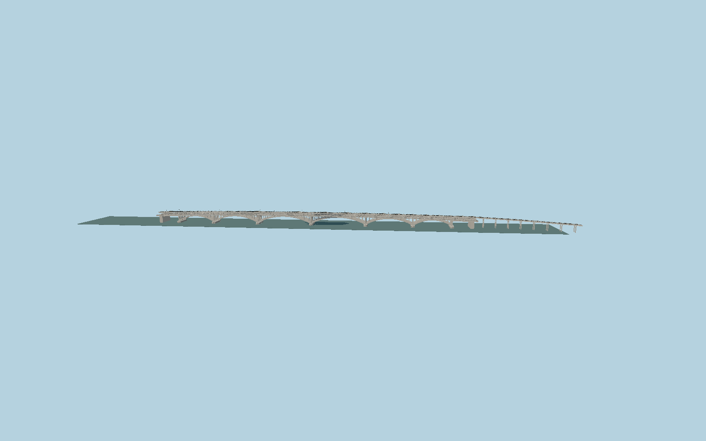

# Kyiv Metro Bridge

The six dry-jointed concrete arch-cantilever spans of Kyiv’s two-level Metro Bridge: lower flanking roadways, elevated central dual railway, cutwater piers, open spandrels, segment joints, footways and the separately mapped curving eastern rail viaduct.

## Evidence

- [Primary reference](https://mostobud-group.com/projects/mist-metro-dnipro/)
- [Primary reference](https://journal.museum.kpi.ua/archive/2016-vol-23/RHT-issue-23-title-03-Konstantinov.pdf)
- [Primary reference](https://dnipr-2023.kyivcity.gov.ua/content/mennyu-1.html)
- [Primary reference](https://kyivcity.gov.ua/news/na_mostu_metro_vikonuyut_unikalniy_etap_remontu__vstanovlyuyut_pidtrimuyuchi_arochni_konstruktsi/)
- [Primary reference](https://davr.gov.ua/protokol-zasidannya-mizhvidomchoi-komisii-po-uzgodzhennyu-rezhimiv-roboti-dniprovskih-vodoshovitsh-na-cherven-2021-roku)
- [Primary reference](https://www.openstreetmap.org/way/887624269)

Published dimensions and reconstruction assumptions are separated in spec.json. Source photos were consulted; no photos or third-party geometry are embedded. Map plan attribution: © OpenStreetMap contributors, ODbL-1.0.

## Source

500220 triangles; 40852380 bytes; 6 material groups. SHA256: sha256:9efe2a724142198efcdd7a4042e16bff7d684adafd5af30c42c39f11f4021813.

Shared surfaces (stone_granite, concrete_plain, metal_painted, metal_stainless) are loaded through the central library; any transparent materials use local PBR parameters. Axis and provisional vertical datum are in spec.json.

Regenerate with node packages/worldgen/scripts/generate-researched-bridges.mjs --ids=N0008; append --check to verify. Import and capture through the standard next-1000 scripts. Geometry validation does not substitute for current-frame visual review.

## Reconstruction limits

- Detailed permanent original exterior, informed by contractor photographs. Active2024–2026temporary support piles, jack towers, steel reinforcement arches, barges and construction equipment are omitted; no future completed restoration is claimed.
- The contractor’s672m span sum, general700m description and694.601m mapped road envelope describe different extents. The mapped889m overall area also includes the eastern elevated rail approach and must not stretch the six river arches.
- Vertical profile, pier exposure, rib/post cross sections, rail-support spacing, detailed fittings and bank transitions are photographic reconstruction, not an engineering model.91.5m reference elevation is provisional and local water/terrain alignment needs host data.
- Dnipro station, its sculptures, subway trains, the separate Rusanivskyi bridge and roads beyond the mapped bridge are separate assets. Submerged foundations and maintenance interiors are excluded.
