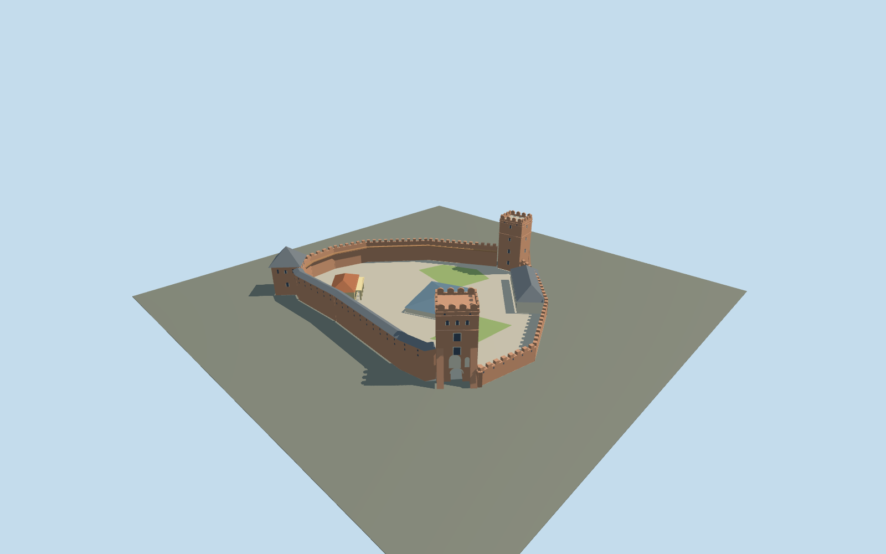

# Lubart's Castle

Lutsk Upper Castle: irregular triangular brick enclosure, west entry tower with buttresses and open round portal, north pyramid-roofed Bishop tower and southeast open-crowned Styr tower; covered timber wall walk, cream noble house, ochre columned book museum and contemporary blue-grey church excavation cover in an open court.

## Evidence and reconstruction

Published dimensions and reconstructed details are separated in spec.json. Primary references:

- [Reference](https://lutskreserve.com/places/verkhniy-lutskyy-zamok)
- [Reference](https://www.visitlutsk.com/luczkij-zamok/)
- [Reference](https://volynrada.gov.ua/map/m-lutsk)
- [Reference](https://tourism.volyn.ua/en/place/1)
- [Reference](https://www.openstreetmap.org/way/633707797)
- [Reference](https://www.openstreetmap.org/way/564453419)

No third-party geometry, photograph or bitmap texture is embedded. Shared surface graphs come from the central library; vertex tints carry model colors. Glazing uses PBR materials; transparent surfaces are declared per model.

## Model and axes

4,497 triangles; 12,459 vertices; 8 material groups; 506,992 bytes. Native bounds: -58.001, 0.000, -52.969 to 60.969, 28.000, 53.113. Source hash: `sha256:a1fc1184c189cc0c9f0cf66c8292ad3cb8dc0fe5f7f01eee00845f9c6a8fbc8e`.

{"up":"+Y","longitudinal":"+X northeast,44.4915 degrees north of east","front":"West entry(-X,-Z),north Bishop(+X,-Z),southeast Styr(-X,+Z)","origin":"Mapped castle compound center,provisional flat courtyard attachmentY=0"}

Whole compound mapped footprint,not a solid building or church footprint. Signed tower orientation based on operator aerial; actual terrain,heights,approaches and footprint replacement need in-world review before activation.

## Reproduce

Run `node packages/worldgen/scripts/generate-signature-towers.mjs --ids=N0277` (or add `--check`). The generator preserves manually edited masters by checking their baseline hashes. Import through the standard authored-model workflow with optimization disabled; then capture all QA cameras, including shared-surface views.

## Pending work

- Mapped compound fixes plan but individual tower/body outlines,annex dimensions,heights,window positions,roof profiles and crown ornament are visual interpretations,not surveys.
- Entry and Styr heights vary27–28m in primary sources; model selects28m and27m respectively.
- Bishop13.5m reference has ambiguous extent/datum. Using it for brick body plus an inferred7m roof is an explicit interpretation,not a verified20.5m total. The hill and relative footing heights remain unmeasured.
- Contemporary church excavation cover is modeled;1.52m map height belongs to ruins,not shelter. No full medieval church or destroyed palace is recreated.
- Compound includes open courtyard and sparse lawns/paving. Neither flat review ground nor demonstration neighbors prove real Lutsk placement.
- Geographic activation,terrain seating and footprint replacement pending. Physical laptop/phone performance and continuous-motion LOD shimmer remain unmeasured.
- No copied photos or unique textures ship. Fine mortar,stone joints,sculpture,thin rails/wires,temporary structures and interiors omitted under medium-fi.

This bundle follows the medium-fi standard. Medium-fi appearance and geographic fit are reviewed separately. Hash-bound visual acceptance is recorded separately after capture inspection.

## Additional geographic data

© OpenStreetMap contributors,ODbL-1.0. State Historical and Cultural Reserve in Lutsk,Lutsk Tourism and Volyn Regional Council primary references.
