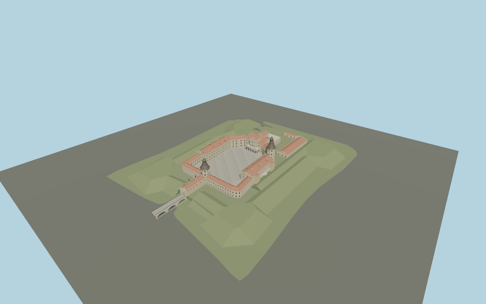

# Nesvizh Castle

Restored ochre palace around its open irregular six-sided courtyard, distinct gate and palace towers with swept metal crowns, red tiled roofs, curved western galleries, ceremonial gate passage, stone arch bridge and grass bastions.

## Evidence and reconstruction

Published dimensions and reconstructed details are separated in spec.json. Primary references:

- [Reference](https://niasvizh.by/en/posetitelyam/dvortsovyy-ansambl/)
- [Reference](https://niasvizh.by/en/history/dvortsovyy_kompleks/)
- [Reference](https://niasvizh.by/upload/bg/dvorec_ekskyrsii_o_myzee.jpg)
- [Reference](https://www.undp.org/belarus/news/sustainable-mobility-helps-tourism-spearhead-green-economy-belarus-regions)
- [Reference](https://whc.unesco.org/en/list/1196/)
- [Reference](https://www.openstreetmap.org/relation/14560856)
- [Reference](https://www.openstreetmap.org/relation/1732915)

No third-party geometry, photograph or bitmap texture is embedded. Shared surface graphs come from the central library; vertex tints carry model colors. Glazing uses PBR materials; transparent surfaces are declared per model.

## Model and axes

186,936 triangles; 384,070 vertices; 9 material groups; 16,074,828 bytes. Native bounds: -116.812, 0.000, -94.312 to 115.106, 37.900, 94.312. Source hash: `sha256:265d4166b08bc10b7bb06532d44d4ff7aba160f03cbc98ea4aa454d389e61f70`.

{"up":"+Y","longitudinal":"+X 27.188 degrees south of east","front":"West gate and approach bridge toward native -X; +Z south-southwest","origin":"Mapped grounds anchor with provisional moat-side ground datum"}

Horizontal location derives from exact identity; terrain and vertical fit are pending.

## Reproduce

Run `node packages/worldgen/scripts/generate-signature-towers.mjs --ids=N0254` (or add `--check`). The generator preserves manually edited masters by checking their baseline hashes. Import through the standard authored-model workflow with optimization disabled; then capture all QA cameras, including shared-surface views.

## Pending work

- Maximum exterior fidelity remains pending: individual pilasters, clock faces, heraldic and figurative sculpture, exact window rhythms, dormers and roof junctions require more reference work.
- Ground datum, rampart slopes, bridge arches and terrace levels are inferred rather than surveyed; in-world terrain fit has not passed. Water and park trees belong to the host terrain layers.
- Some roof geometry and facade profiles are reconstructed; curved gallery roofs and stacked tower profiles need further photographic refinement. Palace interiors, wider park and the separate Corpus Christi Church are outside this exterior asset.
- Detailed source retains tiled roof courses and window reveals. Four separate runtime tiers share plaster, ceramic tile, stone, wood and metal; no embedded images. Physical device approval is pending.

This bundle contains source geometry, not a claim of maximum-fidelity completion. Hash-bound visual acceptance is recorded separately after capture inspection.

## Additional geographic data

Map data © OpenStreetMap contributors, ODbL-1.0. Reference photographs were inspected; no third-party photographs or meshes are embedded.
