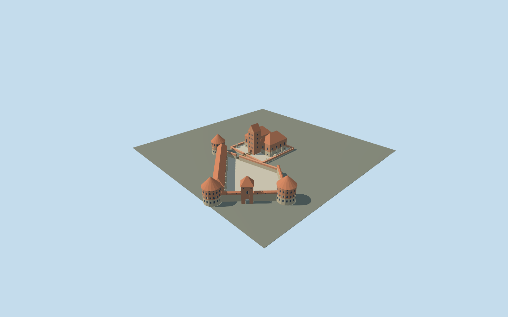

# Trakai Island Castle

Restored Trakai compound with open trapezoidal forecourt,three cone-roof corner towers,arched entry tower,western casemate and separate open-court ducal palace with a tall gabled donjon,short wooden bridge and stone precinct.

## Evidence and reconstruction

Published dimensions and reconstructed details are separated in spec.json. Primary references:

- [Reference](https://trakaimuziejus.lt/en/apie-mus/salos_pilis/)
- [Reference](https://atl.lad.lt/2023/122-129.pdf)
- [Reference](https://www.trakai-visit.lt/en/trakai-island-castle/)
- [Reference](https://www.govilnius.lt/visit-vilnius/places/trakai-castle)
- [Reference](https://www.openstreetmap.org/relation/3111261)

No third-party geometry, photograph or bitmap texture is embedded. Shared surface graphs come from the central library; vertex tints carry model colors. Glazing uses PBR materials; transparent surfaces are declared per model.

## Model and axes

3,386 triangles; 10,158 vertices; 5 material groups; 409,548 bytes. Native bounds: -34.386, 0.000, -24.000 to 88.306, 33.000, 106.973. Source hash: `sha256:a5927908ae27efecc59d9de106e657b50977b4ed0a7f23623d906c92abc75da1`.

{"up":"+Y","longitudinal":"+Z southwest toward forecourt and approach;palace side wings lie along Z","lateral":"+X southeast across palace wings","origin":"Cached palace map-frame center;not whole-compound center;provisional flat groundY0"}

Mapped identity covers palace only. Whole-compound trace is visually aligned,not surveyed. Actual island,terrain,moat,shore bridge,facade orientation and footprint replacement pending.

## Reproduce

Run `node packages/worldgen/scripts/generate-signature-towers.mjs --ids=N0280` (or add `--check`). The generator preserves manually edited masters by checking their baseline hashes. Import through the standard authored-model workflow with optimization disabled; then capture all QA cameras, including shared-surface views.

## Pending work

- Mapped relation3111261 is only the ducal palace. Whole compound is not represented by that38×35m footprint. Forecourt uses sparse primary-plan pixel trace at50/135m per pixel,visually aligned to the palace,not a current metric survey.
- Museum and archaeological paper describe planned historical donjon9.2×9.6m and33m height. The restored tower may differ;33m roof ridge is an authoring interpretation. All other roof heights,radii,wall levels,openings and buttresses are inferred from photos.
- Aerial reference contains excavation overlays and temporary works;these do not ship as textures or structures. Photograph lighting is not baked into materials.
- FlatY0 does not model island,moat or lake levels. Short connecting bridge is approximate;long public shore bridge,island terrain,trees,boats,interiors and temporary works excluded.
- Geographic orientation,compound registration,terrain seating and footprint replacement require in-world review. Inactive draft,replaceFootprint=false. Synthetic context neighbors and flat ground do not verify real Trakai terrain.
- Four shared256² graphs supply brick,granite,ceramic tile and plain wood;blue-grey glass is untextured. Research remains linked evidence only. Fine stone joints,carvings,balusters,glazing bars and wires omitted.
- Physical laptop/phone timings and continuous-motion LOD shimmer remain unmeasured.

This bundle follows the medium-fi standard. Medium-fi appearance and geographic fit are reviewed separately. Hash-bound visual acceptance is recorded separately after capture inspection.

## Additional geographic data

© OpenStreetMap contributors. Trakai History Museum,Lithuanian Archaeological Society/Tautvydas Bajarūnas,Trakai Tourism Information Centre and Go Vilnius.
