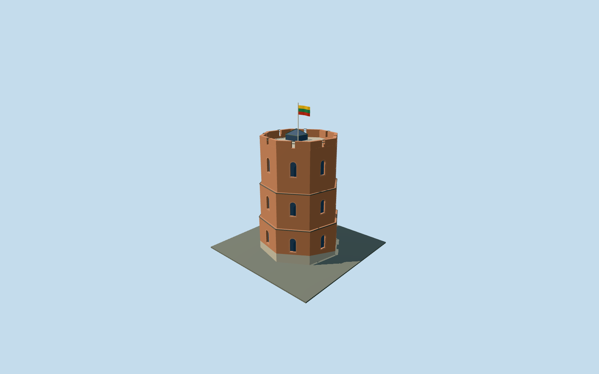

# Gediminas' Tower

Current Vilnius octagonal brick tower: three mapped storeys/setbacks, fieldstone ground cladding, arched windows, northeast courtyard doorway, open terrace/parapet, small glazed roof access and Lithuanian flag. Hill and wider castle ruins stay separate.

## Evidence and reconstruction

Published dimensions and reconstructed details are separated in spec.json. Primary references:

- [Reference](https://api.openstreetmap.org/api/0.6/map?bbox=25.2878,54.6852,25.2956,54.6880)
- [Reference](https://lnm.lt/en/museums/gediminas-castle-tower/)
- [Reference](https://lnm.lt/en/news/gediminas-tower-how-well-do-you-know-the-history-of-this-national-symbol/)
- [Reference](https://www.govilnius.lt/visit-vilnius/latest-tips/date-ideas-in-vilnius/gediminas-tower)
- [Reference](https://www.govilnius.lt/images/5e2b296c0a22e093c617573b?w=1500&h=1000)
- [Reference](https://www.govilnius.lt/images/678f6533f5c3c4b1f07e603a?w=1500&h=1000)
- [Reference](https://www.govilnius.lt/images/5e2b29c88cf8bbf148f616f6?w=1500&h=1000)
- [Reference](https://www.govilnius.lt/images/5e2b2a148cf8bb176bf616f8?w=1500&h=1000)
- [Reference](https://www.govilnius.lt/images/5e2b2a2c8cf8bb6961f616fc?w=1500&h=1000)
- [Reference](https://lithuania.travel/upload/cache/1850xauto/webp/files/2024/07/26/gpb1_1.webp?v=1722008082)

Five existing shared256-square brick/stone/painted metal/gravel/timber graphs, metric repeats and linear tints; flat glazing and vertex-colored national flag. No embedded/new image or copied mesh.

## Model and axes

2,492 triangles; 7,476 vertices; 7 material groups; 303,052 bytes. Native bounds: -6.927, 0.000, -7.065 to 7.016, 25.000, 7.034. Source hash: `sha256:191eaf6a39378e9388528d1b706552113233fef590a989abb18ce0c756c34d3b`.

{"up":"+Y","longitudinal":"Native+X east,+Z south, mapped octagons; heading0","origin":"Mean of eight ground-footprint vertices, modelY0 at courtyard/tower ground attachment; hill belongs to host terrain"}

Exact tower and two upper-part octagons remain native East/South heading0; broader same-QID Upper Castle node excluded. NativeY0 follows host terrain at the tower ground anchor; hill/curtain ruins remain separate.

## Reproduce

Run `node packages/worldgen/scripts/generate-signature-towers.mjs --ids=N0306` (or add `--check`). The generator preserves manually edited masters by checking their baseline hashes. Import through the standard authored-model workflow with optimization disabled; then capture all QA cameras, including shared-surface views.

## Pending work

- Exact tower way24569542 selected; node325130082 names the broader Upper Castle with the same Wikidata ID and is not used as the tower anchor.
- Current three-storey brick tower and observation terrace. Historic fourth storey and wooden telegraph house are excluded, as are the separately located palace/curtain ruins and the natural hill.
- OSM20m height,6m/12m steps and25m flagpole top are preserved as mapped controls; no numeric primary survey of height, facade, stone skirt or roof access was found.
- Original northeast courtyard doorway, arched window rhythm, stone cladding, terrace parapet and glazed access shelter are photo-derived estimates; interior exhibits/stairs and walkable collision certification are excluded.
- Native East/South geometry uses heading0. Terrain attachment samples the tower-center ground at modelY0; a coarse DEM cannot establish the rocky base micrograde.
- Five existing256-square graphs: brick, stone, painted metal, gravel and timber. Flag is flat vertex color and glazing is flat blue-grey; no new/embedded photograph, texture or downloaded mesh.
- Roof-access details and small arch surrounds drop by authored distance level. Static flag drape does not encode surveyed wind direction.
- Actual-site terrain/footprint capture and current exterior review remain separate gates. Physical phone/laptop measurements remain pending.

This bundle follows the medium-fi standard. Medium-fi appearance and geographic fit are reviewed separately. Hash-bound visual acceptance is recorded separately after capture inspection.

## Additional geographic data

© OpenStreetMap contributors; National Museum of Lithuania; GoVilnius; Lithuania Travel / Silvestras Samsonas / LNM.
