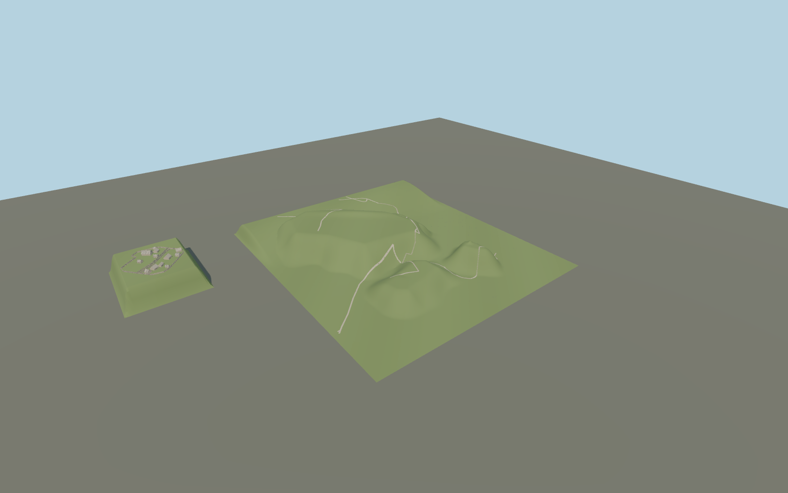

# Kernavė

Five individually positioned surviving hillfort earthworks, mapped pedestrian paths and timber stairs, plus the separate modern three-yard museum reconstruction with twelve mapped wooden buildings and board fencing.

## Evidence and reconstruction

Published dimensions and reconstructed details are separated in spec.json. Primary references:

- [Reference](https://whc.unesco.org/en/list/1137/)
- [Reference](https://whc.unesco.org/document/151842)
- [Reference](https://doi.org/10.15388/ArchLit.2019.20.4)
- [Reference](https://www.kernave.lt/ekspozicija-po-atviru-dangumi/)
- [Reference](https://www.openstreetmap.org/node/1690273888)

No third-party geometry, photograph or bitmap texture is embedded. Shared surface graphs come from the central library; vertex tints carry model colors. Glazing uses PBR materials; transparent surfaces are declared per model.

## Model and axes

140,410 triangles; 379,638 vertices; 3 material groups; 15,354,172 bytes. Native bounds: -338.000, 0.000, -247.000 to 465.000, 36.001, 525.000. Source hash: `sha256:b9709daddae6b379c702d47d39c6bb990a5616df8f27fa3fd5dd0c2d197d59fa`.

{"up":"+Y","longitudinal":"+X east","front":"+Z south","origin":"[24.8517,54.8824], interpreted relative landscape datum"}

Draft only until a terrain survey and multi-part site review establish correct elevations and blending.

## Reproduce

Run `node packages/worldgen/scripts/generate-signature-towers.mjs --ids=N0251` (or add `--check`). The generator preserves manually edited masters by checking their baseline hashes. Import through the standard authored-model workflow with optimization disabled; then capture all QA cameras, including shared-surface views.

## Pending work

- Maximum fidelity pending: earthwork contours are interpreted from documented top dimensions and aerial views; no elevation raster or surveyed mesh is bundled. Terrace datum, erosion scars and inter-hill gullies require measured terrain.
- Q215315 names the town. This source depicts five surviving hillforts and the separate modern open-air reconstruction; it must not be matched as a single castle footprint.
- The three museum yards retain twelve mapped building envelopes and mapped wooden fences. Wall heights, doors, roof pitches, individual boards and log details are approximate. A minor annex is represented within its main roof envelope.
- Published current banks are included. Ancient palisades, towers and buried settlement remains are not reconstructed above ground. Old church remains, chapels, modern museum, wider reserve vegetation and river terrain still need separate site coverage.
- Grass uses vertex color; timber and gravel use existing reusable procedural surface graphs. No model-specific bitmap textures. Landscape patch edges remain visible in standalone review and need host-terrain blending before activation.
- Mapped stairs retain their horizontal routes; step rises/counts derive from the interpreted terrain and are not a certified reconstruction of visitor access.

This bundle contains source geometry, not a claim of maximum-fidelity completion. Hash-bound visual acceptance is recorded separately after capture inspection.

## Additional geographic data

Map geometry © OpenStreetMap contributors, ODbL-1.0. Dimensions summarized from Vengalis & Velius 2019, CC-BY-4.0. Reference photos and LiDAR figure viewed for research only, no image or raster redistribution.
