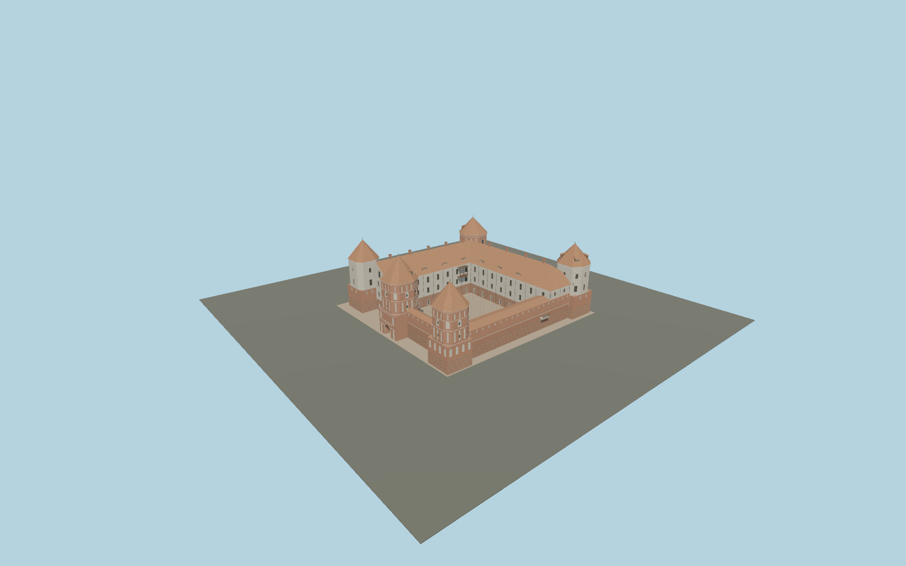

# Mir Castle Complex

Five individually ornamented brick and plaster towers around Mir’s open courtyard, L-shaped residential palace, covered curtain-wall walks, west gate passage and four-arched northern approach bridge.

## Evidence and reconstruction

Published dimensions and reconstructed details are separated in spec.json. Primary references:

- [Reference](https://mirzamak.by/)
- [Reference](https://mirzamak.by/best-photos)
- [Reference](https://whc.unesco.org/en/list/625/)
- [Reference](https://whc.unesco.org/document/169793)
- [Reference](https://www.openstreetmap.org/relation/1579104)

No third-party geometry, photograph or bitmap texture is embedded. Shared surface graphs come from the central library; vertex tints carry model colors. Glazing uses PBR materials; transparent surfaces are declared per model.

## Model and axes

255,892 triangles; 593,826 vertices; 10 material groups; 24,453,976 bytes. Native bounds: -40.100, -0.055, -67.071 to 40.100, 31.750, 38.400. Source hash: `sha256:f309ea5ba68616121c06e1529e32274ebbabb6ae386a14da3e273f40bb32ecee`.

{"up":"+Y","longitudinal":"+X east-southeast, 12.866 degrees south of east","front":"+Z south-southwest; entrance on west/-X","origin":"Mapped castle anchor, provisional local courtyard level"}

Draft placement until restored tower height datum, bridge contact and facing are checked on terrain.

## Reproduce

Run `node packages/worldgen/scripts/generate-signature-towers.mjs --ids=N0250` (or add `--check`). The generator preserves manually edited masters by checking their baseline hashes. Import through the standard authored-model workflow with optimization disabled; then capture all QA cameras, including shared-surface views.

## Pending work

- Maximum fidelity pending: facade proportions, blind-niche patterns, window counts, roof dormers and ridge/chimney positions are photographic interpretations rather than measured restoration drawings.
- The castle and northern arched bridge are modeled. The separate chapel-crypt, guardhouse, park, moat, earth ramparts and later palace remains of the wider complex still need authored geometry.
- Map tower roof heights of 30/31 m differ from the ICOMOS evaluation’s 22–26 m tower dimensions. Height datum and roof inclusion need resolution before geographic completion.
- Bridge arch count follows the museum view; pier geometry, deck elevation and contact with the approach embankment remain provisional. A narrow castle contact plinth is not a surveyed terrain model.
- Eight reusable procedural material graphs provide brick, lime plaster, granite, raw limestone, sandstone, timber, ceramic tile and painted metal. Glass is local PBR color; no embedded photographs.

This bundle contains source geometry, not a claim of maximum-fidelity completion. Hash-bound visual acceptance is recorded separately after capture inspection.

## Additional geographic data

Map geometry © OpenStreetMap contributors, ODbL-1.0. Museum photographs and ICOMOS text are research references only; no third-party images or meshes bundled.
