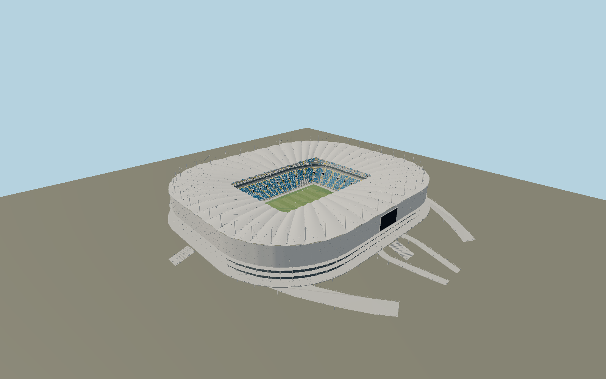

# Rostov Arena — N0694

The executed2018 Rostov Arena has a rounded rectangular white vessel,46 stayed roof consoles and a ridged membrane canopy. Three blue seating tiers have yellow aisle borders, corner access breaks, hospitality glazing and northwest/southeast screens. Physical facade LED points, west media screen, five-level concourse structure, elevated ring terrace and six separately mapped approach ramps establish its individual exterior.

## Identity and evidence

Exact catalog identity **Q4439101**. Source facts: `{"published":"The resident club specifies a105x68m field,115x78m grass area, three spectator tiers, five floors, a40m main building,852x19m media facade with54000 LED points, a27x15m west screen and two15x9m northwest/southeast screens. The executed structural engineer describes46 stayed consoles and arched tube supports beneath the membrane. Macalloy identifies M42 roof tension rods.","reconstructed":"Exact OSM stadium body, ground opening, pitch and six elevated approaches establish plan and orientation. Roof opening,51.48m mast tips, membrane camber, console sections, seated row counts, podium heights and local ramp grades are reconstructed from primary completed photographs; the club40m height sets the shell scale. Facade diode count is represented by54016 repeated nodes; tiny panel perforations are below the authored geometry scale."}`. The source specification keeps published dimensions separate from reconstructed details.

- https://fc-rostov.ru/more/rostov-arena
- https://steel-project.ru/project/stadion-rostov-arena
- https://macalloy.com/project/fifa-world-cup-arenas-in-russia-2018/
- https://www.crocusgroup.ru/projects/civil-construction/stadiony-k-chempionatu-mira-po-futbolu-2018-goda-v-kaliningrade-i-rostove-na-donu/
- https://www.openstreetmap.org/relation/5379619
- https://www.openstreetmap.org/way/361352677

Original component-authored geometry and shared procedural materials. Primary reference photographs are research evidence only and no image pixels or external meshes are embedded. OSM plan coordinates are OpenStreetMap contributors, ODbL1.0.

## Authored geometry and materials

1,141,392 triangles, 2,253,446 vertices, 6 surface groups; 92,570,872 source bytes. SHA-256: `sha256:6cbca17ff89b25869079f97137f4328fbf464bb0b8e013e673780679484e7770`. Actual bounds: -174.962, -0.380, -163.551 to 183.398, 51.499, 162.895 m.

Shared canonical material graphs with metric UV repeats in extras.molenSurface; portable glTF PBR factors and vertex colors remain. Dark recesses/lantern panels retain local fallback materials. Shared references: `matgraph:molen.worldgen.material.membrane` (4 × 4 m), `matgraph:molen.worldgen.material.metal_painted` (2 × 2 m), `matgraph:molen.worldgen.material.concrete_plain` (2 × 2 m). Model-native axes: {"up":"+Y","front":"+Z","origin":"Exact mapped playing-field center. +Z follows its north-northwest axis, +X faces the west main entrance. Y0 is the playing-field and outer approach ground reference."}.

## Placement proposal

Exact playing-field bearing resolves north-northwest axis and places the main entrance/media screen on+X west. The broad original QID-tagged estate parcel is excluded as a footprint; actual stadium multipolygon and six elevated approaches determine the authored plan. Proposed anchor 39.737810321428576, 47.209425357142855 (longitude, latitude), heading -2.837577928704048 radians. Elevation policy: **terrain-contact**. See qa.json for the geographic review status and scope; this placement proposal does not claim surveyed site accuracy. Native ground and pitch datums follow the individual geographic proposal; depressed bowls require their declared terrain cutout.

## Limitations and review

- Published exterior in the completed2018 structural state. Precise chair inventory, joint and panel subdivisions, membrane prestress and concourse/ramp vertical levels remain photo reconstruction. Enclosed service rooms, event graphics and the wider riverside park are outside the asset.

Portable review uses a flat ground contact fixture.

Near/far fixtures are in `spec.qaCameras`. Float32 finite geometry, triangle degeneracy and winding are checked by the generator. The hash-bound qa.json and capture reports record the scope and status of rendering, shared-material, exterior-fidelity and geographic reviews.

Regenerate with `node packages/worldgen/scripts/generate-stadium-models.mjs --ids=N0694`; add `--check` for reproducibility. Editable component recipes are registered by the imports and study list in `packages/worldgen/scripts/generate-stadium-models.mjs`. The generator protects artist-edited master hashes and preserves import/capture/shared-capture/QA documents.
