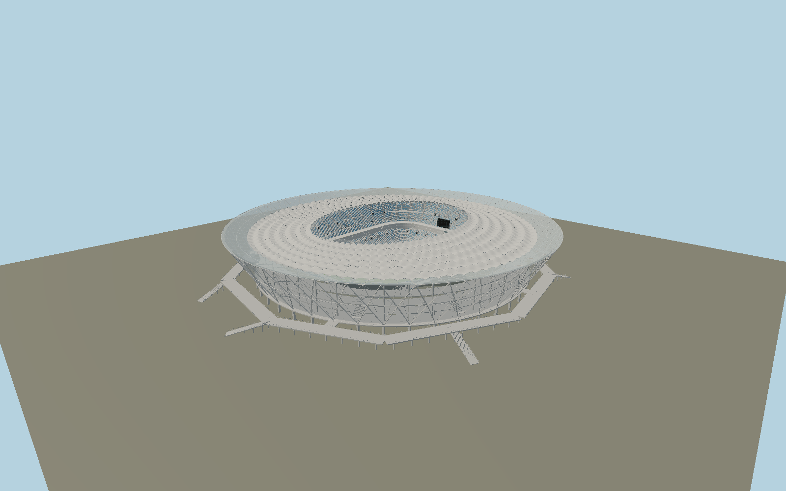

# Volgograd Arena — N0704

Volgograd’s inverted-cone fireworks facade: broad white diamond members, fine branching rods and exposed connection plates in front of a translucent foyer. A44-spoke cable wheel carries a white scalloped roof, blue-tinted rising perimeter canopy, clear inner lip and20m-bowed inner masts. Six-cable upper/lower tension rings, lower catwalk, hanging screens, two blue/white seating tiers, western double VIP ribbon and the mapped elevated angular access circuit distinguish this arena.

## Identity and evidence

Exact catalog identity **Q4366184**. Source facts: `{"published":"PIARENA:49m height, two seating tiers, two western VIP levels, branching steel diamond facade and five-point access concept. Freyssinet:44radial cable lines,20m inner struts,4separator legs per radial axis, upper6×70mm and lower6×130mm tension-ring cables, radial60–70mm cables; roof lifted to48m. Maffeis documents PVC/ETFE roof/foyer construction. Primary architect photographs and cutaway drawings show completed facade and sectional organization.","reconstructed":"303m top diameter and49.5m maximum follow the published stadium envelope corroborated by completed photographs. The exact mapped building base is about256m, distinct from the wider roof; field axis and elevated footbridge are directly mapped. Native8.4m entry deck, inner-ring altitude27.7m, roof dish, branching-member sections, seating pattern and member inventories are scaled/photo reconstructions. Main structural44axes and cable bundle sizes retain primary dimensions."}`. The source specification keeps published dimensions separate from reconstructed details.

- https://piarena.ru/volgograd-arena/
- https://www.freyssinet.com/case-study/volgograd-arena-cable-stayed-roof/
- https://www.maffeis.it/index.php/portfolio-items/volgograd-stadium/
- https://volgogradarena.com/main/tribuni/
- https://www.openstreetmap.org/relation/7718662
- https://www.openstreetmap.org/way/539236144
- https://www.openstreetmap.org/way/622798144

Primary architect/engineer photographs and technical text consulted, not embedded. Original component geometry and shared canonical surfaces. OSM-derived footprint/field/access-path coordinates ©OpenStreetMap contributors,ODbL1.0.

## Authored geometry and materials

1,655,874 triangles, 2,991,452 vertices, 9 surface groups; 127,567,432 source bytes. SHA-256: `sha256:e8ad58867b55f8b6eb763da43fa2b72ab47195b4d0d2391ff4f01045364f962c`. Actual bounds: -200.833, -0.174, -180.959 to 153.848, 49.660, 177.129 m.

Shared canonical material graphs with metric UV repeats in extras.molenSurface; portable glTF PBR factors and vertex colors remain. Dark recesses/lantern panels retain local fallback materials. Shared references: `matgraph:molen.worldgen.material.membrane` (4 × 4 m), `matgraph:molen.worldgen.material.metal_painted` (2 × 2 m), `matgraph:molen.worldgen.material.concrete_plain` (2 × 2 m). Model-native axes: {"up":"+Y","front":"+Z","origin":"Mapped field centre at ground-level playing surface. +Z geographic north and+X west; the elevated entry bridge/deck lies8.4m above the ground."}.

## Placement proposal

Exact mapped rectangular field fixes native+Z north and+Xwest, placing the two VIP levels on the west. The mapped building base is about256m; the visibly inverted roof widens to303m. The elevated access route and radial stairs use the actual mapped bridge paths. Field and supporting piers meetY0; an8.4m elevated deck does not set terrain contact. Proposed anchor 44.548562950000004, 48.7343792 (longitude, latitude), heading -3.141592653589793 radians. Elevation policy: **terrain-contact**. See qa.json for the geographic review status and scope; this placement proposal does not claim surveyed site accuracy. Native ground and pitch datums follow the individual geographic proposal; depressed bowls require their declared terrain cutout.

## Limitations and review

- Detailed permanent exterior and visible bowl; small-member inventories, stair-flight subdivisions and seat colour distribution are constrained reconstructions. Private rooms, temporary event/sponsor art and an exact ticket-seat count are excluded.

Portable review uses a flat ground contact fixture.

Near/far fixtures are in `spec.qaCameras`. Float32 finite geometry, triangle degeneracy and winding are checked by the generator. The hash-bound qa.json and capture reports record the scope and status of rendering, shared-material, exterior-fidelity and geographic reviews.

Regenerate with `node packages/worldgen/scripts/generate-stadium-models.mjs --ids=N0704`; add `--check` for reproducibility. Editable component recipes are registered by the imports and study list in `packages/worldgen/scripts/generate-stadium-models.mjs`. The generator protects artist-edited master hashes and preserves import/capture/shared-capture/QA documents.
