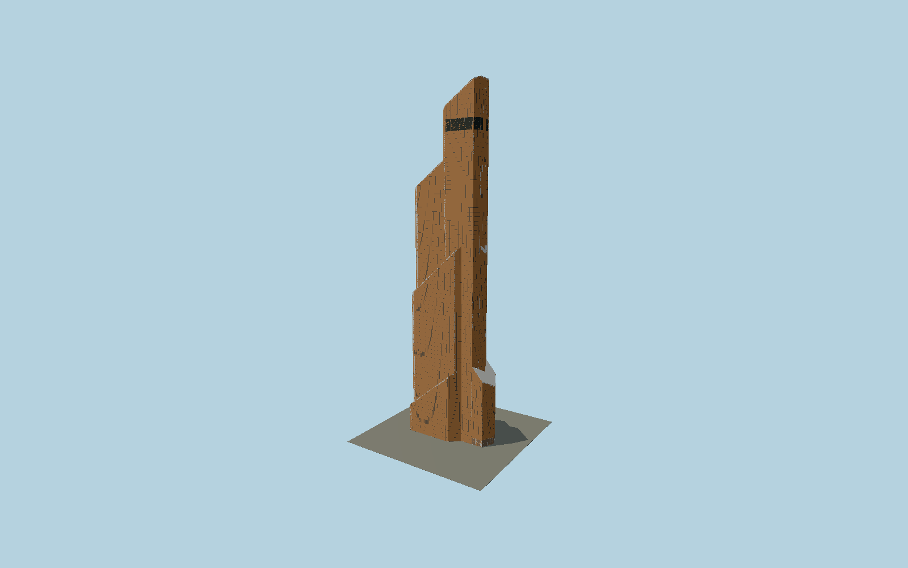

# Mercury City Tower

Moscow’s copper-gold stepped tower with seven individually mapped sloped volumes, white folded edge bands, dense unitized glass, upper media screens and its pointed street entrance.

## Evidence and reconstruction

Published dimensions and reconstructed details are separated in spec.json. Primary references:

- [Reference](https://www.mercury-city.com/en/about/architecture/)
- [Reference](https://www.mercury-city.com/en/mediafacade/)
- [Reference](https://www.yuandacn.com/index.php/en/projects-cn-2/146-overseas/europe/russia/337-mercury-city-tower-2.html)
- [Reference](https://www.skyscrapercenter.com/building/wd/265)
- [Reference](https://www.openstreetmap.org/way/52929368)

No third-party geometry, photograph or bitmap texture is embedded. Shared surface graphs come from the central library; vertex tints carry model colors. Glazing uses PBR materials; transparent surfaces are declared per model.

## Model and axes

176,721 triangles; 530,131 vertices; 3 material groups; 21,207,748 bytes. Native bounds: -47.186, 0.000, -22.263 to 47.222, 338.824, 22.273. Source hash: `sha256:d39867a3098e974df6799f2c90a16cf6f028083ff657a55496d8f1e10b1c33d7`.

{"up":"+Y","longitudinal":"+X along the mapped building long axis","front":"+Z","origin":"Ground-level center of exact-QID mapped footprint frame"}

The geographic proposal uses exact-QID OpenStreetMap evidence. Map-derived orientation and estimated architectural details require real-site visual review; preview eligibility is distinct from geographic/fidelity approval. Map attribution: © OpenStreetMap contributors, ODbL-1.0.

## Reproduce

Run `node packages/worldgen/scripts/generate-signature-towers.mjs --ids=N0169` (or add `--check`). The generator preserves manually edited masters by checking their baseline hashes. Import through the standard authored-model workflow with optimization disabled; then capture all QA cameras, including shared-surface views.

## Pending work

- Exterior geometry uses published overall dimensions and map evidence; panel subdivision, connection dimensions and local entrance details are reconstructed. Glazing uses opaque PBR with explicit geometry; no copied facade photograph is embedded.
- Individual glazing pitch, white-band widths and LED screen vertical datum are reconstructed from owner photographs. Screens show an unlit neutral face; advertisements, interiors and temporary entrance decorations are excluded.

This bundle contains source geometry, not a claim of maximum-fidelity completion. Hash-bound visual acceptance is recorded separately after capture inspection.
