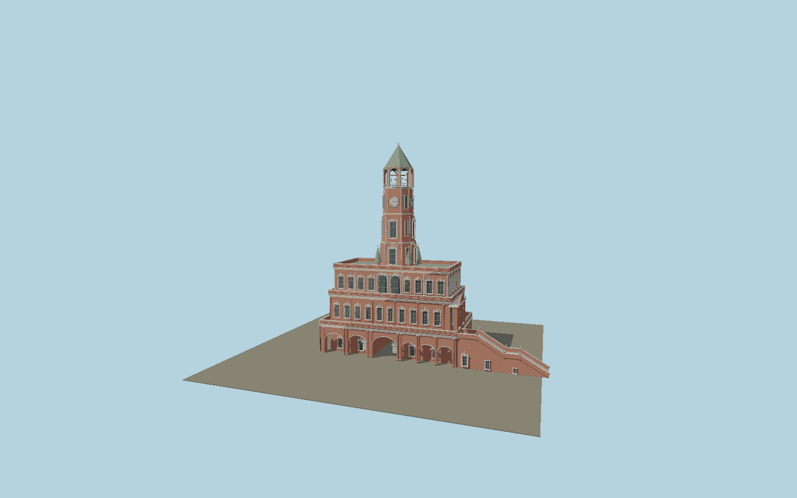

# Sukharev Tower — museum exterior, 1930

Historical museum-era gate tower: asymmetric arcaded galleries, carved window surrounds, octagonal clock shaft, open nine-bell belfry, tiled tent roof and uncovered two-flight eastern stair. The removed imperial eagle is absent.

## Identity and geometry

Catalog N0607, [Q913949](https://www.wikidata.org/wiki/Q913949). Museum director P. V. Sytin’s 1926 firsthand account gives approximately 19.5 × 11.5 sazhen and 30 sazhen height. The 41.6 × 24.5 m base and 64 m envelope use those dimensions; archival plans, the reproduced measured elevation/sections (plate 106), and the Museum of Moscow photograph determine tier proportions, the asymmetric galleries, eastern staircase and carved details. Small details and vertical tier levels are a proportional reconstruction, not a claim of surviving surveyed fabric.

Center of the main 41.6 × 24.5 m rectangular tower base; Y=0 at the historic pavement. +Z is the Sretenska/southern facade; +X is the eastern staircase direction; +Y is up. The geographic proposal identifies its anchor and orientation evidence separately from remaining terrain and azimuth uncertainty.

Source facts and measured references are recorded in spec.json. References: [1](https://history.wikireading.ru/321090), [2](https://upload.wikimedia.org/wikipedia/commons/b/b0/Sukhareva_bashnya_v_Moskve.pdf), [3](https://api.ziyonet.uz/uploads/books/10000014/jMb0bL5knCcfTJ5.pdf), [4](https://online.mosmuseum.ru/moskva-404-1), [5](https://mosmuseum.ru/exhibitions/p/suhareva_tower/), [6](https://www.mos.ru/upload/documents/files/5479/AKTGIKEBolshayaSyharevskayaploshad3.pdf). Reference pages and images are not redistributed.

## Original source and shared materials

Geometry is authored in `packages/worldgen/scripts/sukharev-tower-model.mjs`. Shared material graphs with metric repeat UV0 and original vertex tints; GLB PBR fallback remains self-contained. No per-model texture duplication. No third-party mesh or photograph is embedded.

570,056 triangles; 1,133,680 vertices; 8 material groups; 46,524,168 source bytes. Source hash: `sha256:ca0af27836ba3389f4046c021964648f2971c833366e29c8364facacc00ee2a6`. Geometry validation checks finite Float32 coordinates, indices, triangle area and winding before export.

Regenerate with `node packages/worldgen/scripts/generate-heritage-towers.mjs N0607`; add `--check` for reproducibility. The generator refuses to overwrite a master whose hash differs from source.json. Import uses `--no-optimize` to preserve facade recesses.

## Remaining detail and review

- Dated 1930 exterior only. The building was demolished in 1934; the model requires explicit historical-date opt-in.
- Archive descriptions give approximate total dimensions. Tier elevations, individual relief profiles, glazed tile colors and stair subdivisions are reconstructed from drawings and monochrome photographs; they are not an archaeological survey.
- The imperial eagle, obsolete staircase canopy, removed northern chapel and pre-1701 high chamber roofs are intentionally absent. Interiors, museum displays and surrounding tram infrastructure are outside this exterior asset.
- Near/far visual QA, shared-material inspection and maximum-fidelity approval remain pending.

Named near/far cameras are included for lit visual review. A valid export is not maximum-fidelity certification.
