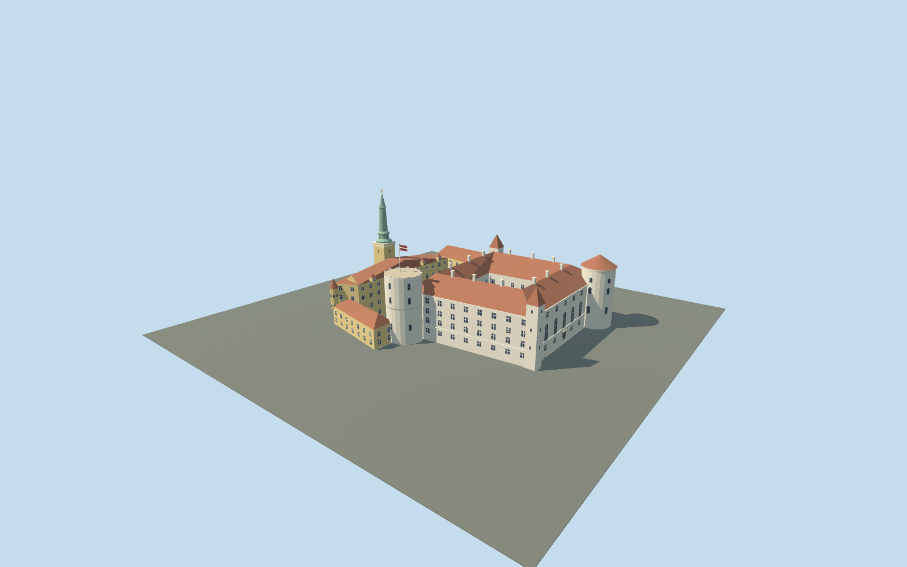

# Riga Castle

Two-court Riga Castle with the white medieval quadrangle, flat-crowned Holy Spirit tower and flag, shallow conical Lead Tower, two square stair towers, yellow presidential ranges, small Erker and copper Three Stars steeple.

## Evidence and reconstruction

Published dimensions and reconstructed details are separated in spec.json. Primary references:

- [Reference](https://www.president.lv/en/riga-castle)
- [Reference](https://lnvm.gov.lv/en/riga-castle/history-of-riga-castle/)
- [Reference](https://sudraba-arhitektura.lv/riga-castle/)
- [Reference](https://www.openstreetmap.org/relation/1393926)
- [Reference](https://hesihe-journals.rtu.lv/iav/article/download/IAV.2025.008/154/323)

No third-party geometry, photograph or bitmap texture is embedded. Shared surface graphs come from the central library; vertex tints carry model colors. Glazing uses PBR materials; transparent surfaces are declared per model.

## Model and axes

6,891 triangles; 18,917 vertices; 6 material groups; 767,300 bytes. Native bounds: -59.373, 0.000, -45.150 to 59.550, 56.750, 43.900. Source hash: `sha256:9e20d1fb890f4351f7c932cd0e3f86ddd27c5c8936ad7bc1a6404ee5151a1096`.

{"up":"+Y","longitudinal":"+X southeast along the riverbank","front":"+Z southwest toward Daugava","origin":"Mapped compound center; Y=0 conservative external attachment plane"}

The exact compound footprint preserves both courtyards. River-facing +Z excludes neighboring St James and Our Lady of Sorrows spires. Real street levels and the forecourt-to-castellum connection require terrain review before activation.

## Reproduce

Run `node packages/worldgen/scripts/generate-signature-towers.mjs --ids=N0264` (or add `--check`). The generator preserves manually edited masters by checking their baseline hashes. Import through the standard authored-model workflow with optimization disabled; then capture all QA cameras, including shared-surface views.

## Pending work

- Northern wing heights, individual tower placement and Three Stars proportions are estimates from published imagery; only the medieval elevation labels are dimensional evidence.
- Courtyard arcades are shallow exterior reveals; the stair gallery is an opaque medium-fi representation. No navigable interiors or room reconstruction.
- Static source review does not prove real-site terrain fit, moving-camera shimmer or physical-device performance.

This bundle follows the medium-fi standard. Medium-fi appearance and geographic fit are reviewed separately. Hash-bound visual acceptance is recorded separately after capture inspection.

## Additional geographic data

Footprints © OpenStreetMap contributors, ODbL-1.0. Architectural drawings and official photographs are linked research references, not redistributed images or textures.
