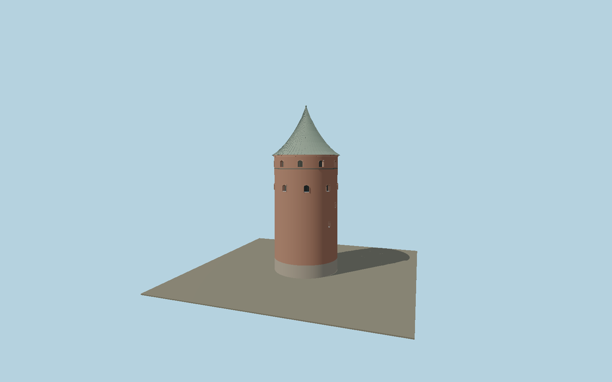

# Powder Tower, Riga

Riga’s surviving round defensive tower, with a fieldstone plinth, deeply recessed arched gun openings, nine exposed northern cannonballs, dark iron tie and the present concave green copper roof with standing seams and finial.

## Identity and geometry

Catalog N0586, [Q186097](https://www.wikidata.org/wiki/Q186097). Latvian official tourism publishes a 14.3 m diameter and 25.6 m tower wall height; current agency photographs show the masonry alone is roughly 1.8 diameters tall, with the roof above. The exact OSM feature explicitly gives total height 37 m and roof height 11.33 m, matching 25.67 m masonry plus roof. The photographed concave metal roof is reconstructed from those dimensions rather than treating 25.6 m as the whole silhouette.

Exact mapped cylindrical tower center, pavement Y=0. −Z north toward Bastejkalns and the visible siege cannonballs; +Z toward the city and adjoining museum; +Y is up. The geographic proposal identifies its anchor and orientation evidence separately from remaining terrain and azimuth uncertainty.

Source facts and measured references are recorded in spec.json. References: [1](https://www.latvia.travel/en/sight/latvian-war-museum), [2](https://www.liveriga.com/en/1594-the-powder-tower), [3](https://www.liveriga.com/userfiles/images/apmekle/ko-redzet/apskates-vietas/arhitektura/pulvertornis/48803267036_661e06a076_k.jpg), [4](https://www.liveriga.com/userfiles/images/apmekle/ko-redzet/apskates-vietas/arhitektura/pulvertornis/48803415137_f29c2f9ae1_k.jpg), [5](https://www.karamuzejs.lv/node/270), [6](https://www.openstreetmap.org/way/45018613). Reference pages and images are not redistributed.

## Original source and shared materials

Geometry is authored in `packages/worldgen/scripts/heritage-towers-580-more-models.mjs`. Shared material graphs with metric repeat UV0 and original vertex tints; GLB PBR fallback remains self-contained. No per-model texture duplication. No third-party mesh or photograph is embedded.

49,798 triangles; 99,684 vertices; 5 material groups; 4,189,460 source bytes. Source hash: `sha256:da8b7f991d75f86eabe86edcbac855a934df2e0ea9ec08593a8112fab2248c9b`. Geometry validation checks finite Float32 coordinates, indices, triangle area and winding before export.

Regenerate with `node packages/worldgen/scripts/generate-heritage-towers.mjs N0586`; add `--check` for reproducibility. The generator refuses to overwrite a master whose hash differs from source.json. Import uses `--no-optimize` to preserve facade recesses.

## Remaining detail and review

- The often-quoted 25.6 m dimension is treated as masonry height, supported by photographed height/diameter proportion and explicit OSM roof-height metadata; the full roof-and-finial silhouette is 37 m.
- Seasonal ivy, individual weathered brick damage and hidden museum galleries are outside the fixed exterior reconstruction. Siege cannonballs and gun opening locations preserve the visible facade rhythm.
- Near/far visual QA, shared-material inspection and maximum-fidelity approval remain pending.

Named near/far cameras are included for lit visual review. A valid export is not maximum-fidelity certification.
