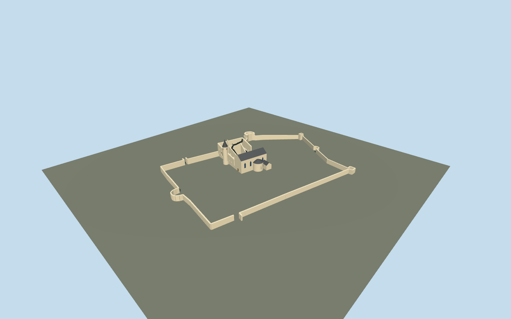

# Haapsalu Castle

Current Haapsalu: roofed cathedral, circular baptismal chapel and lower side roofs, tall round clock tower with curved cone, roofless U-shaped main-castle upper rooms, black modern pavilion/folded stairs and mapped curtain/tower remains.

## Evidence and reconstruction

Published dimensions and reconstructed details are separated in spec.json. Primary references:

- [Reference](https://strapi.lumia.ee/uploads/03_01_Vendo_Jugapuu_a3ece4c6ec.webp)
- [Reference](https://strapi.lumia.ee/uploads/03_02_Tonu_Tunnel_3c4e8fd6bc.webp)
- [Reference](https://strapi.lumia.ee/uploads/03_12_Tonu_Tunnel_b8e3552928.webp)
- [Reference](https://strapi.lumia.ee/uploads/03_16_Tonu_Tunnel_b86482d2db.webp)
- [Reference](https://strapi.lumia.ee/uploads/03_DSC_1908_Vendo_Jugapuu_Copy_892a42a4d8.webp)
- [Reference](https://strapi.lumia.ee/uploads/2_1st_floor_3fcf0aa362.webp)
- [Reference](https://strapi.lumia.ee/uploads/4_section_1_e15947da68.webp)
- [Reference](https://strapi.lumia.ee/uploads/5_section_2_6a20a887e1.webp)
- [Reference](https://www.lumia.ee/en/projects/haapsalu-castle)
- [Reference](https://linnus.salm.ee/haapsalu-piiskopilinnuse-arendus/)
- [Reference](https://giid.salm.ee/en/introduction-en)
- [Reference](https://api.openstreetmap.org/api/0.6/map?bbox=23.5349,58.9455,23.5424,58.9492)
- [Reference](https://linnus.salm.ee/en/the-castle/)

Five existing shared256-square weathered limestone, painted metal, lime plaster, timber and gravel graphs; metric repeats and linear tint. Glass stays flat. No unique or embedded texture or borrowed mesh.

## Model and axes

4,905 triangles; 14,715 vertices; 7 material groups; 592,800 bytes. Native bounds: -114.268, 0.000, -78.501 to 137.117, 38.000, 112.773. Source hash: `sha256:9b2a71df21b1d1dc6034808c35f4ec8c5ef91b00833b40daba5c5dfc2b5c4036`.

{"up":"+Y","longitudinal":"Native+X east,+Z south; heading0 preserves all attributed footprints.","origin":"Wikidata horizontal reference inside cathedral; Y0 provisional outside-ground attachment plane. Actual common city/terrace datum unapproved."}

Native+X east,+Z south, heading0. Exact castle identity node and separate named physical footprints; no exact-QID area or certified ground datum claimed.

## Reproduce

Run `node packages/worldgen/scripts/generate-signature-towers.mjs --ids=N0309` (or add `--check`). The generator preserves manually edited masters by checking their baseline hashes. Import through the standard authored-model workflow with optimization disabled; then capture all QA cameras, including shared-surface views.

## Pending work

- Q866154 is an exact mapped castle identity node687056785. Named cathedral106803938/Q16412871, museum112303709 and surrounding named curtain walls are separately matched physical controls; no exact-QID castle area is invented.
- Mapped museum height38 is a whole-envelope value containing the clock tower. Individual wing/wall sections remain lower and partly roofless. Cathedral25m mapper height is separate. Tower38m is an archival museum reference, not a new survey.
- Architect drawings publish local section levels+18.50/+19.96 and a+0.00 tied to8.30m. The authored mesh uses original estimated relative sections andY0 ground attachment, not a certified elevation survey or a literal copy of the technical plan.
- Nave, south circular baptismal chapel, lower lateral vestries, open upper museum rooms and black modern pavilion/stair zigzags are independent geometry. Lost medieval roofs, reconstructed cloister, full interiors, exhibits, event infrastructure, playground/trees and adjacent city buildings are not invented.
- Outer wall/tower surviving section heights, precise church window count, glass/frame details, pavilion footprint and walkway attachments still require current-site fidelity review. Keep placement draft and footprint replacement off.
- Five existing shared256-square weathered limestone, painted metal, lime plaster, timber and gravel graphs use metric repeats and linear tints. No new unique image, embedded photograph or borrowed mesh.
- Architect/photographer drawings and photographs stay in the private research cache; only attributed original numeric controls and metadata ship. Physical laptop/phone performance and continuous LOD movement remain pending.

This bundle follows the medium-fi standard. Medium-fi appearance and geographic fit are reviewed separately. Hash-bound visual acceptance is recorded separately after capture inspection.

## Additional geographic data

© OpenStreetMap contributors; Foundation of Haapsalu and Läänemaa Museums; LUMIA/KAOS and credited photographers Tõnu Tunnel and Vendo Jugapuu.
