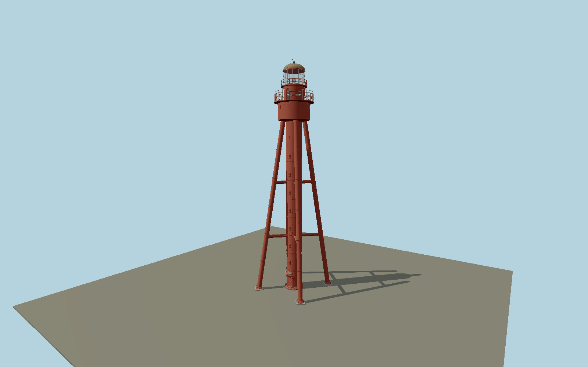

# Ruhnu Lighthouse — N0673

Restored dark-red riveted stair cylinder carried by four inclined tubular iron legs, with two levels of horizontal cylindrical braces, bolted footplates, small shaft windows, reinforced door and rain hood, broad service drum, two railed galleries, clear cylindrical lantern, bronze-toned dome and vane.

## Identity and evidence

Exact catalog identity **Q3376563**. Source facts: `{"heightMeters":38.34,"focalHeightMeters":64.7,"appearance":"Restored2021 exterior in municipality-supplied photographs.","photoApproxDimensionsMeters":{"centralDiameter":2.58,"legDiameter":0.76,"legFootRadius":6.04,"mainGalleryDiameter":6.48},"basis":"Current authority ATON2538 supplies38.34m height andWGS84coordinate. Municipal2021 restoration aerial and close photographs control four legs, two brace levels, bolted plate construction, eight visible shaft-port levels, door fittings and two galleries. All component diameters and heights below the published total are photo-proportioned; generic old40m catalog height is not used."}`. The source specification keeps published dimensions separate from reconstructed details.

- https://nma.transpordiamet.ee/aton/2538/
- https://nma.transpordiamet.ee/info_sheet/2538/en/
- https://www.transpordiamet.ee/ruhnu-tuletorn
- https://visitestonia.com/en/ruhnu-lighthouse
- https://visitestonia.com/images/3911370/V%C3%A4ike+formaat.jpg
- https://visitestonia.com/images/3911369/IMG_4954.JPG
- https://visitestonia.com/images/3911372/IMG_4977.JPG
- https://www.openstreetmap.org/way/1297215907

Original geometry and shared procedural materials. Official photographs are research references only; no reference imagery or third-party mesh is embedded or redistributed.

## Authored geometry and materials

236,557 triangles, 547,947 vertices, 4 surface groups; 22,567,500 source bytes. SHA-256: `sha256:dd292e818a987221fcab046a67f8d9c0602552bd711f39b9f98295e0244add84`. Actual bounds: -5.218, 0.000, -5.218 to 5.218, 38.340, 5.218 m.

Shared canonical material graphs with metric UV repeats in extras.molenSurface; portable glTF PBR factors and vertex colors remain. Dark recesses/lantern panels retain local fallback materials. Shared references: `matgraph:molen.worldgen.material.metal_painted` (2 × 2 m), `matgraph:molen.worldgen.material.stone_granite` (2 × 2 m). Model-native axes: {"up":"+Y","front":"+Z","origin":"Authored main tower center at local base level; attached ensembles are offset from this origin."}.

## Placement proposal

Authority coordinate anchors the central tube. Mapped approach1297215907 ends directly south of the tower, resolving native+Z door to south. Four legs are placed symmetrically around this doorway as in the restored entry photograph. OSMcircle1297215911 is only5.7m wide and does not bound the external supporting legs, so it is not used to stretch the tower. Proposed anchor 23.26012233, 57.80135766 (longitude, latitude), heading 0 radians. Elevation policy: **terrain-contact**. This is a reviewable proposal, not a completed site-fit certification. Ground models require terrain contact; offshore models also require water-datum and base-height checks.

## Limitations and review

- The modeled exterior follows the cited published facts and inspected photographs. Unpublished dimensions and local fittings are explicitly photo-proportioned; no claim of engineering survey accuracy is made.
- Portable PBR and shared metric surfaces are provided. Surface weathering, material color under local lighting and fine facade relief require close render review before maximum-detail acceptance.
- Published total height and anchor are authoritative; iron-tube diameters, brace elevations and small fittings are photograph reconstructions. The centenary plaque is modeled as an unlettered cast panel because tiny text is outside useful exterior viewing scale. Detached station buildings and forest are supplied by map layers. Temporary safety signs and individual paint chips are omitted.

Near/far fixtures are in `spec.qaCameras`. Float32 finite geometry, triangle degeneracy and winding are checked by the generator. Current rendering, shared-material, maximum-fidelity and geographic review results are recorded in `qa.json` and the readiness ledger; source generation alone does not approve a model.

Regenerate with `node packages/worldgen/scripts/generate-lighthouse-models.mjs --ids=N0673`; add `--check` for reproducibility. Editable component recipes are in `packages/worldgen/scripts/lighthouse-baltic-next-models.mjs`. The generator protects artist-edited master hashes and preserves import/capture/shared-capture/QA documents.
