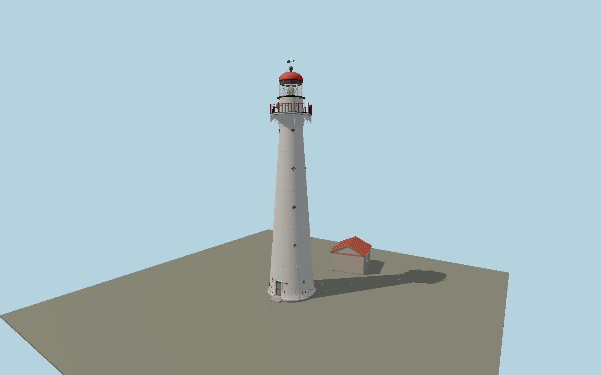

# Kihnu Lighthouse — N0671

White tapered cast-iron tower with flared, red-lined foot; twenty-four small circular apertures in red diamond surrounds; ornate pierced eight-sided gallery, red finial posts and black pickets; white/red Greek-key drum; clear ten-panel lantern with optical apparatus, riveted red dome, ventilator and vane; mapped detached rubble oil store.

## Identity and evidence

Exact catalog identity **Q3361476**. Source facts: `{"heightMeters":28.3,"focalHeightMeters":30.2,"shaftBasePhotoApproxDiameterMeters":5.8,"lanternPhotoApproxDiameterMeters":2.73,"appearance":"Restored white/red exterior shown in municipal tourism aerial and Brand Estonia2024 lantern close-up.","basis":"Navigation authority current ATON2849 provides28.3m structure height and exactWGS84coordinate. Operator and municipal photographs govern the flared base, four upper rows of four ports and eight lowest ports, gallery support geometry and oil store. Brand Estonia credited Priidu Saart close photograph fixes the restored red Greek-key drum pattern, lantern hardware, dome seams and gallery posts. Other dimensions are photo-proportioned."}`. The source specification keeps published dimensions separate from reconstructed details.

- https://nma.transpordiamet.ee/aton/2849/
- https://www.transpordiamet.ee/kihnu-tuletorn
- https://www.transpordiamet.ee/uudised/kihnu-tuletorn-sai-uue-kupli
- https://www.kultuuriruum.ee/tuletorn/
- https://visitkihnu.ee/et/vaatamisvaeaersused/82/kihnu-tuletorn
- https://visitestonia.com/images/709493/kihnu-tuletorn-013-visit-estonia.jpg
- https://toolbox.estonia.ee/asset-page/256622-kihnu-lighthouse
- https://www.openstreetmap.org/way/232111866
- https://www.openstreetmap.org/way/420321434

Original geometry and shared procedural materials. Official photographs are research references only; no reference imagery or third-party mesh is embedded or redistributed.

## Authored geometry and materials

126,985 triangles, 245,221 vertices, 8 surface groups; 10,111,084 source bytes. SHA-256: `sha256:97c0bd40406ef9d20d903f82975e133637e8d15628003c1b45c5cf73fdcef179`. Actual bounds: -3.150, 0.000, -14.840 to 5.754, 28.324, 3.517 m.

Shared canonical material graphs with metric UV repeats in extras.molenSurface; portable glTF PBR factors and vertex colors remain. Dark recesses/lantern panels retain local fallback materials. Shared references: `matgraph:molen.worldgen.material.brick` (1.92 × 0.9 m), `matgraph:molen.worldgen.material.stone` (2 × 2 m), `matgraph:molen.worldgen.material.metal_painted` (2 × 2 m), `matgraph:molen.worldgen.material.stone_granite` (2 × 2 m), `matgraph:molen.worldgen.material.wood_plain` (2 × 0.25 m), `matgraph:molen.worldgen.material.concrete_plain` (2 × 2 m). Model-native axes: {"up":"+Y","front":"+Z","origin":"Authored main tower center at local base level; attached ensembles are offset from this origin."}.

## Placement proposal

Navigation authority exact coordinate fixes tower center, within one meter of exact-QID OSMnode3369832511. Native+Z faces north toward the keeper-house access; the north entry is reconstructed from the photographed closed sea-facing elevations and landward approach. Oil-store footprint is mapped in actual east/south offsets, resolving ensemble rotation; its roof and openings follow the municipal aerial. The broader OSMtower circle includes the stone/plinth skirt and is not used to stretch the shaft. Proposed anchor 23.97109316, 58.097058 (longitude, latitude), heading 3.141592653589793 radians. Elevation policy: **terrain-contact**. This is a reviewable proposal, not a completed site-fit certification. Ordinary ground models use terrain contact; Kiipsaare requires an offshore water/base-height check.

## Limitations and review

- The modeled exterior follows the cited published facts and inspected photographs. Unpublished dimensions and local fittings are explicitly photo-proportioned; no claim of engineering survey accuracy is made.
- Portable PBR and shared metric surfaces are provided. Surface weathering, material color under local lighting and fine facade relief require close render review before maximum-detail acceptance.
- Tower structural height and anchor are published; panel diameters, thin ironwork, aperture dimensions and minor door/roof details are photograph-proportioned. Native north entry is an approach-based reconstruction; detached keeper residences remain map buildings. No reference photograph or survey mesh is embedded. The optical instrument is an exterior-visible representation rather than a working navigational light.

Near/far fixtures are in `spec.qaCameras`. Float32 finite geometry, triangle degeneracy and winding are checked by the generator. Rendering, shared-material alignment, maximum-fidelity and geographic reviews remain pending until their hash-bound reports exist.

Regenerate with `node packages/worldgen/scripts/generate-lighthouse-models.mjs --ids=N0671`; add `--check` for reproducibility. Editable component recipes are in `packages/worldgen/scripts/lighthouse-models.mjs`. The generator protects artist-edited master hashes and preserves import/capture/shared-capture/QA documents.
