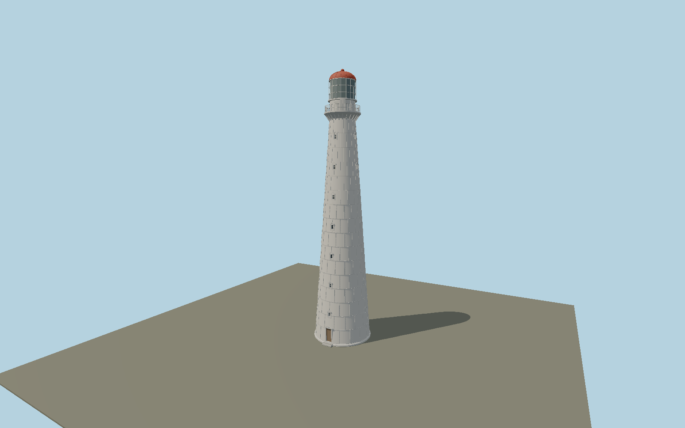

# Tahkuna Lighthouse — N0661

White cast-iron taper with the distinctive staggered grid of raised joint-cover battens, four narrow window columns with little pediments, curved bracketed gallery, white plate watchroom, cylindrical glazed lantern with an external cleaning cage, and the current red ribbed dome.

## Identity and evidence

Exact catalog identity **Q3361471**. Source facts: `{"heightMeters":42.6,"baseDiameterApproxMeters":8.95,"topShaftDiameterApproxMeters":4,"year":1875,"basis":"Municipal destination and Lighthouse Society identify42.6m tower height. Current museum aerial and Society close photograph govern the red dome, cast-iron grid, pedimented openings and gallery arrangement. Diameter is photo-scaled, consistent with the2015 Estonian Post anniversary description reproduced by the philatelic society. Museum sea-height wording and Society live light-height table differ; those values are not substituted for tower height."}`. The source specification keeps published dimensions separate from reconstructed details.

- https://hiiumaa.ee/objekt/tahkuna-tuletorn/
- https://hiiumaamuuseum.ee/en/tahkuna-lighthouse/
- https://hiiumaamuuseum.ee/wp-content/uploads/2024/04/DJI_0021-scaled.jpg
- https://www.etts.ee/en/lighthouses-list/tahkuna-lighthouse/
- https://www.etts.ee/wp-content/uploads/2023/09/tahkuna_vta.jpeg
- https://www.filateelia.ee/foorum/viewtopic.php?p=9354
- https://www.openstreetmap.org/node/3380792473

Original geometry and shared procedural materials. Official photographs are research references only; no reference imagery or third-party mesh is embedded or redistributed.

## Authored geometry and materials

61,870 triangles, 119,700 vertices, 4 surface groups; 4,934,748 source bytes. SHA-256: `sha256:caf7425596b35f9b5b47dc3e298daa7ea7c38324f1ce890d0d035e4d6aac8645`. Actual bounds: -4.650, 0.000, -4.650 to 4.650, 42.600, 5.060 m.

Shared canonical material graphs with metric UV repeats in extras.molenSurface; portable glTF PBR factors and vertex colors remain. Dark recesses/lantern panels retain local fallback materials. Shared references: `matgraph:molen.worldgen.material.metal_painted` (2 × 2 m), `matgraph:molen.worldgen.material.wood_plain` (2 × 0.25 m), `matgraph:molen.worldgen.material.concrete_plain` (2 × 2 m). Model-native axes: {"up":"+Y","front":"+Z","origin":"Authored main tower center at local base level; attached ensembles are offset from this origin."}.

## Placement proposal

Exact-QID mapped lighthouse node fixes tower center. Circular shaft and four approximately quadrantal window columns make silhouette invariant under heading. Main entry/window column is reconstructed toward the southern station approach; its precise small angle is not a mapped entrance measurement. Proposed anchor 22.5862233, 59.0914008 (longitude, latitude), heading -0.2 radians. Elevation policy: **terrain-contact**. This is a reviewable proposal, not a completed site-fit certification. Ordinary ground models use terrain contact; Kiipsaare requires an offshore water/base-height check.

## Limitations and review

- The modeled exterior follows the cited published facts and inspected photographs. Unpublished dimensions and local fittings are explicitly photo-proportioned; no claim of engineering survey accuracy is made.
- Portable PBR and shared metric surfaces are provided. Surface weathering, material color under local lighting and fine facade relief require close render review before maximum-detail acceptance.
- Detached keeper houses, fences and displayed former optical apparatus are separate site features. Raised cast-iron joint pattern is geometric; tiny plate fasteners and evolving paint repairs use the shared metal surface. The current red roof follows exterior photographs, whereas green roof mentioned in history describes the original1875 finish.

Near/far fixtures are in `spec.qaCameras`. Float32 finite geometry, triangle degeneracy and winding are checked by the generator. Rendering, shared-material alignment, maximum-fidelity and geographic reviews remain pending until their hash-bound reports exist.

Regenerate with `node packages/worldgen/scripts/generate-lighthouse-models.mjs --ids=N0661`; add `--check` for reproducibility. Editable component recipes are in `packages/worldgen/scripts/lighthouse-models.mjs`. The generator protects artist-edited master hashes and preserves import/capture/shared-capture/QA documents.
