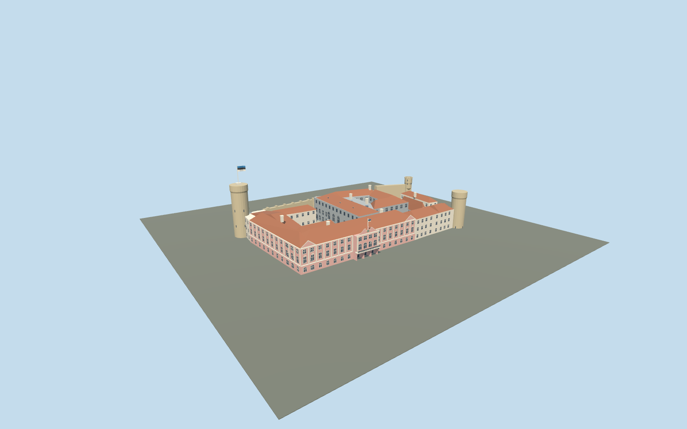

# Toompea Castle

Mapped Toompea compound with pink east and south palace fronts, Baroque central gable, open courts, grey Riigikogu building, limestone western wall, Tall Hermann flag tower, Landskrone and console-mounted Pilsticker.

## Evidence and reconstruction

Published dimensions and reconstructed details are separated in spec.json. Primary references:

- [Reference](https://www.riigikogu.ee/en/visit-us/toompea-castle/toompea-castle-riigikogu-building/)
- [Reference](https://www.riigikogu.ee/en/visit-us/toompea-castle/tall-hermann-toompea-towers/)
- [Reference](https://www.riigikogu.ee/en/visit-us/photos-castle-riigikogu/)
- [Reference](https://www.openstreetmap.org/relation/3502552)
- [Reference](https://www.openstreetmap.org/relation/3502550)

No third-party geometry, photograph or bitmap texture is embedded. Shared surface graphs come from the central library; vertex tints carry model colors. Glazing uses PBR materials; transparent surfaces are declared per model.

## Model and axes

9,769 triangles; 27,003 vertices; 5 material groups; 1,092,484 bytes. Native bounds: -70.249, -12.000, -41.044 to 70.304, 45.600, 44.044. Source hash: `sha256:e447957fc4808006037199c1e31d5dcafb394480cc946882444190bc61cac70a`.

{"up":"+Y","longitudinal":"+X north along the palace","front":"+Z east toward Castle Square","origin":"Mapped compound center; Y=0 Castle Square attachment plane; western foundations extend to Y=-12"}

Exact-QID component footprints resolve tower identity and the east-facing palace. Western foundations extend below the eastern street datum. Require real terrain review before activation; the surrounding gardens and cathedral are excluded.

## Reproduce

Run `node packages/worldgen/scripts/generate-signature-towers.mjs --ids=N0263` (or add `--check`). The generator preserves manually edited masters by checking their baseline hashes. Import through the standard authored-model workflow with optimization disabled; then capture all QA cameras, including shared-surface views.

## Pending work

- Heights tagged in OSM use different local ground levels; reconstructed offsets, roof junctions and northern terrain require geographic review.
- The Baroque gable, state arms, triangular ornament and stone corbels are simplified medium-fi geometry. Flags are static geometric tricolors. No navigable interiors.
- Synthetic neighbor renders do not verify castle-rock fit, continuous-motion shimmer or physical-device performance.

This bundle follows the medium-fi standard. Medium-fi appearance and geographic fit are reviewed separately. Hash-bound visual acceptance is recorded separately after capture inspection.

## Additional geographic data

Footprints © OpenStreetMap contributors, ODbL-1.0. Riigikogu photographs are linked visual evidence, not redistributed textures or geometry.
