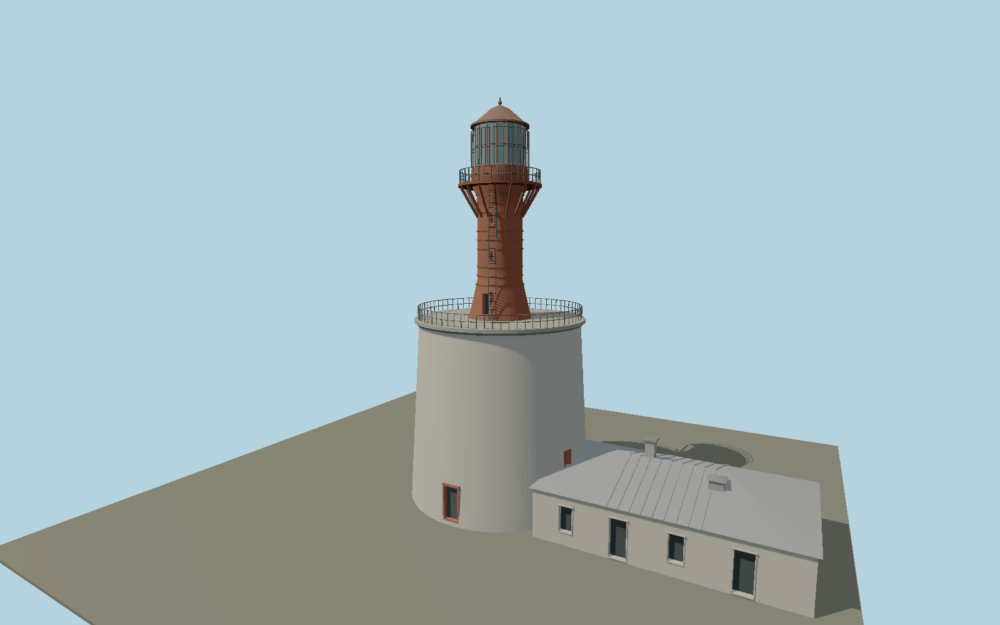

# Keri Lighthouse — N0640

Broad reconstructed limestone drum supporting the narrow riveted red iron bottle tower, two galleries, braced upper balcony, glazed lantern, copper-brown dome and attached low service wing.

## Identity and evidence

Exact catalog identity **Q2984041**. Source facts: `{"heightMeters":30.6,"operatorCoordinate":[25.02274216,59.69871433],"masonryRestoration":"First-stage reconstruction completed by early 2024; upper iron tower and wing restoration remained future stages in the May 2024 operator report.","basis":"Estonian navigation-aid155 record and2024authority restoration photograph;30.6m supersedes unreferenced28m. Tower base14.2m and attached16.58x10.10m wing use mapped nationalETAK outline way244300628."}`. The source specification keeps published dimensions separate from reconstructed details.

- https://nma.transpordiamet.ee/aton/2738/
- https://www.openstreetmap.org/way/244300628
- https://www.transpordiamet.ee/uudised/keri-tuletorni-esimene-renoveerimisetapp-edukalt-loppenud
- https://www.transpordiamet.ee/sites/default/files/styles/crop_rotate_full/public/2024-05/Keri%20TT.jpg?itok=UkZPDB9-

Original geometry and shared procedural materials. Official photographs are research references only; no reference imagery or third-party mesh is embedded or redistributed.

## Authored geometry and materials

47,546 triangles, 95,160 vertices, 5 surface groups; 3,999,584 source bytes. SHA-256: `sha256:4033d4e63ac06af4b7986481dbd1349e8f4b7596fca11187161cbbfa488ff230`. Actual bounds: -7.100, 0.000, -7.100 to 22.430, 30.600, 7.100 m.

Shared canonical material graphs with metric UV repeats in extras.molenSurface; portable glTF PBR factors and vertex colors remain. Dark recesses/lantern panels retain local fallback materials. Shared references: `matgraph:molen.worldgen.material.stone_ashlar` (2.4 × 1.5 m), `matgraph:molen.worldgen.material.stone_limestone` (2.4 × 1.6 m), `matgraph:molen.worldgen.material.metal_painted` (2 × 2 m), `matgraph:molen.worldgen.material.stone_granite` (2 × 2 m). Model-native axes: {"up":"+Y","front":"+Z","origin":"Authored main tower center at local base level; attached ensembles are offset from this origin."}.

## Placement proposal

Official aid coordinate locates the tower base. Authored +X wing follows the measured east-southeast wing axis of nationalETAK-derived OSMway244300628. Tower foundation and wing plan agree at this ground bearing; main service facade faces south-southwest. Proposed anchor 25.02274216, 59.69871433 (longitude, latitude), heading -0.212064481 radians. Elevation policy: **terrain-contact**. This is a reviewable proposal, not a completed site-fit certification. Ground models require terrain contact; offshore models also require water-datum and base-height checks.

## Limitations and review

- The modeled exterior follows the cited published facts and inspected photographs. Unpublished dimensions and local fittings are explicitly photo-proportioned; no claim of engineering survey accuracy is made.
- Portable PBR and shared metric surfaces are provided. Surface weathering, material color under local lighting and fine facade relief require close render review before maximum-detail acceptance.
- The restored 2024 masonry silhouette is used; pre-restoration missing wall sectors and temporary external steel bands are excluded. Wing plan and bearing are mapped; gallery sections, window heights, roof pitch and rivet spacing are photo-proportioned. Adjacent detached keeper houses are outside this tower asset.

Near/far fixtures are in `spec.qaCameras`. Float32 finite geometry, triangle degeneracy and winding are checked by the generator. Current rendering, shared-material, maximum-fidelity and geographic review results are recorded in `qa.json` and the readiness ledger; source generation alone does not approve a model.

Regenerate with `node packages/worldgen/scripts/generate-lighthouse-models.mjs --ids=N0640`; add `--check` for reproducibility. Editable component recipes are in `packages/worldgen/scripts/lighthouse-expansion-models.mjs`. The generator protects artist-edited master hashes and preserves import/capture/shared-capture/QA documents.
