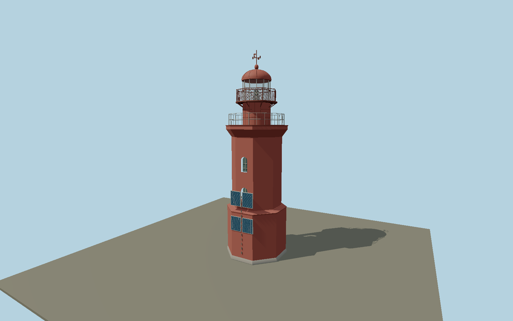

# Rodsher Lighthouse — N0672

Red octagonal tower with broad lower pedestal, reduced upper shaft, two opposed pairs of deep arched windows, flared masonry gallery, circular railed watch room, two pairs of south-facing solar panels, wire-mesh lantern balcony, clear framed lantern, riveted domed roof, red ventilator and cardinal vane.

## Identity and evidence

Exact catalog identity **Q3366505**. Source facts: `{"publishedStructureHeightMeters":18.8976,"publishedFocalHeightMeters":20,"modeledVaneTopMeters":20.45,"surveyControlHeightsMeters":{"baseLedge":4.9,"shaftTop":12.05,"gallery":13.18,"lanternBalcony":15.48,"lanternEave":17.52,"roofGlobe":19.11},"surveyMeasurementBasis":"RGO/Fertoing published GLB rawY span20.75m includes rough ground and vane. Intersections of its triangle mesh supply the pedestal, shaft, flared gallery, watch-room and lantern heights; original point offsets and small survey tilt are removed. Its two pairs of arched windows and solar-bank opposition determine local facade arrangement. Dimensions are reconstructed survey-model controls, not geodetic survey coordinates.","sourceSurveyHash":"sha256:6f4e4ad71d894058cf3abe9cd068e4b7d7919139df2d800ae4d4e559ab25debc"}`. The source specification keeps published dimensions separate from reconstructed details.

- https://rgo.ru/activity/project-list/mayak-rodsher/
- https://rgo.ru/upload/content_block/files/246a6930c50362071bf4979ef4a9fd86/67b2fdb8eb2f0694a33c4f35f3af859b6.glb
- https://rgo.ru/upload/content_block/images/2a4874030ffc83a09c95cfbd1b0facbc/679b960d61ef93e1dd48375b7b05fb951.jpg
- https://creativecommons.org/licenses/by/3.0/

Original geometry and shared procedural materials. Official photographs are research references only; no reference imagery or third-party mesh is embedded or redistributed.

## Authored geometry and materials

38,480 triangles, 73,366 vertices, 6 surface groups; 3,106,572 source bytes. SHA-256: `sha256:4d721aca512bfef94ebd9c45d0c6effccb57189fb9d7e81bc755870fd005106e`. Actual bounds: -2.947, 0.000, -3.950 to 2.947, 20.450, 2.960 m.

Shared canonical material graphs with metric UV repeats in extras.molenSurface; portable glTF PBR factors and vertex colors remain. Dark recesses/lantern panels retain local fallback materials. Shared references: `matgraph:molen.worldgen.material.plaster_lime` (2 × 2 m), `matgraph:molen.worldgen.material.metal_painted` (2 × 2 m), `matgraph:molen.worldgen.material.wood_plain` (2 × 0.25 m), `matgraph:molen.worldgen.material.concrete_plain` (2 × 2 m). Model-native axes: {"up":"+Y","front":"+Z","origin":"Authored main tower center at local base level; attached ensembles are offset from this origin."}.

## Placement proposal

Official project supplies the lighthouse coordinate, correcting the catalog island reference. Native+Z solar banks face the southern sea side; opposite door is landward/north. This quadrant follows the project site photographs and solar array configuration, while the survey model resolves internal180-degree opposition. A survey-north axis is not supplied; exact azimuth is photo-reconstructed. Footing contacts the mapped island terrain rather than forcing the20m focal elevation onto the base. Proposed anchor 26.67976, 59.968681 (longitude, latitude), heading 0 radians. Elevation policy: **terrain-contact**. This is a reviewable proposal, not a completed site-fit certification. Ground models require terrain contact; offshore models also require water-datum and base-height checks.

## Limitations and review

- The modeled exterior follows the cited published facts and inspected photographs. Unpublished dimensions and local fittings are explicitly photo-proportioned; no claim of engineering survey accuracy is made.
- Portable PBR and shared metric surfaces are provided. Surface weathering, material color under local lighting and fine facade relief require close render review before maximum-detail acceptance.
- Published survey/photographic exterior is modeled using clean shared red plaster/iron rather than retaining baked photographic shadows. Thin gallery wire, glass panes and roof hardware are reconstructed as real geometry; surrounding detached derelict houses and island rock terrain remain map features. Small optical hardware is represented only to the detail visible through the lantern. Current maintenance color may vary, but the red daymark and structural arrangement follow the maritime-heritage project.

Near/far fixtures are in `spec.qaCameras`. Float32 finite geometry, triangle degeneracy and winding are checked by the generator. Current rendering, shared-material, maximum-fidelity and geographic review results are recorded in `qa.json` and the readiness ledger; source generation alone does not approve a model.

Regenerate with `node packages/worldgen/scripts/generate-lighthouse-models.mjs --ids=N0672`; add `--check` for reproducibility. Editable component recipes are in `packages/worldgen/scripts/lighthouse-rodsher-model.mjs`. The generator protects artist-edited master hashes and preserves import/capture/shared-capture/QA documents.
