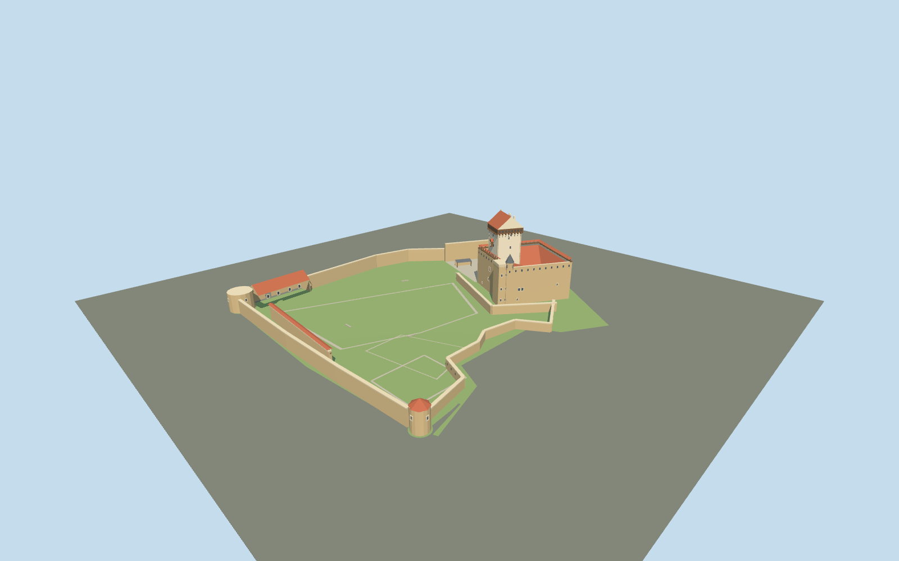

# Hermann Castle

Restored Narva castle: off-white Tall Hermann with projecting timber hoarding and red gable, inward red-roofed stone convent around an open court, southwest octagonal turret and broad western/northern yards.

## Evidence and reconstruction

Published dimensions and reconstructed details are separated in spec.json. Primary references:

- [Reference](https://narvamuuseum.ee/en/muuseum/narva-castle/)
- [Reference](https://narvamuuseum.ee/en/muuseum/meie-ajalugu/)
- [Reference](https://narvamuuseum.ee/en/muuseum/projects/projektid/castle-development/)
- [Reference](https://narvamuuseum.ee/userfiles/files/LH-AS-1_Asendiplaan.pdf)
- [Reference](https://narvamuuseum.ee/en/muuseum/north-courtyard/)
- [Reference](https://bastion.visitnarva.ee/wp-content/uploads/2024/02/narva-bastions-route-booklet-en.pdf)
- [Reference](https://www.openstreetmap.org/relation/5434279)

No third-party geometry, photograph or bitmap texture is embedded. Shared surface graphs come from the central library; vertex tints carry model colors. Glazing uses PBR materials; transparent surfaces are declared per model.

## Model and axes

5,406 triangles; 11,814 vertices; 5 material groups; 493,300 bytes. Native bounds: -105.293, 0.000, -89.442 to 105.042, 51.000, 88.539. Source hash: `sha256:d8d6baa55ca67f9494f2005f513202daba332ae5987a8ca50353b92be61677b8`.

{"up":"+Y","longitudinal":"+X east-northeast,11.35 degrees north of east","front":"-X Western Yard; river on +X; North Yard toward -Z","origin":"Mapped entire site center, provisional court and ground attachment Y=0"}

Site plan aligned to exact mapped perimeter. Geographic activation requires cliff-side seating and northern/western entry review; synthetic captures establish appearance only.

## Reproduce

Run `node packages/worldgen/scripts/generate-signature-towers.mjs --ids=N0274` (or add `--check`). The generator preserves manually edited masters by checking their baseline hashes. Import through the standard authored-model workflow with optimization disabled; then capture all QA cameras, including shared-surface views.

## Pending work

- Original medium-fi reconstruction, not a conservation survey.
- Published51m tower datum unspecified; all other heights and plan components interpreted.
- Current restored hoarding modeled as seen; museum questions its historical authenticity.
- Fine joints, narrow loops, full interiors, tiny flags/fixtures and elaborate workshop equipment omitted.
- Ceramic roof graph supplies low-frequency seams for both red tiles and grey small turret roof, tinted separately.
- Actual terrain contact/approaches, continuous-motion shimmer and physical-device performance pending.

This bundle follows the medium-fi standard. Medium-fi appearance and geographic fit are reviewed separately. Hash-bound visual acceptance is recorded separately after capture inspection.

## Additional geographic data

© OpenStreetMap contributors, ODbL-1.0. Narva Museum operator plan/photos and city bastion booklet used as research only.
