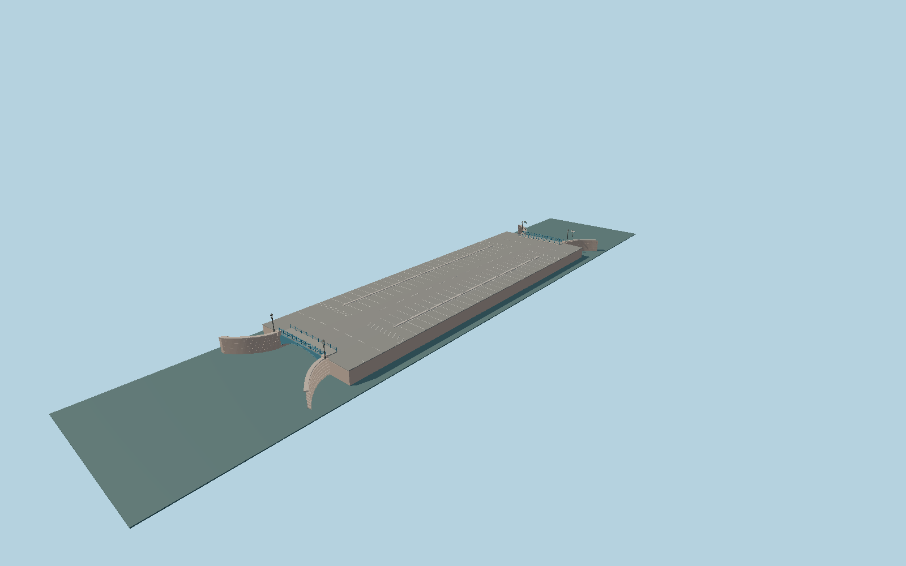

# Blue Bridge

The unusually broad Blue Bridge over the Moika: surviving ribbed cast-iron upstream vault, smoother concrete downstream face, granite splayed quays, ornate blue Moika railings and the parking square above.

## Evidence

- [Primary reference](https://mostotrest-spb.ru/bridges/sinij)
- [Primary reference](https://mostotrest-spb.ru/bridege/photoalbum/sinij-most)
- [Primary reference](https://www.pylon.ru/printed-materials/object2016.pdf)
- [Primary reference](https://stpr.ru/upload/encyclopedia.pdf)
- [Primary reference](https://www.openstreetmap.org/relation/3299061)

Published dimensions and reconstruction assumptions are separated in spec.json. Source photos were consulted; no photos or third-party geometry are embedded. Map plan attribution: © OpenStreetMap contributors, ODbL-1.0.

## Source

926900 triangles; 71885356 bytes; 6 material groups. SHA256: sha256:981d51934c5a7bb582fc34e1c1fc75deedc6fc30e4d0bf38eb38f2acab3906b5.

Shared surfaces (metal_painted, concrete_plain, stone_granite) are loaded through the central library; any transparent materials use local PBR parameters. Axis and provisional vertical datum are in spec.json.

Regenerate with node packages/worldgen/scripts/generate-researched-bridges.mjs --ids=N0027; append --check to verify. Import and capture through the standard next-1000 scripts. Geometry validation does not substitute for current-frame visual review.

## Reconstruction limits

- Absolute road and water levels need site-elevation verification.
- The bridge parking geometry requires a current aerial registration; adjacent square pavement and the Neptune gauge outside the bridge are separate site structures.
- Arch rib pitch, casting ornament profiles and lantern dimensions are photograph-based reconstructions, without fabrication drawings.
