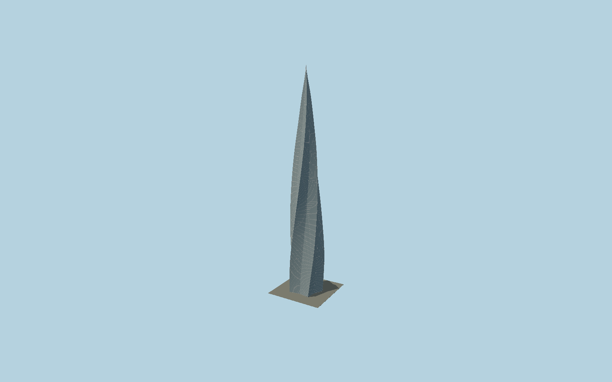

# Lakhta Centre

The462 m five-petal glass flame with a continuous90-degree helical sweep, widening lower profile, tapering upper observation/spire section, individually framed parallelogram glazing and ten fine spiral arrises.

## Evidence and reconstruction

Published dimensions and reconstructed details are separated in spec.json. Primary references:

- [Reference](https://gorproject.ru/en/projects/lakhta-center/)
- [Reference](https://www.mignat.com/en/unternehmenskommunikation-en/tallest-european-skyscraper-in-saint-petersburg-reached-its-final-height-of-462-meters/)
- [Reference](https://europe.arcelormittal.com/newsandmedia/europenews/news-2019/Lakhta)
- [Reference](https://www.openstreetmap.org/relation/18102137)

No third-party geometry, photograph or bitmap texture is embedded. Shared surface graphs come from the central library; vertex tints carry model colors. Glazing uses PBR materials; transparent surfaces are declared per model.

## Model and axes

197,762 triangles; 549,898 vertices; 3 material groups; 22,171,832 bytes. Native bounds: -38.726, 0.000, -34.033 to 34.386, 462.000, 40.236. Source hash: `sha256:625be18134ceab494821e7e4e949fa40a9dc817a2da0cc541087b37c94b8f5aa`.

{"up":"+Y","longitudinal":"+X along the mapped building long axis","front":"+Z","origin":"Ground-level center of exact-QID mapped footprint frame"}

The geographic proposal uses exact-QID OpenStreetMap evidence. Map-derived orientation and estimated architectural details require real-site visual review; preview eligibility is distinct from geographic/fidelity approval. Map attribution: © OpenStreetMap contributors, ODbL-1.0.

## Reproduce

Run `node packages/worldgen/scripts/generate-signature-towers.mjs --ids=N0160` (or add `--check`). The generator preserves manually edited masters by checking their baseline hashes. Import through the standard authored-model workflow with optimization disabled; then capture all QA cameras, including shared-surface views.

## Pending work

- Exterior geometry uses published overall dimensions and map evidence; panel subdivision, connection dimensions and local entrance details are reconstructed. Glazing uses opaque PBR with explicit geometry; no copied facade photograph is embedded.
- Individual glazing panels and helical arrises are explicit. Exact curved pane sag and floor-specific petal bulge are reconstructed. Only the main tower is included; adjacent long low complex and entrance arch are excluded.

This bundle contains source geometry, not a claim of maximum-fidelity completion. Hash-bound visual acceptance is recorded separately after capture inspection.
