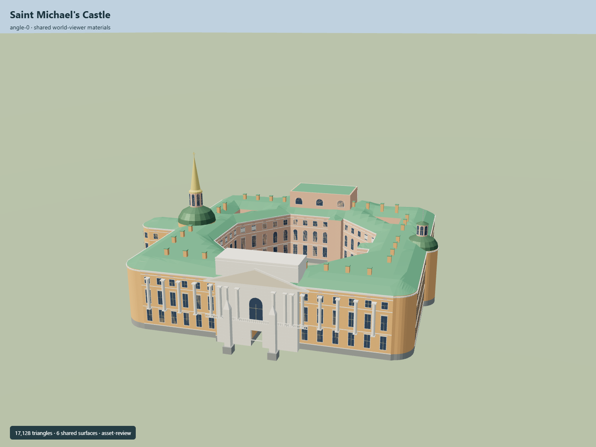

# Saint Michael's Castle

Current Saint Michael’s Castle: rounded near-square salmon exterior around an open octagonal court and two triangular service courts, low green roofs, gold church spire and separate river dome/lantern, monumental south pediment/obelisks, north colonnade/balcony/stair and physically open mapped south entrance.

## Evidence and reconstruction

Published dimensions and reconstructed details are separated in spec.json. Primary references:

- [Reference](https://api.openstreetmap.org/api/0.6/map?bbox=30.3358,59.9397,30.3393,59.9413)
- [Reference](https://rusmuseum.ru/museums/mikhailovsky-castle/)
- [Reference](https://rusmuseum.ru/upload/iblock/ea6/rxyi4rfqjs1728ihlakacrjz0gwe3lna.webp)
- [Reference](https://rusmuseum.ru/upload/iblock/524/4pjmil9zp44n4xeisumxuicgqbh3cs64.webp)
- [Reference](https://rusmuseum.ru/upload/iblock/fb2/a9xm75pkbsv1w9850ygrw7rxqki128wb.webp)
- [Reference](https://upload.wikimedia.org/wikipedia/commons/8/84/Saint_Michael%27s_Castle_Courtyard.jpg?utm_source=commons.wikimedia.org&utm_campaign=imageinfo&utm_content=original)
- [Reference](https://upload.wikimedia.org/wikipedia/commons/5/54/RUS-2016-Aerial-SPB-St_Michael%27s_Castle_02.jpg?utm_source=commons.wikimedia.org&utm_campaign=imageinfo&utm_content=original)
- [Reference](https://upload.wikimedia.org/wikipedia/commons/b/bb/%D0%9C%D0%B8%D1%85%D0%B0%D0%B9%D0%BB%D0%BE%D0%B2%D1%81%D0%BA%D0%B8%D0%B9_%D0%B7%D0%B0%D0%BC%D0%BE%D0%BA_2.JPG?utm_source=commons.wikimedia.org&utm_campaign=imageinfo&utm_content=original)

Six existing shared256-square graphs, linear tints and central metric repeats. Flat glass. No embedded/new image, photo texture, downloaded mesh or printed drawing trace.

## Model and axes

17,128 triangles; 51,384 vertices; 7 material groups; 2,059,596 bytes. Native bounds: -60.979, 0.000, -69.966 to 73.439, 56.400, 66.903. Source hash: `sha256:57cce95a313efd73d9b1a19447bd941639d9321fed137ba997563b3c72766952`.

{"up":"+Y","front":"Main entrance faces roughly south-southeast; native +X east and +Z south","longitudinal":"All horizontal map angles baked into East/South geometry; heading0","origin":"Exact-QID mapped research anchor; provisional attachment Y0. Current local ground, north stair and south passage datum require real-site review."}

Native East/South geometry preserves original mapped horizontal controls with heading0. Provisional attachmentY0 and all authored vertical sections require actual-site review.

## Reproduce

Run `node packages/worldgen/scripts/generate-signature-towers.mjs --ids=N0300` (or add `--check`). The generator preserves manually edited masters by checking their baseline hashes. Import through the standard authored-model workflow with optimization disabled; then capture all QA cameras, including shared-surface views.

## Pending work

- Exact-QID castle relation, all three courtyard rings and separately mapped south passage retain attribution. Native East/South geometry bakes heading0; the map plan axis alone is not geographic/facade approval.
- All vertical sections, roof profiles, church/river dome and lantern forms, spire position/height, column/window counts, obelisks, stairs and floor contacts are original photographic estimates. No primary surveyed vertical height verified.
- Current exterior captures guide rounded corners, open main and service courts, salmon plaster, green roofs, west church gold spire, east dome/lantern and separate south/north entrance compositions. Fine sculpture, heraldry, inscriptions, niches, balusters and interior rooms are simplified or excluded.
- Provisional attachment Y0, north stair and south passage floor have no real-site terrain or vertical-datum approval. No walkable collision claim.
- Detached guard pavilions, monuments to Peter I/Paul I, bridges, current water/embankments/gardens and historic moat fortifications are not merged into this castle GLB.
- Six existing shared 256-square graphs plus flat glass use linear tints and metric UV repeats. No new/embedded image, photo texture, downloaded mesh or printed drawing trace.
- Museum and primary photographers references are private research only, not redistributed. An aerial photograph dated2016 and courtyard photograph dated2013 supplement current museum photos; current roof/site alterations require further review.
- Synthetic Molen/Earth renders do not prove actual terrain fit, continuous streaming transitions or physical ordinary-laptop/phone performance.

This bundle follows the medium-fi standard. Medium-fi appearance and geographic fit are reviewed separately. Hash-bound visual acceptance is recorded separately after capture inspection.

## Additional geographic data

© OpenStreetMap contributors; State Russian Museum; Alex Florstein Fedorov, Andrew Shiva (Godot13), and Nadezhda Pivovarova/Wikimedia Commons.
