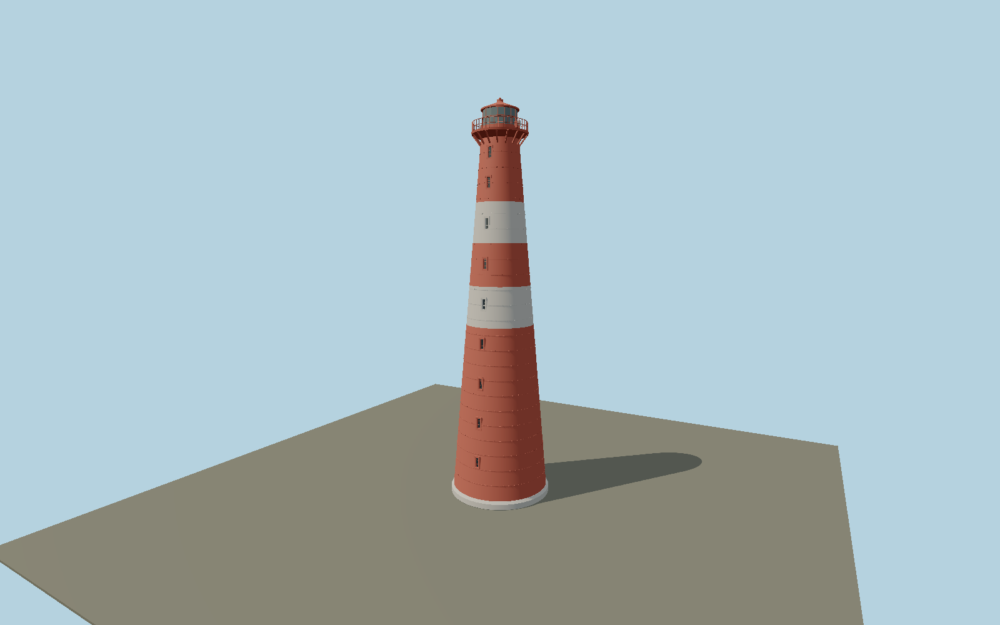

# Slettnes Lighthouse — N0659

Exceptionally tall red cast-iron taper with two broad white bands, shallow cast-plate seams, nine narrow three-pane windows, white concrete base and stair with mahogany door. Open bracketed red gallery, slim lantern and capped red cone.

## Identity and evidence

Exact catalog identity **Q385142**. Source facts: `{"heightMeters":39,"foundationDiameterMeters":10,"basis":"Kystverket2013 conservation planpp17–18 and current operator describe39m cast-iron tower, white foundation, two white bands, three vertical window panes and mahogany door. Exact-QID OSM228886593 supplies circular base extent; iron cross-sections and equipment dimensions photo-proportioned."}`. The source specification keeps published dimensions separate from reconstructed details.

- https://www.kystverket.no/kystkultur/fyrstasjoner/slettnes-fyr/
- https://www.kystverket.no/globalassets/om-kystverket/kystkultur/fyr/troms-og-finnmark/slettnes-forvaltningsplan-15.-november-2013_kort_just-12-10-16_red.pdf
- https://www.openstreetmap.org/way/228886593

Original geometry and shared procedural materials. Official photographs are research references only; no reference imagery or third-party mesh is embedded or redistributed.

## Authored geometry and materials

73,426 triangles, 150,692 vertices, 5 surface groups; 6,309,244 source bytes. SHA-256: `sha256:9bc1a0e2e35aa280d552d4f0d5a0cd5ef134f6fd73bd53282c1407d1762fd6a4`. Actual bounds: -5.000, 0.000, -7.522 to 5.000, 39.000, 5.000 m.

Shared canonical material graphs with metric UV repeats in extras.molenSurface; portable glTF PBR factors and vertex colors remain. Dark recesses/lantern panels retain local fallback materials. Shared references: `matgraph:molen.worldgen.material.metal_painted` (2 × 2 m), `matgraph:molen.worldgen.material.stone_granite` (2 × 2 m), `matgraph:molen.worldgen.material.wood_plain` (2 × 0.25 m), `matgraph:molen.worldgen.material.concrete_plain` (2 × 2 m). Model-native axes: {"up":"+Y","front":"+Z","origin":"Authored main tower center at local base level; attached ensembles are offset from this origin."}.

## Placement proposal

Exact-QID circular tower footprint fixes anchor; operatorp18 photograph explicitly looks east, placing authored window row on western face (+Z). Entrance is reconstructed opposite this row; tower itself is rotational. Host terrain supplies rocky promontory. Proposed anchor 28.218231728, 71.089563944 (longitude, latitude), heading -1.5707963267948966 radians. Elevation policy: **terrain-contact**. This is a reviewable proposal, not a completed site-fit certification. Ground models require terrain contact; offshore models also require water-datum and base-height checks.

## Limitations and review

- The modeled exterior follows the cited published facts and inspected photographs. Unpublished dimensions and local fittings are explicitly photo-proportioned; no claim of engineering survey accuracy is made.
- Portable PBR and shared metric surfaces are provided. Surface weathering, material color under local lighting and fine facade relief require close render review before maximum-detail acceptance.
- Asset is the39m tower; detached station houses and engine building are distinct mapped structures. Casting seam spacing and gallery fittings follow conservation photographs rather than a complete manufacturing drawing.

Near/far fixtures are in `spec.qaCameras`. Float32 finite geometry, triangle degeneracy and winding are checked by the generator. Current rendering, shared-material, maximum-fidelity and geographic review results are recorded in `qa.json` and the readiness ledger; source generation alone does not approve a model.

Regenerate with `node packages/worldgen/scripts/generate-lighthouse-models.mjs --ids=N0659`; add `--check` for reproducibility. Editable component recipes are in `packages/worldgen/scripts/lighthouse-northsea-models.mjs`. The generator protects artist-edited master hashes and preserves import/capture/shared-capture/QA documents.
