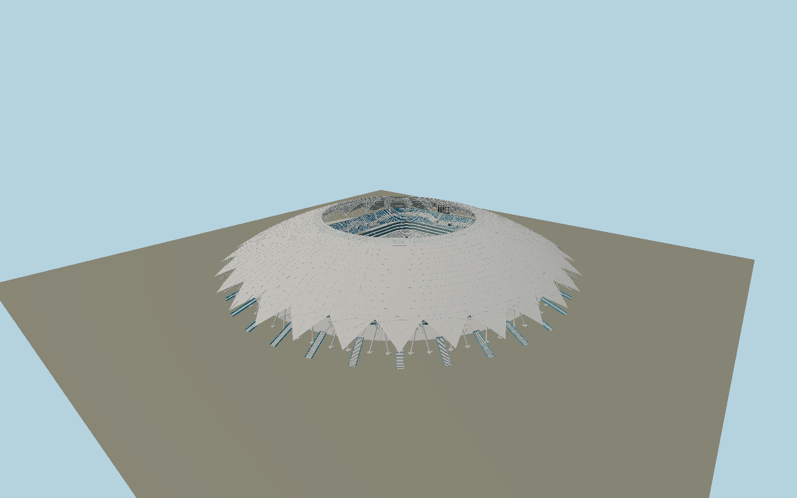

# Samara Arena — N0701

Distinctive spherical silver spacecraft roof over a precisely mapped32point star, central circular opening and inner translucent ring.32three-chord tubular cantilevers, pyramidal steel feet, ring lattices and faceted pointed perimeter bays remain visible from ground and bowl. Open peripheral circulation and32stair banks frame a recessed glass building; two blue/white seating tiers flank three stacked glazed hospitality ribbons, goal-end screens and roof lights.

## Identity and evidence

Exact catalog identity **Q4439099**. Source facts: `{"published":"Roof engineer Stalproekt:32radial spherical three-chord cantilevers,91m maximum cantilever and pyramidal supports. NIC Construction3(18)2018pp54–55:306.4m sphere radius,60m roof height,10.2m maximum truss depth,135.2m support radius. Architect Dmitry Bush/PI Arena published built photographs, floor plans and cross/longitudinal sections confirm star flaps and three hospitality floors.","reconstructed":"Exact mapped building relation8142258 has150m valley/170m tip radii and~73.3m circular opening. Pitch way572625509 defines long-axis direction. Detailed metal-member sections, individual roof-sheet/purlin counts, seating rows/colors, stair widths and recessed façade divisions are photo/section reconstructions. Published paper wording300m radius is inconsistent with the drawing/map; it is treated as nominal300m main-dome diameter, excluding projecting tips."}`. The source specification keeps published dimensions separate from reconstructed details.

- https://steel-project.ru/project/stadion-samara-arena
- https://archvestnik.ru/2018/09/21/vokrug-futbola-o-novykh-stadionakh-rossii/
- https://smr2018.ru/arena/
- https://samaraarena.info/about
- https://www.normacs.info/uploads/ckeditor/attachments/4750/%D0%92%D0%B5%D1%81%D1%82%D0%BD%D0%B8%D0%BA_3_18_2018.pdf
- https://www.openstreetmap.org/relation/8142258
- https://www.openstreetmap.org/way/572625509

Architect/engineer reference photographs and drawings were consulted, not embedded. Original authored mesh and shared procedural surfaces. Mapped outlines credit OpenStreetMap contributors, ODbL1.0.

## Authored geometry and materials

1,350,270 triangles, 2,448,660 vertices, 7 surface groups; 104,358,828 source bytes. SHA-256: `sha256:f50702ad50722d67264bb0329eefef8ebf5fcd7452036c3fc4f491eb4cabdc8f`. Actual bounds: -169.346, 0.000, -169.587 to 169.352, 60.375, 169.943 m.

Shared canonical material graphs with metric UV repeats in extras.molenSurface; portable glTF PBR factors and vertex colors remain. Dark recesses/lantern panels retain local fallback materials. Shared references: `matgraph:molen.worldgen.material.metal_painted` (2 × 2 m), `matgraph:molen.worldgen.material.concrete_plain` (2 × 2 m). Model-native axes: {"up":"+Y","front":"+Z","origin":"Exact mapped pitch center at field/streetY0. +Z points north-northwest; roof-star phase comes from exact mapped tips."}.

## Placement proposal

Exact roof multipolygon and pitch replace the former599m leisure-site parcel. Native+Z follows north-northwest pitch axis;32roof-tip phase comes from mapped maxima, preserving geographic star orientation. Stadium ground contact isY0; outer paving/security estate stays in ordinary map data. Proposed anchor 50.23752545, 53.277990125 (longitude, latitude), heading -2.9152865600390254 radians. Elevation policy: **terrain-contact**. See qa.json for the geographic review status and scope; this placement proposal does not claim surveyed site accuracy. Native ground and pitch datums follow the individual geographic proposal; depressed bowls require their declared terrain cutout.

## Limitations and review

- Detailed permanent exterior and visible bowl. Exact fabrication/row/stair inventories and minor glass divisions remain reconstructed. Closed rooms, temporary2018event lettering, current sponsor branding and remote estate buildings are outside this architectural mesh.

Portable review uses a flat ground contact fixture.

Near/far fixtures are in `spec.qaCameras`. Float32 finite geometry, triangle degeneracy and winding are checked by the generator. The hash-bound qa.json and capture reports record the scope and status of rendering, shared-material, exterior-fidelity and geographic reviews.

Regenerate with `node packages/worldgen/scripts/generate-stadium-models.mjs --ids=N0701`; add `--check` for reproducibility. Editable component recipes are registered by the imports and study list in `packages/worldgen/scripts/generate-stadium-models.mjs`. The generator protects artist-edited master hashes and preserves import/capture/shared-capture/QA documents.
