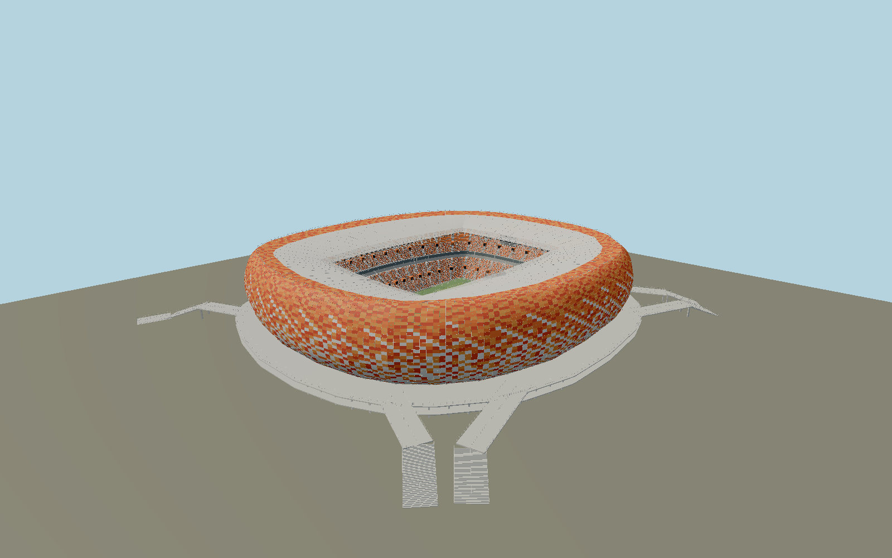

# Mordovia Arena — N0695

Executed Saransk stadium with orange/red/white perforated aluminum cassette shell,88 exposed L-shaped tubular consoles, inward-sloping roof and translucent inner rim. Two concrete podium storeys, mapped kinked access stairways, orange/white patterned seating, east Cyrillic city lettering, hospitality ribbon, orange vomitory heads, screens and roof floodlights define the individual exterior.

## Identity and evidence

Exact catalog identity **Q4533552**. Source facts: `{"published":"Structural engineer specifies88 L-shaped tubular lattice consoles40m high with49m cantilevers. Facade fabricator specifies8712 cassettes, typical2900x1345mm panels50mm deep,65.5mm square holes,2/3mm aluminum, RAL2001/2003/2009/9003 colors; it separately cites an approximate51m highest point. Operator confirms42839 seats and105x68m field. Macalloy supplies M48 tension bars.","reconstructed":"Mapped stadium outer/inner roof rings and enclosed pitch establish exact plan and directed north axis. The88-frame structural count takes precedence over the facade supplier’s84-frame prose. Raised podium level, shell profile, roof slopes, chair layout and individual panel colors are photo reconstructions; current source height is~49m including railing. Perforation spacing85mm is estimated from fabricator photographs; opening size65.5mm is published. The physical8712-cell shell arrangement represents the published inventory at a common nominal layout, not fabrication drawings."}`. The source specification keeps published dimensions separate from reconstructed details.

- https://steel-project.ru/project/stadion-mordoviya-arena
- https://met-form.ru/projects/facade/stadiona-mordoviya-arena/
- https://arenamordovia.ru/stadium/about/
- https://arenamordovia.ru/stadium/field-view-from-stands/
- https://macalloy.com/project/fifa-world-cup-arenas-in-russia-2018/
- https://www.openstreetmap.org/relation/7718715
- https://www.openstreetmap.org/way/590956380

Original component-authored geometry and canonical shared procedural surfaces. Reference photographs are research only; none is embedded as artwork. OSM coordinates are OpenStreetMap contributors, ODbL1.0.

## Authored geometry and materials

1,596,068 triangles, 2,879,272 vertices, 8 surface groups; 119,932,896 source bytes. SHA-256: `sha256:468bd34f3bdf2016c6c2c5a3884a269b4e1964505bb7146ec71ba4cc40d1dc1c`. Actual bounds: -136.260, -0.638, -139.058 to 136.649, 49.546, 155.033 m.

Shared canonical material graphs with metric UV repeats in extras.molenSurface; portable glTF PBR factors and vertex colors remain. Dark recesses/lantern panels retain local fallback materials. Shared references: `matgraph:molen.worldgen.material.metal_perforated_square` (0.085 × 0.085 m), `matgraph:molen.worldgen.material.membrane` (4 × 4 m), `matgraph:molen.worldgen.material.metal_painted` (2 × 2 m), `matgraph:molen.worldgen.material.concrete_plain` (2 × 2 m). Model-native axes: {"up":"+Y","front":"+Z","origin":"Mapped stadium pitch center; +Z near true north, +X west. Y0 is playing field and outer ground, with the two-storey raised terrace atY8."}.

## Placement proposal

Exact pitch long edge directs+Z north and+X west. Roof multipolygon and six mapped approach stair centerlines establish plan; the Wikidata point lies northwest outside the actual stadium and is not used as origin. Proposed anchor 45.203726, 54.1817469 (longitude, latitude), heading 3.1391830218009438 radians. Elevation policy: **terrain-contact**. See qa.json for the geographic review status and scope; this placement proposal does not claim surveyed site accuracy. Native ground and pitch datums follow the individual geographic proposal; depressed bowls require their declared terrain cutout.

## Limitations and review

- Completed stadium exterior; panel-color layout, construction sections, chair inventory and exact local terrace grades are reconstructed from primary photographs. No changing event graphics, surrounding retail district or enclosed rooms. Real square-hole alpha cutouts are baked from the canonical shared graph and also embedded for portable glTF fallback; cassette returns and structural frames remain geometry.

Portable review uses a flat ground contact fixture.

Near/far fixtures are in `spec.qaCameras`. Float32 finite geometry, triangle degeneracy and winding are checked by the generator. The hash-bound qa.json and capture reports record the scope and status of rendering, shared-material, exterior-fidelity and geographic reviews.

Regenerate with `node packages/worldgen/scripts/generate-stadium-models.mjs --ids=N0695`; add `--check` for reproducibility. Editable component recipes are registered by the imports and study list in `packages/worldgen/scripts/generate-stadium-models.mjs`. The generator protects artist-edited master hashes and preserves import/capture/shared-capture/QA documents.
