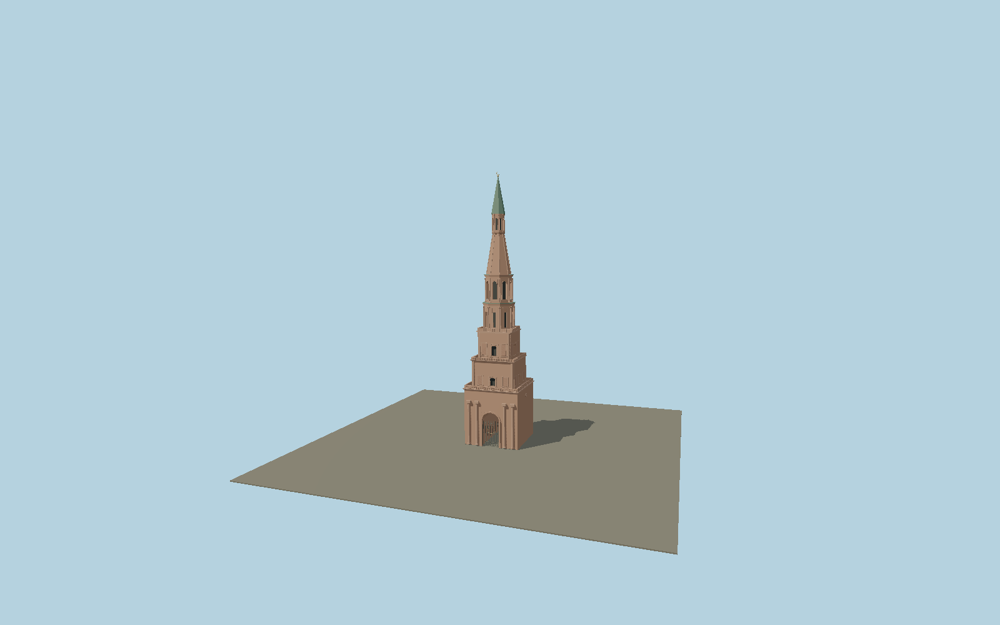

# Söyembikä Tower

Seven-tier leaning brick gate tower of the Kazan Kremlin: open vaulted gate, pylon columns, recessed shirinka parapets, square gallery stages, octagonal upper chambers, tall faceted brick tent and green spire with gilded crescent.

## Identity and geometry

Catalog N0574, [Q2166466](https://www.wikidata.org/wiki/Q2166466). Kazan Kremlin museum-reserve dimensions and architectural description; official exterior photograph constrains the stepped stage envelopes. The separate OSM parts 228963086–228963092 supply stage elevations and a 9 m green roof; opening dimensions are photo-fitted.

Mapped tower outline center at nominal exterior ground. +Z is the approximately west-facing gate facade; +Y is up. The geographic proposal identifies its anchor and orientation evidence separately from remaining terrain and azimuth uncertainty.

Source facts and measured references are recorded in spec.json. References: [1](https://kazan-kremlin.ru/en/architectural-objects/bashnya-syuyumbike), [2](https://www.openstreetmap.org/way/228963085). Reference pages and images are not redistributed.

## Original source and shared materials

Geometry is authored in `packages/worldgen/scripts/next-heritage-tower-models.mjs`. Shared material graphs with metric repeat UV0 and original vertex tints; GLB PBR fallback remains self-contained. No per-model texture duplication. No third-party mesh or photograph is embedded.

38,612 triangles; 76,360 vertices; 3 material groups; 3,214,640 source bytes. Source hash: `sha256:6b314fff4dbb2c8ca5e79fb44273324a6e207151ffc1bf36ade45b93de9a8ca5`. Geometry validation checks finite Float32 coordinates, indices, triangle area and winding before export.

Regenerate with `node packages/worldgen/scripts/generate-heritage-towers.mjs N0574`; add `--check` for reproducibility. The generator refuses to overwrite a master whose hash differs from source.json. Import uses `--no-optimize` to preserve facade recesses.

## Remaining detail and review

- Individual tier heights and brick profiles are fitted to the official exterior photograph. The 140 square metre square base is used instead of the larger OSM lower outline; small attached wall projections are excluded.
- Gate ornament is represented by bars and a sun medallion; figurative metalwork, brick repair patterns, inscriptions and highly detailed console capitals remain simplified.
- The reported lean is represented as a linear shear of the exterior. A measured deformation survey could refine the relative lean of individual tiers.
- Near/far visual QA, shared-material inspection and maximum-fidelity approval remain pending.

Named near/far cameras are included for lit visual review. A valid export is not maximum-fidelity certification.
