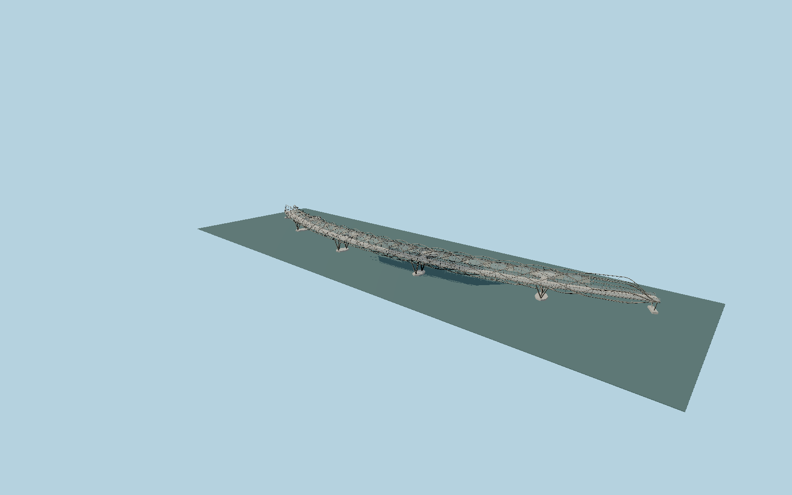

# The Helix Bridge

Curved Singapore crossing with opposing six-strand and five-strand stainless helices, transparent rails, shaded walkway, four bay-side viewing pods and slender tripod piers.

## Evidence

- [Primary reference](https://www.coxarchitecture.com.au/project/the-helix-bridge/)
- [Primary reference](https://teamstainless.org/wp-content/uploads/2025/04/Helix_Pedestrian_Bridge.pdf)
- [Primary reference](https://www.imoa.info/download_files/molyreview/IMOA_MolyReview_2-2011.pdf)
- [Primary reference](https://www.archdaily.com/185400/helix-bridge-cox-architecture-with-architects-61)

Published dimensions and reconstruction assumptions are separated in spec.json. Source photos were consulted; no photos or third-party geometry are embedded. Map plan attribution: © OpenStreetMap contributors, ODbL-1.0.

## Source

505124 triangles; 40086960 bytes; 5 material groups. SHA256: sha256:f9d5a96f56863ea4a79e5309e7ccd8557b2c59b61f82f8fe7447c367fe31fedf.

Shared surfaces (concrete_plain, stone_granite, metal_stainless) are loaded through the central library; any transparent materials use local PBR parameters. Axis and provisional vertical datum are in spec.json.

Regenerate with node packages/worldgen/scripts/generate-researched-bridges.mjs --ids=N0007; append --check to verify. Import and capture through the standard next-1000 scripts. Geometry validation does not substitute for current-frame visual review.

## Reconstruction limits

- Exterior reconstruction, not fabrication geometry. Spans total285m in the source although narrative length is280m; mapped curve is used for fit.
- Helix phase and pitch, small rods, canopy panel boundaries and joint hardware are reconstructed from primary photographs.
- Local reservoir water/pier-cap elevation is provisionally0m in the viewer. Geographic approval requires rendered fit; no survey datum is claimed.
- Adjacent vehicular Bayfront bridge, city promenade, interior foundation piles and dynamic lighting control are outside this asset.
