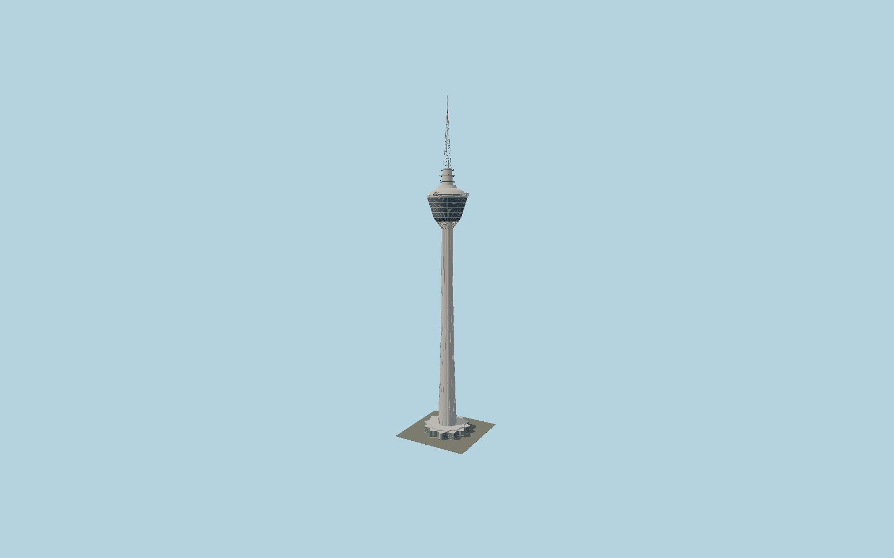

# Kuala Lumpur Tower

KL Tower’s parabolically tapered ribbed concrete shaft, rose muqarnas transition, widening bands of observation glazing, open sky deck, white stepped roof, transmitter galleries and red-white antenna above its mapped star-shaped lobby.

## Evidence and reconstruction

Published dimensions and reconstructed details are separated in spec.json. Primary references:

- [Reference](https://www.cidb.gov.my/wp-content/uploads/2022/11/CIDB-full-layout-12.54pm-lowres_compressed.pdf)
- [Reference](https://storage.ebrochures.malaysia.travel/storage/IDB_PDF_MTG_EN.pdf)
- [Reference](https://www.menarakl.com.my/)
- [Reference](https://girleatworld.net/kl-tower-review/)
- [Reference](https://thetravelauthor.com/kl-tower-kuala-lumpur-your-complete-guide/)
- [Reference](https://www.openstreetmap.org/way/589740576)

No third-party geometry, photograph or bitmap texture is embedded. Shared surface graphs come from the central library; vertex tints carry model colors. Glass is an opaque PBR approximation.

## Model and axes

96,580 triangles; 178,284 vertices; 7 material groups; 7,403,012 bytes. Native bounds: -29.924, 0.000, -29.885 to 29.922, 421.000, 29.882. Source hash: `sha256:071369302ff8e1c81339e29723b174c009b8e58be910d709a11da7ac4f3df4fd`.

{"up":"+Y","longitudinal":"+X along the mapped building long axis","front":"+Z","origin":"Ground-level center of exact-QID mapped footprint frame"}

The geographic proposal uses exact-QID OpenStreetMap evidence. Map-derived orientation and estimated architectural details require real-site visual review; preview eligibility is distinct from geographic/fidelity approval. Map attribution: © OpenStreetMap contributors, ODbL-1.0.

## Reproduce

Run `node packages/worldgen/scripts/generate-signature-towers.mjs --ids=N0161` (or add `--check`). The generator preserves manually edited masters by checking their baseline hashes. Import through the standard authored-model workflow with optimization disabled; then capture all QA cameras, including shared-surface views.

## Pending work

- Exterior geometry uses published overall dimensions and map evidence; panel subdivision, connection dimensions and local entrance details are reconstructed. Glazing uses opaque PBR with explicit geometry; no copied facade photograph is embedded.
- Muqarnas cells, steel antenna bracing, individual glass bands and suspended transparent sky boxes with stairs, I beams and ties are explicit. Exact antenna equipment, box bearings within their verified ENE/SSW sectors, support dimensions and ornament pattern remain reconstructed; nearby pedestrian mall and forest are excluded.

This bundle contains source geometry, not a claim of maximum-fidelity completion. Hash-bound visual acceptance is recorded separately after capture inspection.
